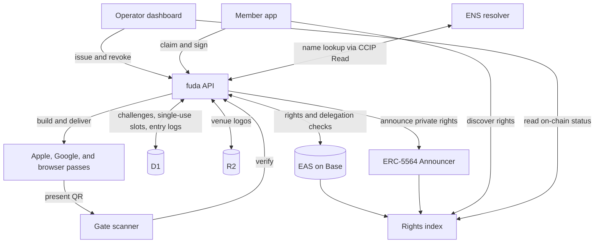
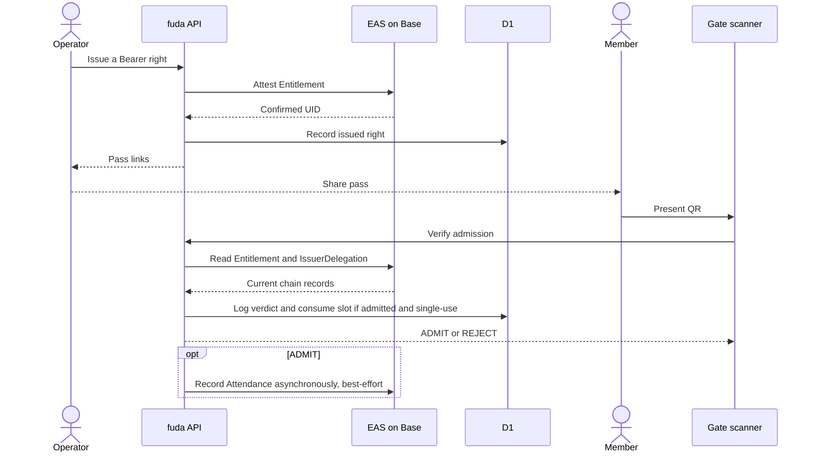

# fuda

**Your rights in your pocket.**

fuda turns memberships, tickets, and loyalty cards into on-chain Rights that people carry as Passes in Apple Wallet, Google Wallet, or the browser. Start without an app install or member sign-up, and secure your Right with a passkey when you're ready.

## Our goal

_**On-chain where trust matters. Invisible everywhere else**._

Membership usually ties a right to the app or system that serves it. Paper and plastic cards are hard to update or revoke; custom apps cost money to build and ask every member to install another app.

**The right should outlive the app.** Its validity should remain independently verifiable when the software around it changes.

## What fuda does

An Operator signs in with a passkey, sets up a Venue, designs a Card, and shares its link or QR. Members scan, save their Pass, and present it at the door or counter.

- **Event passes** — claim from a link and save to Apple Wallet, Google Wallet, or the browser, with no member account required.
- **Membership and loyalty cards** — publish a branded Card from the dashboard, then scan member Passes for entry and award Stamps under the Card's policy.
- **Open verification** — each Right is an [EAS](https://attest.org) attestation on Base. Anyone can check its on-chain validity without a fuda account or API.

ENS gives issuers and Rights names; The Graph supports discovery and on-chain status views. Passkeys and smart accounts let Members take control of their Rights. See [Pass types and flows](./docs/specs/pass-types-and-flows.md) for onboarding, verification levels, and +Private access.

## How it fits together



The rights index supports discovery and status views; ENS supplies names and address resolution. Gate admission uses EAS and D1. See the [architecture overview](./docs/architecture.md) for component responsibilities and trust boundaries.

### From issuance to entry

A Bearer pass follows this sequence. Signed and +Private entry add a holder signature; their flows are described in [Pass types and flows](./docs/specs/pass-types-and-flows.md#gate-protocol).



The gate app asks the API, which reads the Entitlement and its IssuerDelegation from EAS by `eth_call`. The hosted scanner trusts that API's verdict; an independent verifier can read the same records directly. D1 holds operational state — one-time challenges, single-use consumption, entry logs — and a failed chain read fails closed. Revoking on-chain turns the same QR red on the next scan. Anyone can check on-chain validity against Base without a fuda account; reproducing the hosted admission verdict also requires its operational state, including whether a single-use Right has already been consumed. Admissions are attested on-chain as best-effort Attendance, except for +Private Rights, where publishing a visit history would defeat the point.

The principle behind that split is **decentralized at the core, hosted rails only for UX**. A Right's validity lives on-chain, ownable and verifiable by anyone; Apple, Google, and fuda's own Workers are rails that make it pleasant to use. Strip the rails away and every function still has a self-runnable fallback, with worse UX. See [UX and decentralization](./docs/architecture.md#ux-and-decentralization).

## What's in the box

```text
.
├── apps
│   ├── api              issuance, gate verification, passes (Workers + D1)
│   ├── app              member app — /@handle, /signed, /private, /rights
│   ├── dash             operator dashboard — issue, revoke, members, card designer
│   └── gate             scanner — camera QR → verdict screen
├── packages
│   ├── sdk              shared types, validators, qrSvg
│   ├── libs             shared query, wallet, and authentication integrations
│   ├── stealth-address  ERC-5564 scheme-1 stealth address math
│   ├── pass             Apple .pkpass and Google Wallet save-link builders
│   ├── ui               shared web UI components
│   ├── styles           shared base CSS
│   ├── i18n             shared message catalogue
│   ├── ens-contracts    ENS resolver contracts and naming scripts
│   ├── subgraphs/rights the Base query lane the apps read status from
│   └── substreams       optional ERC-5564 / EAS push lane
└── docs                 architecture, specs, ADRs, runbook
```

`packages/subgraphs/*` and `packages/substreams/*` build independently and do not join the pnpm workspace.

Stack: Cloudflare Workers (Hono, Drizzle, D1, R2), viem, valibot, `@noble` crypto, EAS on Base. The protocol surface of the core loop is EAS plus the canonical ERC-5564 announcer. fuda runs one deployment per chain and they never share state — Base Sepolia today, Base mainnet at the cutover; see [Environments](./docs/architecture.md#environments).

## Quick start

See [Local development](./docs/runbook.md#12-local-development) for setup and startup instructions.

## Documentation

- **Architecture**
  - [Architecture overview](./docs/architecture.md) — components, authority and trust boundaries, environments, configuration
  - [Glossary](./docs/CONTEXT.md) — the one-name-per-concept vocabulary the specs, code, and UI share (level vs path, Right vs Pass, Device wallet vs Crypto wallet)
- **Specifications** ([index](./docs/specs/README.md))
  - [Attestation model](./docs/specs/attestation-model.md) — Entitlement, IssuerDelegation, Attendance, lifecycle, the EAS/D1 authority boundary
  - [Pass types and flows](./docs/specs/pass-types-and-flows.md) — templates, wallet roles, activation, privacy-first issuance, the gate protocol
  - [ENS naming](./docs/specs/ens-naming.md) — the name hierarchy, the member number, what a name resolves to, name lifecycle
  - [Substreams packages](./docs/specs/substreams.md) — the optional push lane and its compatibility guarantees
- **Integrations**
  - [The Graph](./docs/integrations/thegraph.md) — rights indexing, Substreams, and verification evidence
- **Operations**
  - [Runbook](./docs/runbook.md) — local development, one-time Cloudflare and Base setup, secrets, deploy order
  - [Agent guidance](./AGENTS.md) — repository workflow and verification
- **Records**
  - [Decision records](./docs/adr/) — why the architecture is shaped this way
  - [References](./docs/references.md) — the standards, prior art, and platform docs the design drew on
