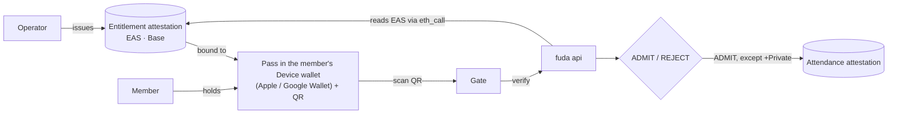

# fuda

**Membership as an on-chain right — issued in seconds, held in the phone's
wallet, verified at a physical door without trusting anyone's server.**

## The problem

Every venue and event hands its visitors a credential: a ticket, a pass, a
membership card. Today those credentials sit in one of three bad places.

- **Plastic and paper** — easy to forget, easy to fake, impossible to verify
  digitally.
- **A custom app** — expensive to build, and the install step loses a large
  share of visitors before they ever hold the credential.
- **A SaaS account** — the credential is a row in a vendor's database, with no
  portability and no way to verify it outside that vendor's API.

Once the visitor is through the gate the relationship usually ends. The ticket
becomes dead paper and the operator keeps no portable proof that the visit
happened. Low-friction credentials are not portable; portable ones normally
drag a crypto wallet into the queue at the door.

## What fuda does

fuda turns the cards a business gives its customers into on-chain rights,
delivered straight to Apple Wallet or Google Wallet, with a browser-based pass
for every other device.

- **No app to install** — a Bearer Right is saved to the phone's own wallet as
  a Pass, and any other device gets the browser pass page.
- **Portable and independently verifiable** — the Right outlives the platform,
  because its validity lives on-chain rather than in fuda's database.
- **Privacy where it is required** — +Private Rights use fresh, one-time
  ERC-5564 stealth addresses, so a member and their other Rights stay
  unlinkable on-chain.
- **Backend included** — the operator never touches Apple certificates, the
  Google Wallet API, or on-chain tooling.

Each Right is an [EAS](https://attest.org) `Entitlement` attestation on Base,
and admission is decided from that record rather than from a fuda account:



The gate app asks the api, and the api reads the Entitlement and its
IssuerDelegation from EAS by `eth_call`; no API response is trusted as a
substitute for those records. D1 holds only operational state — one-time
challenges, single-use consumption, entry logs — and a failed chain read fails
closed. So revoking on-chain turns the same QR red on the next scan, and anyone
can run the same check against Base without a fuda account, which is the
fallback the hosted rails rest on. Admissions are attested on-chain as
best-effort Attendance, except for +Private Rights, where publishing a visit
history would defeat the point.

The principle behind that split is **decentralized at the core, hosted rails
only for UX**. A Right's validity lives on-chain, ownable and verifiable by
anyone; Apple, Google, and fuda's own Workers are rails that make it pleasant
to use. Strip the rails away and every function still has a self-runnable
fallback, with worse UX. See
[UX and decentralization](./docs/architecture.md#ux-and-decentralization).

An issuer picks one of three templates per use case:

- **`standard`** — shop membership and stamp cards, retail loyalty, community
  and coworking spaces, gyms and clubs, event tickets, recurring venue passes.
- **`private`** — employee badges, restricted offices, labs and data centres,
  backstage and crew access, privacy-sensitive memberships.
- **`private + loyalty`** — a private club with loyalty, employee access plus a
  cafeteria balance, coworking plus credits, private events with member
  history. Two Rights that are never correlated at the Gate.

[Pass types and flows](./docs/specs/pass-types-and-flows.md) has the onboarding
steps and wallet roles behind each one.

## What's in the box

```text
.
├── apps
│   ├── api              issuance, gate verification, passes (Workers + D1)
│   ├── app              member app — apex landing, /signed, /private, /rights
│   ├── dash             operator dashboard — issue, revoke, members, card designer
│   └── gate             scanner — camera QR → verdict screen
├── packages
│   ├── sdk              shared types, validators, qrSvg
│   ├── stealth-address  ERC-5564 scheme-1 stealth address math
│   ├── pass             Apple .pkpass and Google Wallet save-link builders
│   ├── ui               shared web UI kit — Scanner, fetch wrapper, short
│   ├── styles           shared base CSS
│   ├── i18n             shared message catalogue
│   ├── ens-contracts    ENS resolver contracts and naming scripts
│   ├── subgraphs/rights the Base query lane the apps read status from
│   └── substreams       optional ERC-5564 / EAS push lane
└── docs                 architecture, specs, ADRs, runbook
```

`packages/subgraphs/*` and `packages/substreams/*` build independently and do
not join the pnpm workspace.

Stack: Cloudflare Workers (Hono, Drizzle, D1, R2), viem, valibot, `@noble`
crypto, EAS on Base. The protocol surface of the core loop is EAS plus the
canonical ERC-5564 announcer. fuda runs one deployment per chain and they never
share state — Base Sepolia today, Base mainnet at the cutover; see
[Environments](./docs/architecture.md#environments).

## Documentation

- **Architecture**
  - [Architecture overview](./docs/architecture.md) — components, authority and
    trust boundaries, environments, configuration
  - [Glossary](./docs/CONTEXT.md) — the one-name-per-concept vocabulary the
    specs, code, and UI share (level vs path, Right vs Pass, Device wallet vs
    Crypto wallet)
- **Specifications** ([index](./docs/specs/README.md))
  - [Attestation model](./docs/specs/attestation-model.md) — Entitlement,
    IssuerDelegation, Attendance, lifecycle, the EAS/D1 authority boundary
  - [Pass types and flows](./docs/specs/pass-types-and-flows.md) — templates,
    wallet roles, activation, privacy-first issuance, the gate protocol
  - [ENS naming](./docs/specs/ens-naming.md) — the name hierarchy, the member
    number, what a name resolves to, name lifecycle
  - [Substreams packages](./docs/specs/substreams.md) — the optional push lane
    and its compatibility guarantees
- **Operations**
  - [Runbook](./docs/runbook.md) — local development, one-time Cloudflare and
    Base setup, secrets, deploy order
  - [Graph demo](./docs/graph-demo.md) — the executable Graph/Substreams demo
    and evidence checklist
- **Records**
  - [Decision records](./docs/adr/) — why the architecture is shaped this way
  - [References](./docs/references.md) — the standards, prior art, and platform
    docs the design drew on
