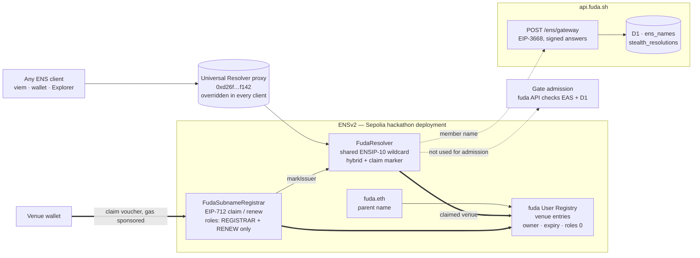
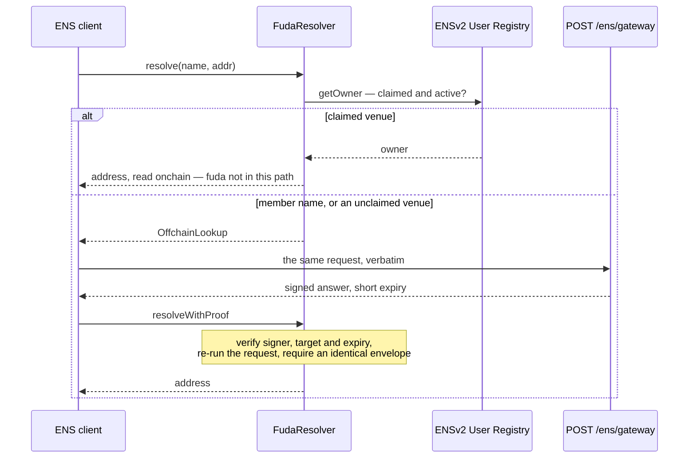

# ENS in fuda

**What fuda does.** A membership, a ticket or an event badge is normally a row in some vendor's database. fuda makes it a revocable on-chain record instead: a venue issues a right, a standard pass can be saved to Apple Wallet, Google Wallet or a browser, and the hosted scanner asks the fuda API to check EAS and enforce admission state in D1. +Private uses the member app's discovery and signature flow instead of Wallet delivery. Anyone can independently check on-chain validity; the hosted admission flow still uses fuda's API.

**Where ENS sits.** It names the two parties of that relationship — the venue that issues a right, and the member number printed on the pass — and nothing else. **ENS names the relationship; EAS proves the right.** No admission path calls ENS. The hosted gate calls the fuda API, which checks EAS by `eth_call`, enforces operational state in D1 and fails closed when required chain reads fail. A name is a display and destination layer on top of that, never an authority.

**Why two kinds of name.** The tree has two levels and they work in deliberately opposite ways. A venue's name is an entry it **owns onchain** in fuda's own ENSv2 User Registry, claimed with its own transaction. The standard card-claim flow writes a member name **offchain and free** as a best-effort side effect of issuance. It resolves once the mirror write succeeds and the venue namespace is active, without a separate member registration. Private issuance is not yet connected to this name-writing flow. The owned, expiring half belongs to the business; the free, disposable half belongs to people who will never hold an ENS key.

Built on the **ETHOnline 2026 ENSv2 beta deployment on Ethereum Sepolia**, not production ENS.



The registry and gateway serve different parts of the tree: **a claimed venue's address comes from the registry**, **a member's comes from the signed gateway**, and **the gate is on neither path**.

|  |  |
| --- | --- |
| [The two halves of the tree](#the-two-halves-of-the-tree) | What a venue name is, what a member name is, and why they differ |
| [What was built](#what-was-built) | The hybrid resolver, the voucher registrar, the gateway and mirror |
| [On the product's path](#on-the-products-path) | Which surfaces touch ENS, which deliberately do not |
| [Evidence](#evidence) | Deployed addresses, live names, and how to check them without trusting this page |
| [Reproduce it](#reproduce-it) | What runs offline, what needs an RPC, and how to resolve a name yourself |
| [Source map](#source-map) | Every file, one hop |

Deeper background: [naming spec](../specs/ens-naming.md) · [why one shared hybrid resolver (ADR 0005)](../adr/0005-hybrid-ensv2-resolver.md) · [why fuda keeps the registry root (ADR 0007)](../adr/0007-root-custody-of-the-issuer-registry.md)

## The two halves of the tree

|  | `<venue>.fuda.eth` | `<member-no>.<venue>.fuda.eth` |
| --- | --- | --- |
| Where it lives | an entry in fuda's own ENSv2 User Registry | offchain, in fuda's mirror, served by a signed CCIP-Read gateway |
| Who owns it | the venue's own wallet | nobody — the member holds no ENS key |
| What it costs | one transaction, sponsored through fuda’s ERC-7677 endpoint; Alchemy’s verifying paymaster pays | no member registration transaction |
| When it starts resolving | when the venue’s claim confirms | after standard issuance writes the mirror successfully, under an active venue namespace |
| When it stops | while expired or unregistered; no fallback to offchain venue data | when its mirror record is darkened on revoke or the claimed venue namespace becomes inactive |
| Transferable | no (role bitmap `0`) | n/a |

A venue can take custody of its identity; a member gets an addressable credential without being asked to become a crypto user.

A venue's public handle **is** its ENS label by construction — the same `isIssuerHandle` grammar validates both, so there is no mapping table between "the URL" and "the name". Members choose nothing: a member number is 12 random characters from a 28-character confusable-free alphabet plus one Luhn mod 28 check character, so it reveals no issue order and no member count.

**The +Private case — verified live with a manually provisioned name.** The ENS gateway can allocate a **fresh stealth address per gateway query** from a stored stealth meta-address and a per-name counter. It signs the result with a short expiry, returns `no-store` and does not publish an ERC-5564 Announcement. The allocation is recorded in D1. This rotates the returned address; it does not conceal the queried name from the gateway or make the gateway unaware of its allocations.

Current private rights are issued through the admin API without a venue association or member-name mirror write. The live verification uses a dedicated member-name mirror row manually provisioned for an existing private right and resolves it twice through the deployed ENS path. Automated venue-scoped private issuance and name creation remain unconnected. By contrast, the +Private member app already discovers and verifies EAS rights using an address created **per issued right**. ENS resolution would allocate separate destination addresses; it would not move an existing EAS right or rotate its holder on each entry. The device demonstration establishes discovery and signed admission; the separate [live viem capture](#live-private-name-resolution) establishes rotating ENS resolution.

## What was built

### 1. `FudaResolver` — one shared hybrid resolver

[`packages/ens-contracts/contracts/FudaResolver.sol`](../../packages/ens-contracts/contracts/FudaResolver.sol)

One ENSIP-10 wildcard resolver sits on `fuda.eth` and on every claimed venue entry, and it answers from two different places depending on what is being asked:



Three properties are worth stating precisely:

- **Gateway answers are authenticated and routing is rechecked.** `resolveWithProof` checks the target, expiry and a strict low-s signature from the authorized signer, then **re-executes the exact request against the resolver's current state** and requires the same `OffchainLookup` routing envelope. It trusts that signer for the offchain result; it does not independently verify the D1 record or recompute a stealth address.
- **A failed registry read never falls back offchain** (`testRegistryFailureNeverFallsBackOffchain`). Unavailable is not the same as unclaimed.
- **No offchain resurrection.** An append-only claim marker records that a namespace was once claimed; from then on, a venue namespace answers empty while expired or unregistered rather than reverting to stale hosted data. A valid renewal or re-registration can restore an active namespace; the marker prevents offchain fallback, not future registry ownership.

The resolver serves exactly two records — `addr(bytes32)` (`0x3b3b57de`) and `addr(bytes32,uint256)` coin type 60 (`0xf1cb7e06`). No `text`, no `contenthash`. A name here is a destination, not a profile.

In practice the offchain branch answers member names: nothing is mirrored for a venue until it claims, so an unclaimed venue name is routed offchain and comes back empty.

### 2. `FudaSubnameRegistrar` — claiming, without handing over revocation

[`packages/ens-contracts/contracts/FudaSubnameRegistrar.sol`](../../packages/ens-contracts/contracts/FudaSubnameRegistrar.sol)

One press in the dashboard. fuda signs the permission; the venue signs the transaction.

| Step | What happens |
| --- | --- |
| 1 | `POST /v1/issuers/me/ens/claim-voucher` — reads the registrar nonce fresh (so an abandoned prompt is simply retried at the same nonce), signs an EIP-712 `ClaimVoucher`, records the name as `voucher_issued` |
| 2 | The operator's own wallet submits `claim(voucher)` on Ethereum Sepolia as an ERC-4337 user operation. `POST /v1/ens/paymaster` is fuda's ERC-7677 endpoint: it accepts only a `claim` or `renew` on fuda's registrar, then forwards the request — with fuda's policy id — to **Alchemy's onchain verifying paymaster**, which signs and pays. fuda restricts; Alchemy pays; the venue never funds a wallet |
| 3 | `POST /v1/issuers/me/ens/claimed` — fetches the receipt, requires the registrar's own event in it, and only then records `claimed`. An unverifiable hash leaves the name pending, which is recoverable; recording an unconfirmed claim is not |

The nonce is consumed **before** the external registry call, so a revert rolls the whole thing back, and the EIP-712 domain is pinned to chain `11155111` at construction (`WrongChain`) so a voucher cannot be replayed onto another deployment.

Strip the paymaster and the claim still works — it just costs the venue gas. That is "decentralized at the core, hosted rails only for UX" in one object. The claim receipt shows this split: see [Live names](#live-names).

**What holds the permissions apart**, which is where a naming system usually cheats:

- The registrar receives only **`REGISTRAR | RENEW`** on the User Registry. Claim power therefore carries **no** revocation power: a compromised voucher signer could mint names it should not, but could not take any name down.
- Claimed entries are written with child role bitmap **`0`** — the venue cannot transfer the name or repoint its resolver or subregistry.
- **No principal holds `UNREGISTER`.**
- **Said plainly: a venue name is not censorship-resistant against fuda.** fuda's parent-owner key holds the admin bit and could grant `UNREGISTER` to itself. The root is kept rather than renounced for this deployment, and [ADR 0007](../adr/0007-root-custody-of-the-issuer-registry.md) records why. The honest sentence is "the venue owns it; fuda kept the root and wrote down why", not "fuda cannot take it back".
- A member name goes dark on revoke and a claimed venue name **does not**. That asymmetry is deliberate: tying an onchain unregister to revocation would hand revocation power to a live principal, which is exactly what the role split exists to prevent.

### 3. The gateway and the mirror

[`apps/api/src/ens/`](../../apps/api/src/ens)

`POST /ens/gateway` is the EIP-3668 endpoint the ENS client calls after the resolver returns `OffchainLookup`. It decodes the request, checks the `addr` selector and the node, looks the name up in the `ens_names` mirror, and signs the answer over `0x1900 ‖ resolver ‖ expires ‖ keccak(request) ‖ keccak(result)`.

[`mirror.ts`](../../apps/api/src/ens/mirror.ts) writes standard member names after card issuance, venue names on the claim path, and darkening on revoke. Member-name writes and darkening are best-effort: failures do not fail the underlying issuance or revocation, and the mirror may remain missing or stale. Issuer claim writes report failures to their route. [`resolution.ts`](../../apps/api/src/ens/resolution.ts) separately advances private resolution counters and records allocations in `stealth_resolutions`; ENS also has mutable state in its onchain registry.

## On the product's path

| Surface | ENS involvement |
| --- | --- |
| `POST /ens/gateway` on `api.fuda.sh` | The CCIP-Read gateway. Deliberately **outside** the `/v1` prefix: the URL is configured in the deployed resolver. Rate-limited to 120/h per IP, EIP-3668 shapes, `no-store` |
| Standard card issuance | Writes the member’s name into the mirror as a best-effort side effect; admin private issuance does not currently write a venue-scoped name |
| Revoke | Takes that member name dark |
| Dashboard | Shows the venue's name and runs the one-press claim |
| **Gate** | **Never calls ENS.** Names are never shown at the gate, never logged in Entry, never included in announcements |

Note what the dashboard row does _not_ say: it **prints** the name string the API returns. No fuda surface resolves a name through ENS. Every resolution shown as evidence below is done from a third-party client, which is stronger anyway — it is not fuda's own code answering.

## Evidence

The evidence below covers the deployed contracts, claimed venue, standard member name and rotating private member name.

### Deployed addresses

ETHOnline 2026 ENSv2 beta deployment, Ethereum Sepolia (`11155111`) — **not** production ENS. All 40 hackathon addresses are pinned in [`deployment.ts`](../../packages/ens-contracts/src/deployment.ts) as one indivisible address family with their runtime code hashes, and preflight refuses to run against a wrong chain, a mixed address family, or changed runtime code.

| Item | Value |
| --- | --- |
| Universal Resolver override | `0xd26f2040d083af1cd2962ba303f4bea0c4faf142` (`UpgradableUniversalResolverProxy`) |
| Parent name | `fuda.eth` |
| fuda User Registry | `0xBf987666C8e4e78d3226aA86A9A7FE141F63C99D` |
| `FudaResolver` | `0x133e6eeb3eAf0F804FbB9c1536AcA090B36A93AB` |
| `FudaSubnameRegistrar` | `0x58AF04ff5e6DAB45ECD17bD38fC4f4BBa45778B9` |
| Parent owner / registry root | `0x5A89D95Ad9f964C75F4Adc2122ADb70Cc6607Cd4` |
| Voucher signer | `0x5c5DE7F78d90701066f5C52e8100B5e2c73845F9` |
| Gateway signer | `0xf0D345D00fA513D92ACCbc10Db721792577FcF9f` |
| Gateway URL in the resolver | `https://api.fuda.sh/ens/gateway` |

The voucher signer, the gateway signer and the EAS issuer key are three separate keys.

`ens:verify` checks the deployed topology through a public Sepolia RPC using the addresses above:

```json
{
  "chainId": 11155111,
  "parentName": "fuda.eth",
  "parentNode": "0xb966af14f29d73e4a56d2b2db08c22ff89b7e594eaf18b02a5bb452aec27e5ff",
  "parentAddress": "0x5A89D95Ad9f964C75F4Adc2122ADb70Cc6607Cd4",
  "userRegistryAddress": "0xBf987666C8e4e78d3226aA86A9A7FE141F63C99D",
  "resolverAddress": "0x133e6eeb3eAf0F804FbB9c1536AcA090B36A93AB",
  "registrarAddress": "0x58AF04ff5e6DAB45ECD17bD38fC4f4BBa45778B9",
  "registrarRoles": "65537",
  "voucherSigner": "0x5c5DE7F78d90701066f5C52e8100B5e2c73845F9",
  "gatewaySigner": "0xf0D345D00fA513D92ACCbc10Db721792577FcF9f",
  "gatewayUrls": ["https://api.fuda.sh/ens/gateway"],
  "status": "verified"
}
```

`registrarRoles` `65537` is `REGISTRAR | RENEW` and nothing else — the line that carries the access-control argument above. The report also re-asserts the exact root role bitmap (`setupRoles`, omitted here as a 78-digit integer); a mismatch fails the run.

### Live names

The venue and standard member name below were verified through registry reads and a plain viem client with the hackathon Universal Resolver override.

**The claimed venue — `ethonline2026.fuda.eth`**, the venue behind [`app.fuda.sh/@ethonline2026`](https://app.fuda.sh/@ethonline2026).

|  |  |
| --- | --- |
| Claim transaction | [`0x183ea8e80230ae753dd922b3d765a810c17a9493f567d24f826b5917a0647f39`](https://sepolia.etherscan.io/tx/0x183ea8e80230ae753dd922b3d765a810c17a9493f567d24f826b5917a0647f39) — Sepolia block 11687641, `IssuerClaimed(labelHash = keccak("ethonline2026"), issuer, tokenId, expiry, nonce 0)` |
| Owner, read back with `getOwner(tokenId)` | `0x79644701D0e1Ba5b196dE910D34C2Eec2bF2872a` — the venue's own dashboard wallet, the account that runs this venue and controls its members' rights |
| Role bitmap, read back with `roles(tokenId, owner)` | **`0`** — non-transferable, resolver and subregistry locked |
| Expiry, read back with `getExpiry(tokenId)` | `1820736366` = 2027-09-12T08:06:06Z |
| Resolver / subregistry on the entry | `FudaResolver` `0x133e6eeb…93AB` / `0x0000…0000` — the shared hybrid resolver, no subregistry, exactly what the registrar writes |
| Who paid | The receipt's `UserOperationEvent` (EntryPoint `0x5FF137D4…2789`): `sender` = the venue wallet above, **`paymaster` = `0xC03Aac639Bb21233e0139381970328dB8bcEeB67`** (Alchemy's Sepolia onchain paymaster), `success = true`, `actualGasCost` = 668 298 012 319 140 wei; submitted by a bundler (`0x7c25ef85…74c7`), not by the venue |
| Resolved from a third-party client | viem with the hackathon Universal Resolver override: `getEnsAddress({ name: 'ethonline2026.fuda.eth' })` → `0x79644701D0e1Ba5b196dE910D34C2Eec2bF2872a`, answered from the registry — fuda not on the path |

**The member name — `c8hnrypq5ngpa.ethonline2026.fuda.eth`**, printed on the pass as member number `C8HN-RYPQ-5NGPA`, written offchain the instant the right was issued.

|  |  |
| --- | --- |
| The right it names | EAS attestation `0x5ccd4917252d19d9cf80ecff496954881744566dcc74ba2bc5d13071775aa4b3` on Base Sepolia, `GET /v1/verify/<uid>` → `ADMIT` |
| Resolved from a third-party client | `getEnsAddress({ name: 'c8hnrypq5ngpa.ethonline2026.fuda.eth' })` → `0x8cF3e1Ea8b84A1F20da47C98e02B7D9F3FE8c833` — the right's holder, in about half a second |
| How that answer was produced | The name has no registry entry, so the resolver returned `OffchainLookup`; the client called `POST /ens/gateway`; the resolver's `resolveWithProof` verified the signed envelope and re-executed the request before answering. |
| Registered anywhere | No. Nobody owns this name and nobody paid for it |

### Live +Private name resolution

A plain viem **2.56.3** client resolved the same private member name twice
through the hackathon Universal Resolver and deployed signed CCIP-Read gateway.
Both returned valid, nonzero addresses, and the addresses differed.

| Item | Captured value |
| --- | --- |
| Name | `qfkcx9h7dgnte.ethonline2026.fuda.eth` |
| Query 1 | `0x3e4151d574070C956AB08a89E50FBC54AF8E7aB2` |
| Query 2 | `0x84692a5507BAc9EB3DBFB2969FAfBe6dB1585630` |
| Ethereum Sepolia block at start/end | `11695771` / `11695771` |
| Universal Resolver | `0xd26f2040d083af1cd2962ba303f4bea0c4faf142` |
| Gateway | `POST https://api.fuda.sh/ens/gateway`, HTTP 200 on both queries |
| Existing Base Sepolia right | [`0xf9e9c1bf…fb025c`](https://base-sepolia.easscan.org/attestation/view/0xf9e9c1bf7df42097c29048b4497a857c4c8a966ef4d870c2ead1b6fbc3fb025c) |
| Provisioning | One manually added `ens_names` row with `level = private`, a generated member number, the existing right UID and its recipient's stealth meta-address |
| Post-check | Resolution counter `2`; allocation nonces `0` and `1` match the two viem addresses; the original right still returns `ADMIT` |
| Implementation commit | [`9755bd9`](https://github.com/oboroxyz/fuda-sh/commit/9755bd9505077b7dc1298bff4624b75fec51c684) |

The venue name was already claimed. The preparation added only a dedicated
name mirror row; it did not reissue or revoke the right, change its EAS holder,
or change the original member row's `issuerId` / `cardId` (both remain null).
The returned ENS destinations are separate from the right's existing holder.

**What this proves:** the deployed Universal Resolver → `FudaResolver` →
CCIP-Read gateway → `resolveWithProof` path returns rotating private addresses
through viem. The signed offchain answer is authenticated by the resolver;
its content still relies on the authorized gateway signer.

**What remains unconnected:** automatic creation of this name through
venue-scoped private issuance. This is live integration evidence from manually
prepared data, separate from the phone's discovery / signed-admission capture.
The video does not need to show these queries for this evidence to be valid.

To repeat with the client configured in [Reproduce it](#reproduce-it):

```ts
const name = 'qfkcx9h7dgnte.ethonline2026.fuda.eth'
const first = await client.getEnsAddress({ name })
const second = await client.getEnsAddress({ name })
if (!first || !second || first.toLowerCase() === second.toLowerCase()) {
  throw new Error('Expected two different private ENS addresses')
}
console.log({ name, first, second })
```

Repeating the queries creates new allocation rows and advances the gateway's
D1 counter; it does not consume or revoke the right. Future answers will differ
from the recorded results above.

### Verify it independently

The venue registry entry can be checked independently of fuda’s API. Member-name resolution uses the signed gateway as described above. Open the hackathon ENS Explorer — <https://hackathon-deployment-portal-app.ens-cf.workers.dev/> — and enter `ethonline2026.fuda.eth`: the entry shows its owner, its resolver, its role bitmap and its expiry directly from the registry. Or resolve it from your own client: [Reproduce it](#reproduce-it).

## Reproduce it

### From a clean clone, no network

```sh
pnpm install --frozen-lockfile

# resolver + registrar: 70 Hardhat 3 Solidity test functions, plus the
# TypeScript suite covering the pinned manifest, preflight and vouchers
pnpm --filter @fuda/ens-contracts test

# the gateway, the mirror, the lookup and the +Private allocation,
# including hex vectors shared with the Solidity suite
pnpm --filter api test
```

The shared vectors are the point of that last line: `conformance.test.ts` and the Solidity suite assert the same bytes, so the gateway and the resolver cannot drift on the wire format.

### Against the live deployment, read-only

Needs an Ethereum Sepolia RPC URL and nothing else — no keys, no secrets. Preflight checks the chain id, the Universal Resolver override, every runtime code hash and address-family purity; verify re-reads the deployed topology, including the exact root role bitmap:

```sh
ENS_RPC_URL=https://… pnpm --filter @fuda/ens-contracts ens:preflight

ENS_RPC_URL=https://… \
ENS_PARENT_ADDRESS=0x5A89D95Ad9f964C75F4Adc2122ADb70Cc6607Cd4 \
ENS_VOUCHER_SIGNER_ADDRESS=0x5c5DE7F78d90701066f5C52e8100B5e2c73845F9 \
ENS_GATEWAY_SIGNER_ADDRESS=0xf0D345D00fA513D92ACCbc10Db721792577FcF9f \
ENS_USER_REGISTRY_ADDRESS=0xBf987666C8e4e78d3226aA86A9A7FE141F63C99D \
ENS_RESOLVER_ADDRESS=0x133e6eeb3eAf0F804FbB9c1536AcA090B36A93AB \
ENS_REGISTRAR_ADDRESS=0x58AF04ff5e6DAB45ECD17bD38fC4f4BBa45778B9 \
  pnpm --filter @fuda/ens-contracts ens:verify
```

Every value on that command line is public and appears in [Deployed addresses](#deployed-addresses) above.

### Resolve a name yourself

**viem ships production ENS addresses.** Against this deployment they resolve the wrong tree, so the Universal Resolver must be overridden — once, in the chain definition. `ENS_HACKATHON_CHAIN` does it, and preflight asserts it:

```ts
import { createPublicClient, http } from 'viem'
import { ENS_HACKATHON_CHAIN } from '@fuda/ens-contracts'

const client = createPublicClient({
  chain: ENS_HACKATHON_CHAIN, // sepolia + the hackathon Universal Resolver
  transport: http(),
})

// a venue's name → the venue's own wallet, read from the ENSv2 User Registry
await client.getEnsAddress({ name: '<venue>.fuda.eth' })

// a member number from a pass → that member's address, answered offchain
await client.getEnsAddress({ name: '<member-no>.<venue>.fuda.eth' })

// The manually provisioned private name is demonstrated above;
// automatic venue-scoped private issuance is still unconnected.
```

The verified results are: `ethonline2026.fuda.eth` answers `0x79644701D0e1Ba5b196dE910D34C2Eec2bF2872a` and `c8hnrypq5ngpa.ethonline2026.fuda.eth` answers `0x8cF3e1Ea8b84A1F20da47C98e02B7D9F3FE8c833` — the two values recorded in [Live names](#live-names). Rerun the calls with the override set to establish current state.

## Source map

**Contracts** — [`packages/ens-contracts/contracts/`](../../packages/ens-contracts/contracts)

| File | What |
| --- | --- |
| [`FudaResolver.sol`](../../packages/ens-contracts/contracts/FudaResolver.sol) | `resolve` — DNS-wire name → ancestor namehashes → nearest claim marker → `getOwner` → onchain answer, selector-specific empty, or `OffchainLookup`. `resolveWithProof` — verify target, expiry, low-s signature and signer, then re-staticcall and require an identical envelope. `markIssuer` — registrar-only, append-only |
| [`FudaSubnameRegistrar.sol`](../../packages/ens-contracts/contracts/FudaSubnameRegistrar.sol) | `claim` / `renew` / `setVoucherSigner`; EIP-712 domain pinned to chain 11155111 at construction; registers `owner=issuer, subregistry=0, resolver=shared, roles=0`, then `markIssuer` |
| [`interfaces/IUserRegistry.sol`](../../packages/ens-contracts/contracts/interfaces/IUserRegistry.sol) | the entire ENSv2 surface fuda consumes: `register`, `renew`, `getOwner` |
| [`libraries/FudaECDSA.sol`](../../packages/ens-contracts/contracts/libraries/FudaECDSA.sol) | strict 65-byte low-s recovery, shared by both contracts |
| [`test/`](../../packages/ens-contracts/test) | 70 Solidity test functions, including `testActiveClaimedIssuerLegacyAddrComesFromRegistry`, `testRegistryFailureNeverFallsBackOffchain`, `testRegisteredIssuerHasNoTransferRole`, `testInactiveClaimedIssuerReturnsSelectorSpecificEmptyAddresses`, `testRejectsWrongChainAtConstruction`, `testAcceptsTypeScriptConformanceVector` |

**Deployment manifest and tooling** — [`packages/ens-contracts/src/`](../../packages/ens-contracts/src)

| File | What |
| --- | --- |
| [`deployment.ts`](../../packages/ens-contracts/src/deployment.ts) | the 40 pinned hackathon addresses, their runtime code hashes, `ENS_HACKATHON_CHAIN` (the Universal Resolver override), and the Enhanced Access Control bit layout |
| [`vouchers.ts`](../../packages/ens-contracts/src/vouchers.ts) | `claimVoucherTypedData`, `renewVoucherTypedData`, and `toRegistryExpiry` (fuda's inclusive validity → the registry's exclusive `uint64` bound) |
| [`deploy/preflight.ts`](../../packages/ens-contracts/src/deploy/preflight.ts) | read-only: chain id, Universal Resolver override, runtime code hashes, address-family purity, parent availability |
| [`deploy/topology.ts`](../../packages/ens-contracts/src/deploy/topology.ts) | resumable deployment of the resolver and registrar, resolver set on the parent, `REGISTRAR \| RENEW` granted |
| [`deploy/verify.ts`](../../packages/ens-contracts/src/deploy/verify.ts) | the standalone read-only topology check behind `ens:verify` |

**Gateway, mirror and claim** — [`apps/api/src/ens/`](../../apps/api/src/ens)

| File | What |
| --- | --- |
| [`routes/ens-gateway.ts`](../../apps/api/src/routes/ens-gateway.ts) | `POST /ens/gateway`: sender allowlist, rate limit, EIP-3668 error shapes, `no-store` |
| [`gateway.ts`](../../apps/api/src/ens/gateway.ts) | decode `resolve(bytes,bytes)`, DNS name, `addr` selector and node check, lookup, sign |
| [`lookup.ts`](../../apps/api/src/ens/lookup.ts) | answers only `offchain` and `claimed` rows, expiry-aware |
| [`mirror.ts`](../../apps/api/src/ens/mirror.ts) | every mirror write in the product: member names at issuance, venue names on the claim path, darkening on revoke |
| [`resolution.ts`](../../apps/api/src/ens/resolution.ts) | the +Private path: counter reservation, HMAC-derived ephemeral key, ERC-5564 stealth address |
| [`routes/ens-claim.ts`](../../apps/api/src/routes/ens-claim.ts) | voucher signing, receipt-confirmed recording, paymaster sponsorship |
| [`conformance.test.ts`](../../apps/api/src/ens/conformance.test.ts) | hex vectors shared with the Solidity suite |

Handle and member-number grammar are shared by every surface: [`packages/sdk/src/member-number.ts`](../../packages/sdk/src/member-number.ts).
