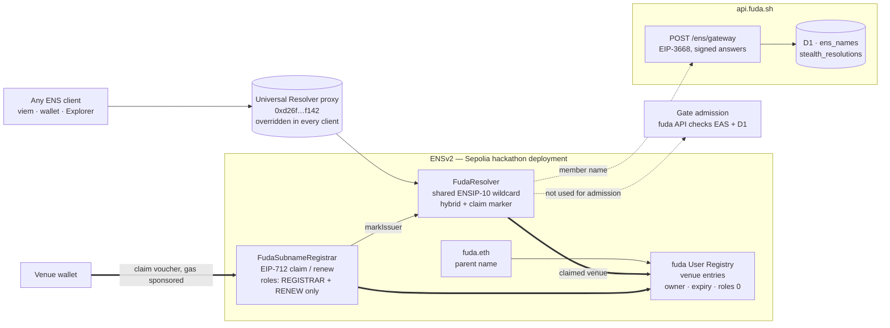
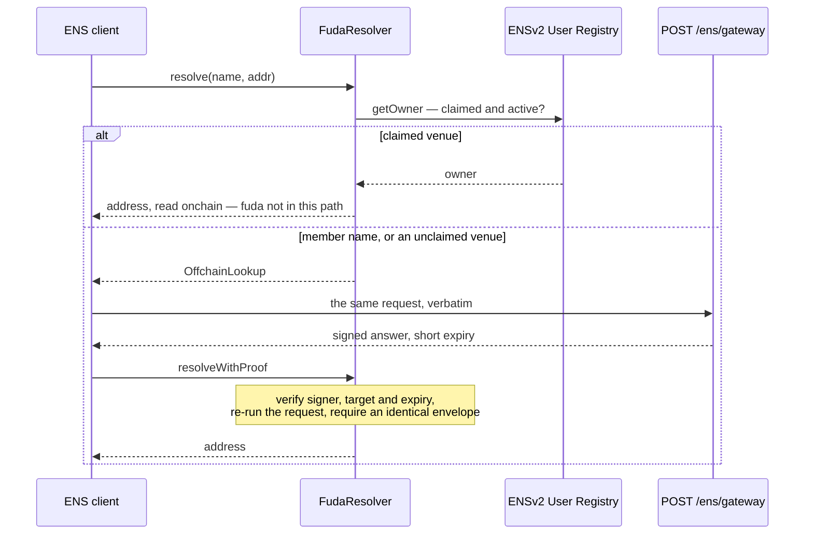

# ENS in fuda

**What fuda does.** A membership, a ticket or an event badge becomes a revocable on-chain record: a venue issues a right, a standard pass goes to Apple Wallet, Google Wallet or a browser, and the hosted scanner asks the fuda API to check EAS and enforce admission state in D1. +Private uses the member app's discovery and signature flow instead.

**Where ENS sits.** It names the two parties of that relationship — the venue that issues a right and the member number printed on the pass — and nothing else. **ENS names the relationship; EAS proves the right.** No admission path calls ENS. A name is a display and destination layer, never an authority.

**Why two kinds of name.** A venue's name is an entry it **owns onchain** in fuda's own ENSv2 User Registry, claimed with its own transaction. A member's name is written **offchain and free** as a best-effort side effect of standard issuance, so people who will never hold an ENS key still get an addressable credential. Private issuance is not yet connected to this name-writing flow.

Built on the **ETHOnline 2026 ENSv2 beta deployment on Ethereum Sepolia**, not production ENS.



**A claimed venue's address comes from the registry, a member's from the signed gateway, and the gate is on neither path.**

Deeper background: [naming spec](../specs/ens-naming.md) · [why one shared hybrid resolver (ADR 0005)](../adr/0005-hybrid-ensv2-resolver.md) · [why fuda keeps the registry root (ADR 0007)](../adr/0007-root-custody-of-the-issuer-registry.md)

## The two halves of the tree

|  | `<venue>.fuda.eth` | `<member-no>.<venue>.fuda.eth` |
| --- | --- | --- |
| Where it lives | fuda's own ENSv2 User Registry | offchain mirror, served by a signed CCIP-Read gateway |
| Who owns it | the venue's own wallet | nobody — the member holds no ENS key |
| What it costs | one transaction, sponsored via fuda's ERC-7677 endpoint; Alchemy's paymaster pays | nothing |
| Resolves | once the claim confirms, while unexpired; no offchain fallback | once standard issuance writes the mirror, under an active venue namespace |
| Goes dark | while expired or unregistered | on revoke, or when the venue namespace becomes inactive |
| Transferable | no (role bitmap `0`) | n/a |

A venue's public handle **is** its ENS label: the same `isIssuerHandle` grammar validates both. A member number is 12 random characters from a 28-character confusable-free alphabet plus a Luhn mod 28 check character, so it reveals no issue order and no member count.

**+Private.** The gateway can allocate a **fresh stealth address per query** from a stored stealth meta-address and a per-name counter, signed with a short expiry, `no-store`, without publishing an ERC-5564 Announcement. This rotates the returned address; it does not conceal the queried name from the gateway. Today private rights are issued through the admin API without a member-name mirror write, so the live evidence in [Live +Private name resolution](#live-private-name-resolution) uses a manually provisioned mirror row for an existing right. Automated private name creation remains unconnected.

## What was built

### 1. `FudaResolver` — one shared hybrid resolver

[`packages/ens-contracts/contracts/FudaResolver.sol`](../../packages/ens-contracts/contracts/FudaResolver.sol)

One ENSIP-10 wildcard resolver sits on `fuda.eth` and every claimed venue entry, answering from the registry or from the gateway depending on the name:



- **Gateway answers are authenticated and routing is rechecked.** `resolveWithProof` checks target, expiry and a strict low-s signature from the authorized signer, then re-executes the request against current state and requires the same `OffchainLookup` envelope. It trusts that signer for the offchain result; it does not verify the D1 record itself.
- **A failed registry read never falls back offchain** (`testRegistryFailureNeverFallsBackOffchain`). Unavailable is not unclaimed.
- **No offchain resurrection.** An append-only claim marker means a once-claimed venue namespace answers empty while expired or unregistered, instead of reverting to stale hosted data. Renewal or re-registration restores it.

The resolver serves only `addr(bytes32)` and `addr(bytes32,uint256)` coin type 60. No `text`, no `contenthash`: a name here is a destination, not a profile.

### 2. `FudaSubnameRegistrar` — claiming, without handing over revocation

[`packages/ens-contracts/contracts/FudaSubnameRegistrar.sol`](../../packages/ens-contracts/contracts/FudaSubnameRegistrar.sol)

One press in the dashboard. fuda signs the permission; the venue signs the transaction.

| Step | What happens |
| --- | --- |
| 1 | `POST /v1/issuers/me/ens/claim-voucher` reads the registrar nonce fresh, signs an EIP-712 `ClaimVoucher`, records `voucher_issued` |
| 2 | The venue's wallet submits `claim(voucher)` as an ERC-4337 user operation. `POST /v1/ens/paymaster` (ERC-7677) accepts only `claim` or `renew` on fuda's registrar and forwards to **Alchemy's verifying paymaster**, which pays. Strip it and the claim still works; it just costs the venue gas |
| 3 | `POST /v1/issuers/me/ens/claimed` fetches the receipt, requires the registrar's own event, and only then records `claimed` |

The nonce is consumed before the registry call, so a revert rolls everything back, and the EIP-712 domain is pinned to chain `11155111` at construction, so a voucher cannot be replayed onto another deployment.

**What holds the permissions apart:**

- The registrar holds only **`REGISTRAR | RENEW`** on the User Registry: claim power carries **no** revocation power.
- Claimed entries get child role bitmap **`0`**: the venue cannot transfer the name or repoint its resolver.
- **No principal holds `UNREGISTER`.** But said plainly: **a venue name is not censorship-resistant against fuda.** The parent-owner key holds the admin bit and could grant `UNREGISTER` to itself. The root is kept, not renounced, and [ADR 0007](../adr/0007-root-custody-of-the-issuer-registry.md) records why.
- A member name goes dark on revoke; a claimed venue name does not. Tying an onchain unregister to revocation would hand revocation power to a live principal, which is what the role split prevents.

### 3. The gateway and the mirror

[`apps/api/src/ens/`](../../apps/api/src/ens)

`POST /ens/gateway` is the EIP-3668 endpoint: it decodes the request, checks the `addr` selector and node, looks the name up in the `ens_names` mirror, and signs the answer over `0x1900 ‖ resolver ‖ expires ‖ keccak(request) ‖ keccak(result)`. [`mirror.ts`](../../apps/api/src/ens/mirror.ts) writes member names after standard issuance, venue names on the claim path, and darkening on revoke. Member-name writes and darkening are best-effort: they never fail the underlying issuance or revocation, and the mirror may remain missing or stale. [`resolution.ts`](../../apps/api/src/ens/resolution.ts) advances private resolution counters and records allocations in `stealth_resolutions`.

## On the product's path

| Surface | ENS involvement |
| --- | --- |
| `POST /ens/gateway` on `api.fuda.sh` | The CCIP-Read gateway, outside `/v1` because its URL is configured in the deployed resolver. 120/h per IP, `no-store` |
| Standard card issuance | Writes the member's name into the mirror, best-effort |
| Revoke | Takes that member name dark |
| Dashboard | Shows the venue's name and runs the one-press claim |
| **Gate** | **Never calls ENS.** Names are never shown at the gate, never logged in Entry, never included in announcements |

No fuda surface resolves a name through ENS; the dashboard prints the string the API returns. Every resolution below was done from a third-party client.

## Evidence

### Deployed addresses

ETHOnline 2026 ENSv2 beta deployment, Ethereum Sepolia (`11155111`), **not** production ENS. All 40 hackathon addresses are pinned in [`deployment.ts`](../../packages/ens-contracts/src/deployment.ts) with their runtime code hashes; preflight refuses a wrong chain, a mixed address family, or changed runtime code.

| Item                         | Value                                        |
| ---------------------------- | -------------------------------------------- |
| Universal Resolver override  | `0xd26f2040d083af1cd2962ba303f4bea0c4faf142` |
| Parent name                  | `fuda.eth`                                   |
| fuda User Registry           | `0xBf987666C8e4e78d3226aA86A9A7FE141F63C99D` |
| `FudaResolver`               | `0x133e6eeb3eAf0F804FbB9c1536AcA090B36A93AB` |
| `FudaSubnameRegistrar`       | `0x58AF04ff5e6DAB45ECD17bD38fC4f4BBa45778B9` |
| Parent owner / registry root | `0x5A89D95Ad9f964C75F4Adc2122ADb70Cc6607Cd4` |
| Voucher signer               | `0x5c5DE7F78d90701066f5C52e8100B5e2c73845F9` |
| Gateway signer               | `0xf0D345D00fA513D92ACCbc10Db721792577FcF9f` |
| Gateway URL in the resolver  | `https://api.fuda.sh/ens/gateway`            |

The voucher signer, the gateway signer and the EAS issuer key are three separate keys. `ens:verify` re-reads this topology from a public Sepolia RPC and reports `status: verified` with `registrarRoles: 65537`, which is `REGISTRAR | RENEW` and nothing else.

### Live names

**The claimed venue, `ethonline2026.fuda.eth`**, behind [`app.fuda.sh/@ethonline2026`](https://app.fuda.sh/@ethonline2026).

|  |  |
| --- | --- |
| Claim transaction | [`0x183ea8e8…647f39`](https://sepolia.etherscan.io/tx/0x183ea8e80230ae753dd922b3d765a810c17a9493f567d24f826b5917a0647f39), Sepolia block 11687641, `IssuerClaimed(labelHash = keccak("ethonline2026"), …, nonce 0)` |
| Owner (`getOwner`) | `0x79644701D0e1Ba5b196dE910D34C2Eec2bF2872a`, the venue's own dashboard wallet |
| Roles (`roles(tokenId, owner)`) | **`0`**: non-transferable, resolver and subregistry locked |
| Expiry (`getExpiry`) | `1820736366` = 2027-09-12T08:06:06Z |
| Resolver / subregistry | `FudaResolver` / `0x0000…0000` |
| Who paid | `UserOperationEvent`: `sender` = the venue wallet, **`paymaster` = `0xC03Aac639Bb21233e0139381970328dB8bcEeB67`** (Alchemy's Sepolia paymaster), `success = true`; submitted by a bundler, not the venue |
| Resolved by viem | `getEnsAddress({ name: 'ethonline2026.fuda.eth' })` → `0x79644701D0e1Ba5b196dE910D34C2Eec2bF2872a`, from the registry, fuda not on the path |

**The member name, `c8hnrypq5ngpa.ethonline2026.fuda.eth`**, printed on the pass as `C8HN-RYPQ-5NGPA`, written offchain when the right was issued.

|  |  |
| --- | --- |
| The right it names | EAS attestation `0x5ccd4917252d19d9cf80ecff496954881744566dcc74ba2bc5d13071775aa4b3` on Base Sepolia, `GET /v1/verify/<uid>` → `ADMIT` |
| Resolved by viem | `getEnsAddress({ name: 'c8hnrypq5ngpa.ethonline2026.fuda.eth' })` → `0x8cF3e1Ea8b84A1F20da47C98e02B7D9F3FE8c833`, the right's holder, via `OffchainLookup` → gateway → `resolveWithProof` |
| Registered anywhere | No. Nobody owns this name and nobody paid for it |

### Live +Private name resolution

A plain viem 2.56.3 client resolved the same private member name twice through the hackathon Universal Resolver and the deployed gateway. Both answers were valid, nonzero and different.

| Item | Captured value |
| --- | --- |
| Name | `qfkcx9h7dgnte.ethonline2026.fuda.eth` |
| Query 1 / Query 2 | `0x3e4151d574070C956AB08a89E50FBC54AF8E7aB2` / `0x84692a5507BAc9EB3DBFB2969FAfBe6dB1585630` |
| Sepolia block | `11695771` for both |
| Gateway | `POST https://api.fuda.sh/ens/gateway`, HTTP 200 on both |
| Underlying right | [`0xf9e9c1bf…fb025c`](https://base-sepolia.easscan.org/attestation/view/0xf9e9c1bf7df42097c29048b4497a857c4c8a966ef4d870c2ead1b6fbc3fb025c) on Base Sepolia, still `ADMIT` afterwards |
| Provisioning | One manually added `ens_names` row (`level = private`) with a generated member number, the right UID and its recipient's stealth meta-address |
| Post-check | Resolution counter `2`; allocation nonces `0` and `1` match the two addresses |
| Implementation commit | [`9755bd9`](https://github.com/oboroxyz/fuda-sh/commit/9755bd9505077b7dc1298bff4624b75fec51c684) |

**What this proves:** the deployed Universal Resolver → `FudaResolver` → gateway → `resolveWithProof` path returns rotating private addresses to an ordinary client. The two addresses are destinations allocated per query; they are not the right's EAS holder, which is unchanged. The answer is authenticated by the resolver; its content still relies on the authorized gateway signer. **What remains unconnected:** automatic creation of this name through private issuance. Repeating the two queries yields new addresses and advances the counter; it does not consume or revoke the right.

### Verify it independently

Open the hackathon ENS Explorer, <https://hackathon-deployment-portal-app.ens-cf.workers.dev/>, and enter `ethonline2026.fuda.eth`: owner, resolver, role bitmap and expiry come straight from the registry. Or resolve any of the names above from your own client, below.

## Reproduce it

### From a clean clone, no network

```sh
pnpm install --frozen-lockfile

# resolver + registrar: 70 Hardhat 3 Solidity test functions, plus the
# TypeScript suite covering the pinned manifest, preflight and vouchers
pnpm --filter @fuda/ens-contracts test

# the gateway, the mirror, the lookup and the +Private allocation,
# including hex vectors shared with the Solidity suite
pnpm --filter api test
```

`conformance.test.ts` and the Solidity suite assert the same bytes, so the gateway and the resolver cannot drift on the wire format.

### Against the live deployment, read-only

Needs only an Ethereum Sepolia RPC URL. Every other value is public and listed in [Deployed addresses](#deployed-addresses).

```sh
ENS_RPC_URL=https://… pnpm --filter @fuda/ens-contracts ens:preflight

ENS_RPC_URL=https://… \
ENS_PARENT_ADDRESS=0x5A89D95Ad9f964C75F4Adc2122ADb70Cc6607Cd4 \
ENS_VOUCHER_SIGNER_ADDRESS=0x5c5DE7F78d90701066f5C52e8100B5e2c73845F9 \
ENS_GATEWAY_SIGNER_ADDRESS=0xf0D345D00fA513D92ACCbc10Db721792577FcF9f \
ENS_USER_REGISTRY_ADDRESS=0xBf987666C8e4e78d3226aA86A9A7FE141F63C99D \
ENS_RESOLVER_ADDRESS=0x133e6eeb3eAf0F804FbB9c1536AcA090B36A93AB \
ENS_REGISTRAR_ADDRESS=0x58AF04ff5e6DAB45ECD17bD38fC4f4BBa45778B9 \
  pnpm --filter @fuda/ens-contracts ens:verify
```

### Resolve a name yourself

viem ships production ENS addresses, so the Universal Resolver must be overridden once in the chain definition. `ENS_HACKATHON_CHAIN` does that:

```ts
import { createPublicClient, http } from 'viem'
import { ENS_HACKATHON_CHAIN } from '@fuda/ens-contracts'

const client = createPublicClient({ chain: ENS_HACKATHON_CHAIN, transport: http() })

await client.getEnsAddress({ name: 'ethonline2026.fuda.eth' })
// → 0x79644701D0e1Ba5b196dE910D34C2Eec2bF2872a, from the registry

await client.getEnsAddress({ name: 'c8hnrypq5ngpa.ethonline2026.fuda.eth' })
// → 0x8cF3e1Ea8b84A1F20da47C98e02B7D9F3FE8c833, answered offchain

const name = 'qfkcx9h7dgnte.ethonline2026.fuda.eth'
const first = await client.getEnsAddress({ name })
const second = await client.getEnsAddress({ name })
// first !== second: a fresh stealth address per query
```

Rerun the calls to establish current state; the private name will answer new addresses each time.

## Source map

**Contracts** — [`packages/ens-contracts/contracts/`](../../packages/ens-contracts/contracts)

| File | What |
| --- | --- |
| [`FudaResolver.sol`](../../packages/ens-contracts/contracts/FudaResolver.sol) | `resolve`: name → nearest claim marker → `getOwner` → onchain answer, selector-specific empty, or `OffchainLookup`. `resolveWithProof`: verify, re-staticcall, require an identical envelope. `markIssuer`: registrar-only, append-only |
| [`FudaSubnameRegistrar.sol`](../../packages/ens-contracts/contracts/FudaSubnameRegistrar.sol) | `claim` / `renew` / `setVoucherSigner`; EIP-712 domain pinned to chain 11155111; registers `owner=issuer, subregistry=0, resolver=shared, roles=0`, then `markIssuer` |
| [`interfaces/IUserRegistry.sol`](../../packages/ens-contracts/contracts/interfaces/IUserRegistry.sol) | the entire ENSv2 surface fuda consumes: `register`, `renew`, `getOwner` |
| [`libraries/FudaECDSA.sol`](../../packages/ens-contracts/contracts/libraries/FudaECDSA.sol) | strict 65-byte low-s recovery, shared by both contracts |
| [`test/`](../../packages/ens-contracts/test) | 70 Solidity test functions, e.g. `testRegistryFailureNeverFallsBackOffchain`, `testRegisteredIssuerHasNoTransferRole`, `testRejectsWrongChainAtConstruction`, `testAcceptsTypeScriptConformanceVector` |

**Deployment manifest and tooling** — [`packages/ens-contracts/src/`](../../packages/ens-contracts/src)

| File | What |
| --- | --- |
| [`deployment.ts`](../../packages/ens-contracts/src/deployment.ts) | the 40 pinned hackathon addresses and code hashes, `ENS_HACKATHON_CHAIN`, the Enhanced Access Control bit layout |
| [`vouchers.ts`](../../packages/ens-contracts/src/vouchers.ts) | `claimVoucherTypedData`, `renewVoucherTypedData`, `toRegistryExpiry` |
| [`deploy/preflight.ts`](../../packages/ens-contracts/src/deploy/preflight.ts) | read-only: chain id, Universal Resolver override, code hashes, address-family purity |
| [`deploy/topology.ts`](../../packages/ens-contracts/src/deploy/topology.ts) | resumable deployment; resolver set on the parent; `REGISTRAR \| RENEW` granted |
| [`deploy/verify.ts`](../../packages/ens-contracts/src/deploy/verify.ts) | the read-only topology check behind `ens:verify` |

**Gateway, mirror and claim** — [`apps/api/src/ens/`](../../apps/api/src/ens)

| File | What |
| --- | --- |
| [`routes/ens-gateway.ts`](../../apps/api/src/routes/ens-gateway.ts) | `POST /ens/gateway`: rate limit, EIP-3668 error shapes, `no-store` |
| [`gateway.ts`](../../apps/api/src/ens/gateway.ts) | decode `resolve(bytes,bytes)`, check selector and node, lookup, sign |
| [`lookup.ts`](../../apps/api/src/ens/lookup.ts) | answers only `offchain` and `claimed` rows, expiry-aware |
| [`mirror.ts`](../../apps/api/src/ens/mirror.ts) | member names at issuance, venue names on claim, darkening on revoke |
| [`resolution.ts`](../../apps/api/src/ens/resolution.ts) | the +Private path: counter reservation, HMAC-derived ephemeral key, ERC-5564 stealth address |
| [`routes/ens-claim.ts`](../../apps/api/src/routes/ens-claim.ts) | voucher signing, receipt-confirmed recording, paymaster sponsorship |
| [`conformance.test.ts`](../../apps/api/src/ens/conformance.test.ts) | hex vectors shared with the Solidity suite |

Handle and member-number grammar are shared by every surface: [`packages/sdk/src/member-number.ts`](../../packages/sdk/src/member-number.ts).
