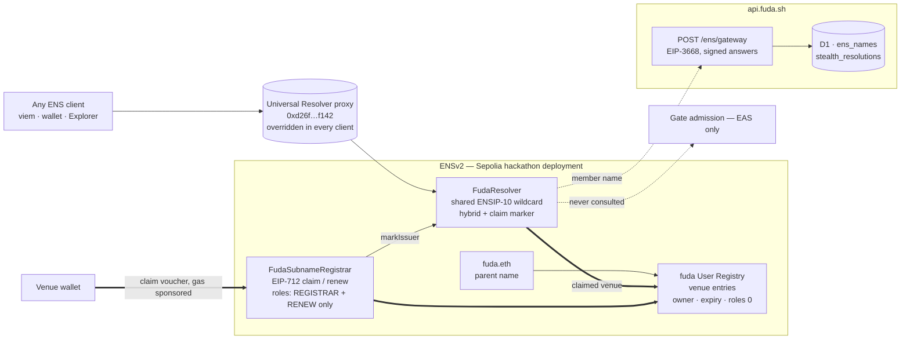
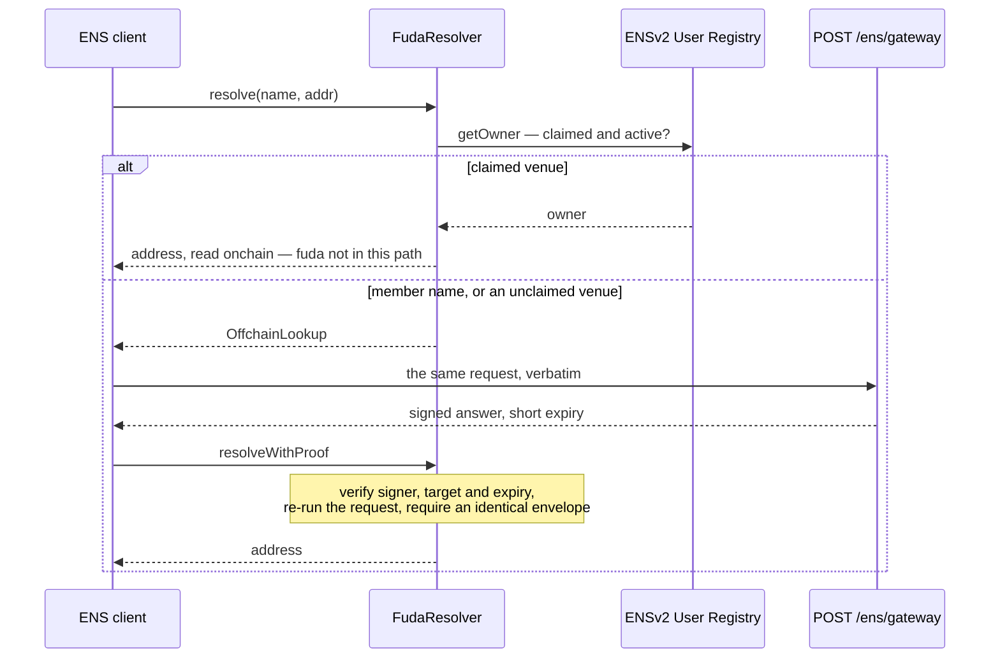

# ENS in fuda

**What fuda does.** A membership, a ticket or an event badge is normally a row in some vendor's database. fuda makes it a revocable on-chain record instead: a venue issues a right, the member keeps it in Apple Wallet, Google Wallet or a browser pass, and a scanner at a real door decides admission by reading the chain — not by asking fuda whether this person is a customer.

**Where ENS sits.** It names the two parties of that relationship — the venue that issues a right, and the member number printed on the pass — and nothing else. **ENS names the relationship; EAS proves the right.** No admission path ever calls ENS: the gate reads EAS directly by `eth_call` and fails closed. A name is a display and destination layer on top of that, never an authority.

**Why two kinds of name.** The tree has two levels and they work in deliberately opposite ways. A venue's name is an entry it **owns onchain** in fuda's own ENSv2 User Registry, claimed with its own transaction. A member's name is written **offchain and free**, resolves the instant the right exists, and was never registered anywhere. The owned, expiring half belongs to the business; the free, disposable half belongs to people who will never hold an ENS key.

Built on the **ETHOnline 2026 ENSv2 beta deployment on Ethereum Sepolia**, not production ENS.



Bold is onchain and fuda-free, dotted is fuda answering under signature: **a claimed venue's address comes from the registry**, **a member's comes from the signed gateway**, and **the gate is on neither path**.

|  |  |
| --- | --- |
| [The two halves of the tree](#the-two-halves-of-the-tree) | What a venue name is, what a member name is, and why they differ |
| [What was built](#what-was-built) | The hybrid resolver, the voucher registrar, the gateway and mirror |
| [On the product's path](#on-the-products-path) | Which surfaces touch ENS, which deliberately do not |
| [Evidence](#evidence) | Deployed addresses, live names, and how to check them without trusting this page |
| [Reproduce it](#reproduce-it) | What runs offline, what needs an RPC, and how to resolve a name yourself |
| [Source map](#source-map) | Every file, one hop |

Deeper background: [naming spec](../specs/ens-naming.md) · [why one shared hybrid resolver (ADR 0005)](../adr/0005-hybrid-ensv2-resolver.md) · [why fuda keeps the registry root (ADR 0007)](../adr/0007-root-custody-of-the-issuer-registry.md)

## The two halves of the tree

|  | `<venue>.fuda.eth` | `<member-no>.<venue>.fuda.eth` |
| --- | --- | --- |
| Where it lives | an entry in fuda's own ENSv2 User Registry | offchain, in fuda's mirror, served by a signed CCIP-Read gateway |
| Who owns it | the venue's own wallet | nobody — the member holds no ENS key |
| What it costs | one transaction, **gas sponsored by fuda** | nothing |
| When it starts resolving | when the venue's claim confirms | the instant the right is issued |
| When it stops | at expiry or unregistration — and then it goes **dark**, never back to offchain data | when the right is revoked |
| Transferable | no (role bitmap `0`) | n/a |

A venue can take custody of its identity; a member gets an addressable credential without being asked to become a crypto user.

A venue's public handle **is** its ENS label by construction — the same `isIssuerHandle` grammar validates both, so there is no mapping table between "the URL" and "the name". Members choose nothing: a member number is 12 random characters from a 28-character confusable-free alphabet plus one Luhn mod 28 check character, so it reveals no issue order and no member count.

**The +Private case.** A +Private right is issued to a one-time ERC-5564 stealth address so the member's rights stay unlinkable onchain, and its name behaves accordingly: the gateway derives a **fresh stealth address on every query** from the member's stealth meta-address and a per-name counter, signs it with a short expiry, and never caches or announces it. The same name never returns the same address twice — a usable payment or airdrop destination that exposes no stable address and creates no durable onchain link to the member.

## What was built

### 1. `FudaResolver` — one shared hybrid resolver

[`packages/ens-contracts/contracts/FudaResolver.sol`](../../packages/ens-contracts/contracts/FudaResolver.sol)

One ENSIP-10 wildcard resolver sits on `fuda.eth` and on every claimed venue entry, and it answers from two different places depending on what is being asked:



Three properties are worth stating precisely:

- **The gateway's answer is not trusted.** `resolveWithProof` checks the target, the expiry and a strict low-s signature from the known signer, then **re-executes the exact request against the resolver's own state** and demands an identical envelope.
- **A failed registry read never falls back offchain** (`testRegistryFailureNeverFallsBackOffchain`). Unavailable is not the same as unclaimed.
- **No offchain resurrection.** An append-only claim marker records that a namespace was once claimed; from then on, an expired or unregistered venue namespace answers empty forever rather than quietly reverting to fuda's hosted data. A name that has been owned never goes back to being rented.

The resolver serves exactly two records — `addr(bytes32)` (`0x3b3b57de`) and `addr(bytes32,uint256)` coin type 60 (`0xf1cb7e06`). No `text`, no `contenthash`. A name here is a destination, not a profile.

In practice the offchain branch answers member names: nothing is mirrored for a venue until it claims, so an unclaimed venue name is routed offchain and comes back empty.

### 2. `FudaSubnameRegistrar` — claiming, without handing over revocation

[`packages/ens-contracts/contracts/FudaSubnameRegistrar.sol`](../../packages/ens-contracts/contracts/FudaSubnameRegistrar.sol)

One press in the dashboard. fuda signs the permission; the venue signs the transaction.

| Step | What happens |
| --- | --- |
| 1 | `POST /v1/issuers/me/ens/claim-voucher` — reads the registrar nonce fresh (so an abandoned prompt is simply retried at the same nonce), signs an EIP-712 `ClaimVoucher`, records the name as `voucher_issued` |
| 2 | The operator's own wallet submits `claim(voucher)` on Ethereum Sepolia as an ERC-4337 user operation. `POST /v1/ens/paymaster` is fuda's ERC-7677 endpoint: it accepts only a `claim` or `renew` on fuda's registrar, then forwards the request — with fuda's policy id — to **Alchemy's onchain verifying paymaster**, which signs and pays. fuda restricts; Alchemy pays; the venue never funds a wallet |
| 3 | `POST /v1/issuers/me/ens/claimed` — fetches the receipt, requires the registrar's own event in it, and only then records `claimed`. An unverifiable hash leaves the name pending, which is recoverable; recording an unconfirmed claim is not |

The nonce is consumed **before** the external registry call, so a revert rolls the whole thing back, and the EIP-712 domain is pinned to chain `11155111` at construction (`WrongChain`) so a voucher cannot be replayed onto another deployment.

Strip the paymaster and the claim still works — it just costs the venue gas. That is "decentralized at the core, hosted rails only for UX" in one object. The first claim's receipt shows exactly this split: see [Live names](#live-names).

**What holds the permissions apart**, which is where a naming system usually cheats:

- The registrar receives only **`REGISTRAR | RENEW`** on the User Registry. Claim power therefore carries **no** revocation power: a compromised voucher signer could mint names it should not, but could not take any name down.
- Claimed entries are written with child role bitmap **`0`** — the venue cannot transfer the name or repoint its resolver or subregistry.
- **No principal holds `UNREGISTER`.**
- **Said plainly: a venue name is not censorship-resistant against fuda.** fuda's parent-owner key holds the admin bit and could grant `UNREGISTER` to itself. The root is kept rather than renounced for this deployment, and [ADR 0007](../adr/0007-root-custody-of-the-issuer-registry.md) records why. The honest sentence is "the venue owns it; fuda kept the root and wrote down why", not "fuda cannot take it back".
- A member name goes dark on revoke and a claimed venue name **does not**. That asymmetry is deliberate: tying an onchain unregister to revocation would hand revocation power to a live principal, which is exactly what the role split exists to prevent.

### 3. The gateway and the mirror

[`apps/api/src/ens/`](../../apps/api/src/ens)

`POST /ens/gateway` is the EIP-3668 endpoint the resolver calls. It decodes the request, checks the `addr` selector and the node, looks the name up in the `ens_names` mirror, and signs the answer over `0x1900 ‖ resolver ‖ expires ‖ keccak(request) ‖ keccak(result)`.

The mirror is the only mutable state ENS has in fuda, and exactly one module writes it ([`mirror.ts`](../../apps/api/src/ens/mirror.ts)): member names at issuance, venue names on the claim path, and darkening on revoke. A mirror write never fails the operation that triggered it — a missing name costs a resolution, a failed issuance costs a member their card.

## On the product's path

| Surface | ENS involvement |
| --- | --- |
| `POST /ens/gateway` on `api.fuda.sh` | The CCIP-Read gateway. Deliberately **outside** the `/v1` prefix: the address is written into the deployed resolver and can never be reissued. Rate-limited to 120/h per IP, EIP-3668 shapes, `no-store` |
| Issuance | Writes the member's name into the mirror as a side effect of issuing the right |
| Revoke | Takes that member name dark |
| Dashboard | Shows the venue's name and runs the one-press claim |
| **Gate** | **Never calls ENS.** Names are never shown at the gate, never logged in Entry, never included in announcements |

Note what the dashboard row does _not_ say: it **prints** the name string the API returns. No fuda surface resolves a name through ENS. Every resolution shown as evidence below is done from a third-party client, which is stronger anyway — it is not fuda's own code answering.

## Evidence

### Deployed addresses

ETHOnline 2026 ENSv2 beta deployment, Ethereum Sepolia (`11155111`) — **not** production ENS. All 40 hackathon addresses are pinned in [`deployment.ts`](../../packages/ens-contracts/src/deployment.ts) as one indivisible address family with their runtime code hashes, and preflight refuses to run against a wrong chain, a mixed address family, or changed runtime code.

| Item | Value |
| --- | --- |
| Universal Resolver override | `0xd26f2040d083af1cd2962ba303f4bea0c4faf142` (`UpgradableUniversalResolverProxy`) |
| Parent name | `fuda.eth` |
| fuda User Registry | `0xBf987666C8e4e78d3226aA86A9A7FE141F63C99D` |
| `FudaResolver` | `0x133e6eeb3eAf0F804FbB9c1536AcA090B36A93AB` |
| `FudaSubnameRegistrar` | `0x58AF04ff5e6DAB45ECD17bD38fC4f4BBa45778B9` |
| Parent owner / registry root | `0x5A89D95Ad9f964C75F4Adc2122ADb70Cc6607Cd4` |
| Voucher signer | `0x5c5DE7F78d90701066f5C52e8100B5e2c73845F9` |
| Gateway signer | `0xf0D345D00fA513D92ACCbc10Db721792577FcF9f` |
| Gateway URL in the resolver | `https://api.fuda.sh/ens/gateway` |

The voucher signer, the gateway signer and the EAS issuer key are three separate keys.

`ens:verify`, re-run read-only against a public Sepolia RPC on 2026-09-12 with nothing but the addresses above on the command line:

```json
{
  "chainId": 11155111,
  "parentName": "fuda.eth",
  "parentNode": "0xb966af14f29d73e4a56d2b2db08c22ff89b7e594eaf18b02a5bb452aec27e5ff",
  "parentAddress": "0x5A89D95Ad9f964C75F4Adc2122ADb70Cc6607Cd4",
  "userRegistryAddress": "0xBf987666C8e4e78d3226aA86A9A7FE141F63C99D",
  "resolverAddress": "0x133e6eeb3eAf0F804FbB9c1536AcA090B36A93AB",
  "registrarAddress": "0x58AF04ff5e6DAB45ECD17bD38fC4f4BBa45778B9",
  "registrarRoles": "65537",
  "voucherSigner": "0x5c5DE7F78d90701066f5C52e8100B5e2c73845F9",
  "gatewaySigner": "0xf0D345D00fA513D92ACCbc10Db721792577FcF9f",
  "gatewayUrls": ["https://api.fuda.sh/ens/gateway"],
  "status": "verified"
}
```

`registrarRoles` `65537` is `REGISTRAR | RENEW` and nothing else — the line that carries the access-control argument above. The report also re-asserts the exact root role bitmap (`setupRoles`, omitted here as a 78-digit integer); a mismatch fails the run.

### Live names

The first venue to claim a name and the first member name to resolve, both on 2026-09-12. Every value below was read back from the chain or returned by a client fuda does not control; none is copied from fuda's database.

**The claimed venue — `ethonline2026.fuda.eth`**, the venue behind [`fuda.sh/@ethonline2026`](https://fuda.sh/@ethonline2026).

|  |  |
| --- | --- |
| Claim transaction | [`0x183ea8e80230ae753dd922b3d765a810c17a9493f567d24f826b5917a0647f39`](https://sepolia.etherscan.io/tx/0x183ea8e80230ae753dd922b3d765a810c17a9493f567d24f826b5917a0647f39) — Sepolia block 11687641, `IssuerClaimed(labelHash = keccak("ethonline2026"), issuer, tokenId, expiry, nonce 0)` |
| Owner, read back with `getOwner(tokenId)` | `0x79644701D0e1Ba5b196dE910D34C2Eec2bF2872a` — the venue's own dashboard wallet, the account that runs this venue and controls its members' rights |
| Role bitmap, read back with `roles(tokenId, owner)` | **`0`** — non-transferable, resolver and subregistry locked |
| Expiry, read back with `getExpiry(tokenId)` | `1820736366` = 2027-09-12T08:06:06Z |
| Resolver / subregistry on the entry | `FudaResolver` `0x133e6eeb…93AB` / `0x0000…0000` — the shared hybrid resolver, no subregistry, exactly what the registrar writes |
| Who paid | The receipt's `UserOperationEvent` (EntryPoint `0x5FF137D4…2789`): `sender` = the venue wallet above, **`paymaster` = `0xC03Aac639Bb21233e0139381970328dB8bcEeB67`** (Alchemy's Sepolia onchain paymaster), `success = true`, `actualGasCost` = 668 298 012 319 140 wei; submitted by a bundler (`0x7c25ef85…74c7`), not by the venue |
| Resolved from a third-party client | viem with the hackathon Universal Resolver override: `getEnsAddress({ name: 'ethonline2026.fuda.eth' })` → `0x79644701D0e1Ba5b196dE910D34C2Eec2bF2872a`, answered from the registry — fuda not on the path |

**The member name — `c8hnrypq5ngpa.ethonline2026.fuda.eth`**, printed on the pass as member number `C8HN-RYPQ-5NGPA`, written offchain the instant the right was issued.

|  |  |
| --- | --- |
| The right it names | EAS attestation `0x5ccd4917252d19d9cf80ecff496954881744566dcc74ba2bc5d13071775aa4b3` on Base Sepolia, `GET /v1/verify/<uid>` → `ADMIT` |
| Resolved from a third-party client | `getEnsAddress({ name: 'c8hnrypq5ngpa.ethonline2026.fuda.eth' })` → `0x8cF3e1Ea8b84A1F20da47C98e02B7D9F3FE8c833` — the right's holder, in about half a second |
| How that answer was produced | The name has no registry entry, so the resolver returned `OffchainLookup`; the client called `POST /ens/gateway`; the resolver's `resolveWithProof` verified the signed envelope and re-executed the request before answering. This was the gateway's first production resolution |
| Registered anywhere | No. Nobody owns this name and nobody paid for it |

**Not demonstrated in this submission:** a +Private member name resolved twice to two different stealth addresses. No +Private right has been issued under a venue name yet; the rotating-address path is covered by the API tests and by the conformance vectors shared with the Solidity suite, but it has not been exercised against the deployed resolver, and this page does not claim that it has.

### Verify it independently

Nothing here requires trusting this page or any fuda service. Open the hackathon ENS Explorer — <https://hackathon-deployment-portal-app.ens-cf.workers.dev/> — and enter `ethonline2026.fuda.eth`: the entry shows its owner, its resolver, its role bitmap and its expiry directly from the registry. Or resolve it from your own client: [Reproduce it](#reproduce-it).

## Reproduce it

### From a clean clone, no network

```sh
pnpm install --frozen-lockfile

# resolver + registrar: 70 Hardhat 3 Solidity test functions, plus the
# TypeScript suite covering the pinned manifest, preflight and vouchers
pnpm --filter @fuda/ens-contracts test

# the gateway, the mirror, the lookup and the +Private allocation,
# including hex vectors shared with the Solidity suite
pnpm --filter api test
```

The shared vectors are the point of that last line: `conformance.test.ts` and the Solidity suite assert the same bytes, so the gateway and the resolver cannot drift on the wire format.

### Against the live deployment, read-only

Needs an Ethereum Sepolia RPC URL and nothing else — no keys, no secrets. Preflight checks the chain id, the Universal Resolver override, every runtime code hash and address-family purity; verify re-reads the deployed topology, including the exact root role bitmap:

```sh
ENS_RPC_URL=https://… pnpm --filter @fuda/ens-contracts ens:preflight

ENS_RPC_URL=https://… \
ENS_PARENT_ADDRESS=0x5A89D95Ad9f964C75F4Adc2122ADb70Cc6607Cd4 \
ENS_VOUCHER_SIGNER_ADDRESS=0x5c5DE7F78d90701066f5C52e8100B5e2c73845F9 \
ENS_GATEWAY_SIGNER_ADDRESS=0xf0D345D00fA513D92ACCbc10Db721792577FcF9f \
ENS_USER_REGISTRY_ADDRESS=0xBf987666C8e4e78d3226aA86A9A7FE141F63C99D \
ENS_RESOLVER_ADDRESS=0x133e6eeb3eAf0F804FbB9c1536AcA090B36A93AB \
ENS_REGISTRAR_ADDRESS=0x58AF04ff5e6DAB45ECD17bD38fC4f4BBa45778B9 \
  pnpm --filter @fuda/ens-contracts ens:verify
```

Every value on that command line is public and appears in [Deployed addresses](#deployed-addresses) above.

### Resolve a name yourself

**viem ships production ENS addresses.** Against this deployment they resolve the wrong tree, so the Universal Resolver must be overridden — once, in the chain definition. `ENS_HACKATHON_CHAIN` does it, and preflight asserts it:

```ts
import { createPublicClient, http } from 'viem'
import { ENS_HACKATHON_CHAIN } from '@fuda/ens-contracts'

const client = createPublicClient({
  chain: ENS_HACKATHON_CHAIN, // sepolia + the hackathon Universal Resolver
  transport: http(),
})

// a venue's name → the venue's own wallet, read from the ENSv2 User Registry
await client.getEnsAddress({ name: '<venue>.fuda.eth' })

// a member number from a pass → that member's address, answered offchain
await client.getEnsAddress({ name: '<member-no>.<venue>.fuda.eth' })

// a +Private member's name → a different stealth address every call
```

Against the deployment today, `ethonline2026.fuda.eth` answers `0x79644701D0e1Ba5b196dE910D34C2Eec2bF2872a` and `c8hnrypq5ngpa.ethonline2026.fuda.eth` answers `0x8cF3e1Ea8b84A1F20da47C98e02B7D9F3FE8c833` — the same two values as in [Live names](#live-names), from any client with the override set.

## Source map

**Contracts** — [`packages/ens-contracts/contracts/`](../../packages/ens-contracts/contracts)

| File | What |
| --- | --- |
| [`FudaResolver.sol`](../../packages/ens-contracts/contracts/FudaResolver.sol) | `resolve` — DNS-wire name → ancestor namehashes → nearest claim marker → `getOwner` → onchain answer, selector-specific empty, or `OffchainLookup`. `resolveWithProof` — verify target, expiry, low-s signature and signer, then re-staticcall and require an identical envelope. `markIssuer` — registrar-only, append-only |
| [`FudaSubnameRegistrar.sol`](../../packages/ens-contracts/contracts/FudaSubnameRegistrar.sol) | `claim` / `renew` / `setVoucherSigner`; EIP-712 domain pinned to chain 11155111 at construction; registers `owner=issuer, subregistry=0, resolver=shared, roles=0`, then `markIssuer` |
| [`interfaces/IUserRegistry.sol`](../../packages/ens-contracts/contracts/interfaces/IUserRegistry.sol) | the entire ENSv2 surface fuda consumes: `register`, `renew`, `getOwner` |
| [`libraries/FudaECDSA.sol`](../../packages/ens-contracts/contracts/libraries/FudaECDSA.sol) | strict 65-byte low-s recovery, shared by both contracts |
| [`test/`](../../packages/ens-contracts/test) | 70 Solidity test functions, including `testActiveClaimedIssuerLegacyAddrComesFromRegistry`, `testRegistryFailureNeverFallsBackOffchain`, `testRegisteredIssuerHasNoTransferRole`, `testInactiveClaimedIssuerReturnsSelectorSpecificEmptyAddresses`, `testRejectsWrongChainAtConstruction`, `testAcceptsTypeScriptConformanceVector` |

**Deployment manifest and tooling** — [`packages/ens-contracts/src/`](../../packages/ens-contracts/src)

| File | What |
| --- | --- |
| [`deployment.ts`](../../packages/ens-contracts/src/deployment.ts) | the 40 pinned hackathon addresses, their runtime code hashes, `ENS_HACKATHON_CHAIN` (the Universal Resolver override), and the Enhanced Access Control bit layout |
| [`vouchers.ts`](../../packages/ens-contracts/src/vouchers.ts) | `claimVoucherTypedData`, `renewVoucherTypedData`, and `toRegistryExpiry` (fuda's inclusive validity → the registry's exclusive `uint64` bound) |
| [`deploy/preflight.ts`](../../packages/ens-contracts/src/deploy/preflight.ts) | read-only: chain id, Universal Resolver override, runtime code hashes, address-family purity, parent availability |
| [`deploy/topology.ts`](../../packages/ens-contracts/src/deploy/topology.ts) | resumable deployment of the resolver and registrar, resolver set on the parent, `REGISTRAR \| RENEW` granted |
| [`deploy/verify.ts`](../../packages/ens-contracts/src/deploy/verify.ts) | the standalone read-only topology check behind `ens:verify` |

**Gateway, mirror and claim** — [`apps/api/src/ens/`](../../apps/api/src/ens)

| File | What |
| --- | --- |
| [`routes/ens-gateway.ts`](../../apps/api/src/routes/ens-gateway.ts) | `POST /ens/gateway`: sender allowlist, rate limit, EIP-3668 error shapes, `no-store` |
| [`gateway.ts`](../../apps/api/src/ens/gateway.ts) | decode `resolve(bytes,bytes)`, DNS name, `addr` selector and node check, lookup, sign |
| [`lookup.ts`](../../apps/api/src/ens/lookup.ts) | answers only `offchain` and `claimed` rows, expiry-aware |
| [`mirror.ts`](../../apps/api/src/ens/mirror.ts) | every mirror write in the product: member names at issuance, venue names on the claim path, darkening on revoke |
| [`resolution.ts`](../../apps/api/src/ens/resolution.ts) | the +Private path: counter reservation, HMAC-derived ephemeral key, ERC-5564 stealth address |
| [`routes/ens-claim.ts`](../../apps/api/src/routes/ens-claim.ts) | voucher signing, receipt-confirmed recording, paymaster sponsorship |
| [`conformance.test.ts`](../../apps/api/src/ens/conformance.test.ts) | hex vectors shared with the Solidity suite |

Handle and member-number grammar are shared by every surface: [`packages/sdk/src/member-number.ts`](../../packages/sdk/src/member-number.ts).
