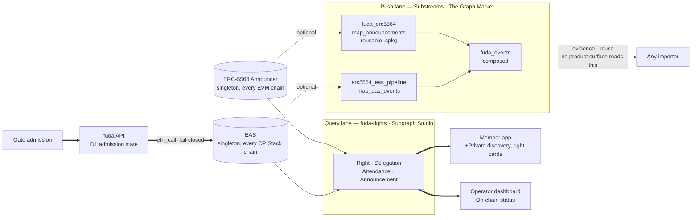
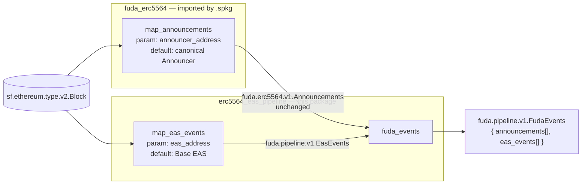
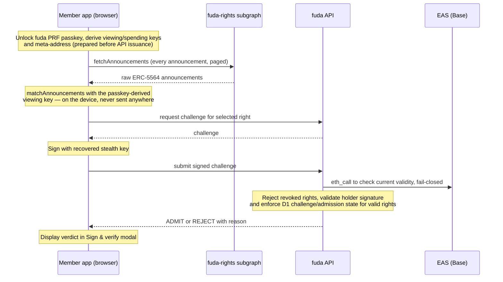

# The Graph in fuda

**What fuda does.** A membership, a ticket or an event badge becomes a revocable on-chain record: a venue issues a right, a standard pass goes to Apple Wallet, Google Wallet or a browser, and the hosted scanner asks the fuda API to check EAS and enforce admission state in D1. +Private uses the member app's discovery and signature flow instead.

**Where The Graph sits.** On the read path of two of the four surfaces. The member app queries a subgraph to discover +Private rights it cannot see any other way; the operator dashboard queries the same subgraph for on-chain status. The API's own announcement cache was deleted when the subgraph landed, so there is no fallback index. The gate never touches The Graph: its API checks EAS and fails closed.

**Why Substreams as well.** The events fuda cares about belong to two public standards, not to fuda. Packaging the extraction as a reusable Substreams module and composing fuda's own events on top makes that separation real: the standard's half is importable by anyone, and stopping the whole lane changes nothing about the product.



Bold is required, dotted is optional: **stop the subgraph and +Private discovery and on-chain status become unavailable**; **stop the Substreams lane and nothing in the product changes**; **the gate never goes through The Graph**. Standard Wallet delivery and QR verification are Graph-independent.

Deeper background: [module contracts](../specs/substreams.md) · [why two independent lanes (ADR 0003)](../adr/0003-graph-push-query-lanes.md) · [why nothing is filtered server-side (ADR 0002)](../adr/0002-unfiltered-announcement-log.md) · [deploying and smoke-testing the subgraph](../runbook.md)

## The two standards underneath

Both contracts are **singletons deployed at the same address on every chain**. The whole design leans on that fact.

| Contract | Address | Scope |
| --- | --- | --- |
| [ERC-5564](https://eips.ethereum.org/EIPS/eip-5564) Announcer | `0x55649E01B5Df198D18D95b5cc5051630cfD45564` | same on every EVM chain |
| [EAS](https://attest.org) | `0x4200000000000000000000000000000000000021` | same on every OP Stack chain |

**ERC-5564, stealth addresses.** For +Private, the member's WebAuthn PRF passkey derives viewing and spending keys and a stealth meta-address locally. The issuer creates a fresh stealth address **per issued right**, attests the EAS right to it, and posts an `Announcement` to the canonical Announcer with the ephemeral public key, a view tag and the right UID. The recipient scans the raw announcements with the viewing key to find their rights and recover the stealth signing keys. The Announcer is a public log; it decides neither ownership nor admission. A fresh address per right avoids reusing a holder across rights; it does not hide the issuer's recipient mapping or repeated presentations of the same UID from the gate, and the address is not regenerated per visit. Private issuance currently uses the admin API; the public card-claim UI is not connected. [Fluidkey](https://docs.fluidkey.com/technical-documentation/technical-walkthrough/) runs the same standard in production, and fuda borrowed two ideas from it: deriving stealth keys from a root secret so a user can re-enumerate their own addresses, and letting a stable name resolve to a fresh address per query.

**EAS, attestations as the source of truth.** EAS is a public contract for signed, schema-typed, revocable statements. fuda puts three kinds there: a right (`Entitlement`), a venue's authority to issue (`IssuerDelegation`), and a visit (`Attendance`). The hosted gate resolves the first two by `eth_call` through the API and enforces admission with D1 state; revoked rights are rejected on the next verification. The subgraph is never the authority for admission. Private admission does not emit a public Attendance. Live UIDs are in [Evidence](#evidence); the model is in [`attestation-model.md`](../specs/attestation-model.md).

## What was built

### 1. `fuda_erc5564`, a reusable Substreams module

[`packages/substreams/erc5564/`](../../packages/substreams/erc5564)

One map module, `map_announcements`, extracting raw ERC-5564 `Announcement` events from a **parameterized** Announcer address, defaulting to the canonical singleton. No fuda policy: it does not restrict the scheme id, decode metadata, match a viewing key or make an RPC call. The protobuf package `fuda.erc5564.v1` is the public contract, pinned in [the spec](../specs/substreams.md). Any other ERC-5564 consumer, a wallet, a payroll tool, a donation page, can take the same package and get announcements without writing Rust.

### 2. `erc5564_eas_pipeline`, the composition

[`packages/substreams/erc5564-eas-pipeline/`](../../packages/substreams/erc5564-eas-pipeline)

This package **imports the first one by `.spkg`** and composes it with an EAS module into a single stream:

```yaml
imports:
  erc5564: ../erc5564/fuda-erc5564-v0.1.0.spkg

modules:
  - name: fuda_events
    inputs:
      - map: erc5564:map_announcements # imported, unchanged
      - map: map_eas_events # this package's own
```



Everything inside `fuda_erc5564` is the standard, everything inside `erc5564_eas_pipeline` is fuda, and the seam is a `.spkg` file plus a protobuf package name. `fuda_events` places both lists side by side with **no total order** across them; `tx_hash` + `log_index` are the identity keys.

### 3. `fuda-rights`, the subgraph

[`packages/subgraphs/rights/`](../../packages/subgraphs/rights)

An AssemblyScript subgraph with two `ethereum/events` sources (EAS `Attested`/`Revoked`, Announcer `Announcement`) producing `Right`, `Delegation`, `Attendance` and `Announcement` entities. It indexes the contracts directly, independently of the Substreams output, and is deployed to Subgraph Studio.

## On the product's read path

When the subgraph landed, the API's D1 announcement crawl and its `GET /announcements` route were **deleted** (migration [`0001_drop_announcement_cache.sql`](../../apps/api/migrations/0001_drop_announcement_cache.sql)). There is no fuda-hosted fallback for +Private discovery.

| Surface | What it reads from the Graph | Code |
| --- | --- | --- |
| Member app `/private` | Every raw `Announcement`, paged by a `(blockNumber, id)` cursor, matched locally against the passkey-derived viewing key | [`PrivateScreen.tsx`](../../apps/app/src/member/PrivateScreen.tsx) → [`private-member.ts`](../../apps/app/src/private-member.ts) |
| Member app `/rights` | Public rights by holder, combined with device memory and live API status checks | [`RightsList.tsx`](../../apps/app/src/member/RightsList.tsx) |
| Operator dashboard, "On-chain status" | Rights by holder, Attendance by right, IssuerDelegation by issuer, shown next to the operator's own rows, never merged | [`on-chain-status.ts`](../../apps/dash/src/on-chain-status.ts), [`OnChainStatus.tsx`](../../apps/dash/src/OnChainStatus.tsx) |
| Shared SDK | The only Graph client: four typed fetchers with full response validation, integer scalars kept as `bigint` | [`graph.ts`](../../packages/sdk/src/graph.ts) |
| Config | `VITE_GRAPH_RIGHTS_ENDPOINT`, baked in at build time. Empty → private discovery and on-chain status report missing configuration; `/rights` falls back to device-remembered passes | [`app/config.ts`](../../apps/app/src/config.ts), [`dash/config.ts`](../../apps/dash/src/config.ts) |

Gate admission and issuance are absent from that table on purpose: the gate calls the API, which checks EAS and D1; issuance writes EAS and D1.

+Private discovery is the path that explains why the indexer stays dumb:



The app requests every indexed announcement with no viewing key and no member-specific filter. Filtering per issuer or per member would let the indexer learn which announcements belong to whom, shrinking the anonymity set, which is why [ADR 0003](../adr/0003-graph-push-query-lanes.md) preserves the privacy invariant from ADR 0002. Matching belongs to the device; state ("is this right valid right now?") belongs to the API checking EAS. Revoked announcements remain discoverable: finding a right is not proof it is valid. This does not hide ordinary request metadata from the Graph provider.

## Evidence

The identifiers and results below are dated captures, not a fresh health check. Rerun the steps in [Reproduce it](#reproduce-it) to establish current state.

### Identifiers

| Item | Value |
| --- | --- |
| Subgraph | `fuda-rights` v0.1.0 on Subgraph Studio, `https://api.studio.thegraph.com/query/87336/fuda-rights/v0.1.0` |
| Deployment | `QmRGTZM5fsiCqh15aQAKwnEG2fzs1h8gymKAHzddf6LZgP` |
| Network / start block | Base Sepolia, from block `7552655` |
| Substreams provider | The Graph Market (Pinax) |
| `fuda-erc5564-v0.1.0.spkg` sha256 | `c5aa6056b885d3144da5014afda5eb46f69b64ed51cb51109443c942aa531ff9` |
| `erc5564-eas-pipeline-v0.1.0.spkg` sha256 | `408a25bc9be646f7e84ccfbd3f1b024aaaf0509bed5a93f9a89e1b50a4829dba` |
| Attester for every capture below | `0xAA64E3814A88f4bA4588787EB04e5eACBabcd77E` |

The `.spkg` files are built locally and not committed; the checksums identify the artifacts used for the Substreams captures.

### Captured from the live stream

From The Graph Market on Base Sepolia. All three events belong to one +Private right, `0xe5c5a670…dacf7bf`: one right's whole life read out of a single composed stream, with the announcement arriving through the imported package unchanged.

| Event                   | Block    | Stream                                 |
| ----------------------- | -------- | -------------------------------------- |
| EAS `Attested`          | 46468810 | `fuda_events` (composed)               |
| ERC-5564 `Announcement` | 46468812 | `fuda_events`, via the imported module |
| EAS `Revoked`           | 46468842 | `fuda_events` (composed)               |

On the query side, [`queries/smoke.graphql`](../../packages/subgraphs/rights/queries/smoke.graphql) answered from Studio with the Bearer right `0x2211134e…b966`, its delegation `0x7bb324ad…6155`, attendance `0x0e92458a…00d9`, and a non-null `revokedAt` after a revoke, matching the transaction receipts.

### Real-device +Private follow-up, 2026-09-13

Real iPhone captures from `app.fuda.sh`, UI deployed from commit [`9755bd9`](https://github.com/oboroxyz/fuda-sh/commit/9755bd9), show discovered rights with distinct stealth holders and the Sign & verify results:

| Right | EAS UID | Stealth holder | Captured result |
| --- | --- | --- | --- |
| Active MULTI_USE right A | [`0xf9e9c1bf…fb025c`](https://base-sepolia.easscan.org/attestation/view/0xf9e9c1bf7df42097c29048b4497a857c4c8a966ef4d870c2ead1b6fbc3fb025c) | `0x805b27f19749Ff0F47733ab57eEcE2bE9a1c9674` | ADMIT through Sign & verify |
| Previously revoked right | [`0xf0250f47…e04a08`](https://base-sepolia.easscan.org/attestation/view/0xf0250f47ba19f66e1870a46cff2d3c2b476efa87270d8cc3db7a2086d3e04a08) | `0x119446ABE91613BC1159ADA7fb83e28687C6823E` | REJECT / REVOKED |

At 08:12:25 UTC, Studio returned A's scheme-1 announcement at block 46759404 with the expected holder and UID metadata; `_meta` reported block 46759427 and `hasIndexingErrors: false`. The announcement transaction is [`0xefa2f4bd…260b3`](https://sepolia.basescan.org/tx/0xefa2f4bdd75bb09a02c7851c38c8ae4b858dec4e503cb457aa6069105e3260b3).

These verdicts concern two **different rights**, not one right revoked mid-capture. The result appears in the member app, not a paired physical gate, and an unlocked-list screenshot does not show the OS passkey ceremony. This is evidence for the **subgraph query lane** only. Private ENS rotation was verified separately through [live viem queries](./ens.md#live-private-name-resolution).

### Verify it independently

None of this requires trusting this page or any fuda service. The 9/6 attestations check out three ways: on a third-party EAS explorer, in the subgraph, and in the composed stream capture above.

| What | UID on the Base Sepolia EAS explorer | Schema |
| --- | --- | --- |
| +Private right (revoked) | [`0xe5c5a670…dacf7bf`](https://base-sepolia.easscan.org/attestation/view/0xe5c5a670df22a5978125885a95d27863c283b66ef47bd49b95d03d580dacf7bf) | Entitlement |
| Bearer right (revoked) | [`0x2211134e…57abb966`](https://base-sepolia.easscan.org/attestation/view/0x2211134ef501c67828d03fd12fadc2b36937e9924a3f96cfa75ee61557abb966) | Entitlement |
| Root delegation (active) | [`0x7bb324ad…1a6e155`](https://base-sepolia.easscan.org/attestation/view/0x7bb324ad1ec399488f18178153a046d7bcca44bb9688e72e0ce9581a61a6e155) | IssuerDelegation |
| Attendance | [`0x0e92458a…3800d9`](https://base-sepolia.easscan.org/attestation/view/0x0e92458a6f8bb9a8053eaad0d52658f6125683198dce30e3ae9d1aca943800d9) | Attendance |

The +Private right's recipient is `0x000A9A88…75431`, a one-time stealth address. The Bearer right and the Attendance share recipient `0xb682824e…e4B4`, which is how "this holder attended" is expressed without a database.

The three schemas are what the subgraph's `handleAttested` decodes and what [`wrangler.jsonc`](../../apps/api/wrangler.jsonc)'s `EAS_SCHEMAS` lists, so explorer, Worker and indexer can be compared directly:

| Schema | UID | Fields |
| --- | --- | --- |
| Entitlement | [`0x42ffdba9…d86d616`](https://base-sepolia.easscan.org/schema/view/0x42ffdba952267e373cb33ecf9fdc190fb27b30140d0695dabb8383bbed86d616) | `address holder, address issuer, uint8 usageModel, uint8 tier, uint8 level, bytes32 serial, uint64 validFrom, uint64 validUntil, string metaURI` |
| IssuerDelegation | [`0x62c93e6e…3895f327`](https://base-sepolia.easscan.org/schema/view/0x62c93e6e95f3956ba5937fc8454203ba781af5e455657952e915e71c3895f327) | `address issuer, bool active, string name` |
| Attendance | [`0x22a41470…6e10241`](https://base-sepolia.easscan.org/schema/view/0x22a41470aabe3a0edec1f9948975a887f21adddd6cf009e865e267cac6e10241) | `bytes32 rightUID, address holder, uint64 enteredAt, bytes32 slotId` |

The same UIDs come back from the subgraph, with `revokedAt` non-null for the two revoked ones:

```sh
curl -s -X POST -H 'content-type: application/json' \
  -d '{"query":"{ _meta { block { number } hasIndexingErrors } rights(first:10){ id revokedAt delegation { name active } } attendances(first:10){ id } }"}' \
  https://api.studio.thegraph.com/query/87336/fuda-rights/v0.1.0
```

The Graph endpoint is compiled into each bundle at build time, so it is visible in the shipped JavaScript for <https://app.fuda.sh> and <https://dash.fuda.sh>, and absent from <https://gate.fuda.sh>:

```sh
curl -s https://app.fuda.sh/ | grep -o '/assets/index-[^"]*\.js' | head -1
curl -s https://app.fuda.sh/assets/index-<hash>.js | grep -o 'api\.studio\.thegraph\.com[^"]*'
```

## Reproduce it

### From a clean clone, no credentials

```sh
pnpm install --frozen-lockfile
pnpm --ignore-workspace --dir packages/subgraphs/rights install --frozen-lockfile

# the two Substreams modules
cargo test --manifest-path packages/substreams/erc5564/Cargo.toml               # 6 tests
cargo test --manifest-path packages/substreams/erc5564-eas-pipeline/Cargo.toml  # 4 tests

# the wasm both packages actually ship
cargo build --release --target wasm32-unknown-unknown \
  --manifest-path packages/substreams/erc5564/Cargo.toml
cargo build --release --target wasm32-unknown-unknown \
  --manifest-path packages/substreams/erc5564-eas-pipeline/Cargo.toml

# the subgraph mappings. `subgraph.yaml`, `src/schema-uids.ts` and `generated/`
# are gitignored; prepare reads top-level Sepolia vars from apps/api/wrangler.jsonc.
pnpm graph:prepare
pnpm graph:codegen
pnpm graph:test                                                                 # 12 Matchstick tests
# Matchstick ships no binary for some kernels; if it fails to start,
# run the same suite in Docker with `graph test -d`.
```

Built with `substreams` CLI 1.22.0, crates `substreams` 0.7.6, `substreams-ethereum` 0.11.1, `prost` 0.13. A rebuild reproduces the checksums above only under the same toolchain; they identify the artifacts rather than promising byte-reproducibility.

### The cross-chain proof

"It runs on other chains too" is not a checkable claim: anyone can swap an address constant and recompile for the second network. A `.spkg` makes it checkable, because the package is a **single binary file** holding wasm, manifest and protobuf. Hash the file, run it against one chain, run **that same file** against another, hash it again. Matching hashes mean nothing was rebuilt or edited; only the `-e` endpoint differed. This is possible because the Announcer is at the same address on every EVM chain, so there is no address to change.

```sh
export ERC5564_PACKAGE=packages/substreams/erc5564/fuda-erc5564-v0.1.0.spkg
sha256sum "$ERC5564_PACKAGE"

substreams run -e "<BASE_SEPOLIA_FIREHOSE_ENDPOINT>" \
  "$ERC5564_PACKAGE" map_announcements \
  --start-block "<KNOWN_ANNOUNCEMENT_BLOCK>" --stop-block +1000

substreams run -e "<SECOND_EVM_FIREHOSE_ENDPOINT>" \
  "$ERC5564_PACKAGE" map_announcements \
  --start-block "<KNOWN_ANNOUNCEMENT_BLOCK>" --stop-block +1000

sha256sum "$ERC5564_PACKAGE"   # must be identical to the first
```

**What was actually run.** The identical `erc5564_eas_pipeline`, same checksum, streamed a 2,000-block range on **Base mainnet** through the same provider. It processed successfully, and that range contained no `Announcement`. So this proves the _artifact_ is portable; it does not prove fuda decoded third-party events on a second chain. Running it yourself needs a Graph Market token and two Firehose endpoints, the one procedure here a clean clone cannot execute.

### That the push lane is not plumbing

```sh
pkill -f 'substreams run'
pgrep -af '[s]ubstreams run' && echo 'FAIL: a runner is still active'
```

With no runner alive, +Private discovery still finds the right, the dashboard's on-chain status still answers, and a revoked pass still scans red. That shows the **Substreams lane** is not on the read path. It does **not** show the product works without The Graph: remove the subgraph and private discovery and on-chain lookups become unavailable.

Deploying and operating the subgraph is covered in [`docs/runbook.md`](../runbook.md), §7 for the deploy and §9 for the smoke query against real UIDs.

## Source map

One anti-drift detail first: the subgraph's `subgraph.yaml` and schema-UID map are **generated from the API's Sepolia schema/start-block configuration** ([`scripts/prepare.ts`](../../packages/subgraphs/rights/scripts/prepare.ts)), and generation fails loudly while `EAS_SCHEMAS` or `ANNOUNCER_FROM_BLOCK` are unset, so the indexer accepts the same schema UIDs as the API. Rebuild and deploy both after changing those inputs.

**`packages/substreams/erc5564/`**, `fuda_erc5564` v0.1.0

| File | What |
| --- | --- |
| [`substreams.yaml`](../../packages/substreams/erc5564/substreams.yaml) | one map module; `params` default = the canonical Announcer |
| [`src/lib.rs`](../../packages/substreams/erc5564/src/lib.rs) | `map_announcements` handler; `extract_announcements`; full 32-byte `scheme_id` |
| [`proto/`](../../packages/substreams/erc5564/proto) | `fuda.erc5564.v1.Announcement` / `Announcements`, the public contract |
| [`tests/map_announcements.rs`](../../packages/substreams/erc5564/tests/map_announcements.rs) | address parsing, decoding, wrong address, failed tx, malformed logs |

**`packages/substreams/erc5564-eas-pipeline/`**, `erc5564_eas_pipeline` v0.1.0

| File | What |
| --- | --- |
| [`substreams.yaml`](../../packages/substreams/erc5564-eas-pipeline/substreams.yaml) | the `imports:` line and `fuda_events` inputs |
| [`src/lib.rs`](../../packages/substreams/erc5564-eas-pipeline/src/lib.rs) | `fuda_events`; `map_eas_events`; `merge_events` |
| [`proto/fuda.proto`](../../packages/substreams/erc5564-eas-pipeline/proto) | imports the ERC-5564 proto rather than redefining it |

**`packages/subgraphs/rights/`**, the `fuda-rights` subgraph

| File | What |
| --- | --- |
| [`schema.graphql`](../../packages/subgraphs/rights/schema.graphql) | `Right`, `Delegation` (mutable), `Attendance`, `Announcement` (immutable) |
| [`src/eas.ts`](../../packages/subgraphs/rights/src/eas.ts) | `handleAttested` decodes by schema UID + version; `handleRevoked` |
| [`src/announcer.ts`](../../packages/subgraphs/rights/src/announcer.ts) | `handleAnnouncement`: stores every announcement, unfiltered |
| [`src/codecs.ts`](../../packages/subgraphs/rights/src/codecs.ts) | ABI decoders for the three EAS schema payloads |
| [`scripts/prepare.ts`](../../packages/subgraphs/rights/scripts/prepare.ts) | generates the manifest and UID map; refuses placeholders |

`packages/substreams/*` and `packages/subgraphs/*` build independently and are not pnpm workspace members; see [`AGENTS.md`](../../AGENTS.md).
