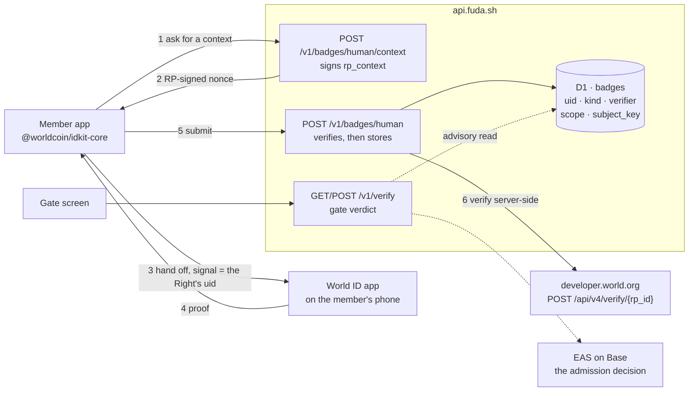

# World ID in fuda

**What fuda does.** A membership, a ticket or an event badge becomes a revocable on-chain record: a venue issues a Right, a standard pass goes to Apple Wallet, Google Wallet or a browser, and a gate checks EAS and admission state before letting someone in.

**Where World ID sits.** After issuance, and nowhere near the door. On a card whose issuer has turned the integration on, a member who already holds a Right can attach a **Verified Human badge** to it. Claiming stays instant for people who have never heard of World; the gate still decides admission from the chain alone, calling neither World nor anything new; and a venue can finally address a promise to _a person_ — one badge per member — instead of to a bearer token. **EAS proves the right; World ID counts the people.**

Built on **World ID 4.0**, `allow_legacy_proofs: false`. A 3.0 proof is refused on both sides: one person must not be able to hold a 3.0 nullifier and a 4.0 nullifier for the same action and badge a pass with each.

**Step 6 is the point.** A client-reported success is never trusted; the proof is verified from the Worker, and only a verified proof reaches D1.

## The two rules the table enforces

| Rule | Constraint | What it stops |
| --- | --- | --- |
| One badge per Right and kind | primary key `(uid, kind)` | a second person badging a pass that already carries one |
| One subject per verifier and scope | unique index `(verifier, scope, subject_key)` | one person badging several passes |

`scope` is `rp_id:action` — 4.0 nullifiers are RP-scoped — and `subject_key` is the nullifier. A repeat verification of the _same_ pass by the _same_ person is not an error: it answers success with the existing badge, because a member tapping the button twice is the normal case.

## What was built

### 1. The table and its store

[`apps/api/migrations/0015_badges.sql`](../../apps/api/migrations/0015_badges.sql) · [`apps/api/src/badges/store.ts`](../../apps/api/src/badges/store.ts)

`saveBadge` returns `{ ok: true }`, `{ conflict: 'pass' }` or `{ conflict: 'subject' }` — the two conflicts are different rules and the routes answer them differently. The unique index is the authority: two simultaneous requests both pass the reads, and the loser re-resolves rather than throwing.

There is no evidence column. The proof is not stored — only the nullifier, the credential label, and when it happened.

### 2. The verifier seam and the World adapter

[`apps/api/src/badges/verifier.ts`](../../apps/api/src/badges/verifier.ts) · [`apps/api/src/badges/providers/world.ts`](../../apps/api/src/badges/providers/world.ts)

`BadgeVerifier` is the whole vendor surface: `configured()`, `context()`, `verify()`. No `@worldcoin/*` import exists outside the adapter, and the routes are named after the claim (`/badges/human`), not the vendor. Replacing the verifier behind a kind is not a client-visible change.

The adapter checks everything it can before spending a round trip:

| Check                                                              | Refusal     |
| ------------------------------------------------------------------ | ----------- |
| A session proof rather than a uniqueness proof                     | `bad_proof` |
| `protocol_version` is not `4.0`                                    | `bad_proof` |
| `environment` is not `production`                                  | `bad_proof` |
| The proof's `action` is not this deployment's                      | `bad_proof` |
| `issuer_schema_id` outside `{1: proof_of_human, 9310: mnc}`        | `bad_proof` |
| A `signal_hash` that is present and does not match the Right's uid | `bad_input` |
| The portal's verify answers anything but `success: true`           | `bad_proof` |

Each refusal names its reason in the log. A badge that never arrives is otherwise three failures wearing one face: the page losing the answer, World refusing to make a proof, and this adapter refusing the one it was given.

### 3. The routes

[`apps/api/src/routes/badges.ts`](../../apps/api/src/routes/badges.ts)

`POST /v1/badges/:kind/context` returns the RP-signed context. `POST /v1/badges/:kind` takes `{ uid, payload }`, verifies, and stores. Both are rate-limited, both are `no-store`, and both answer **`501 badges_not_configured`** while the verifier is unconfigured — an unconfigured deployment looks like the feature does not exist rather than like it is broken.

A badge is refused for a Right that would not be admitted: the route resolves the verdict first and answers `404` unless it is `ADMIT`. A badge on a revoked Right would be a record nobody can use.

### 4. Badges in the gate verdict

[`apps/api/src/routes/verify.ts`](../../apps/api/src/routes/verify.ts)

`badgesFor` catches a failed read and returns an empty list, and an empty list means **no `badges` key at all** — a Right without one keeps the exact response shape it had before badges existed. The read is advisory in the same way the Attendance hook is: it can never turn a scan into a failure, and a missing table looks like a healthy verdict. Confirm the table by SQL, never by a verdict.

`VerifyResponse.badges` is an array from its first version, and each entry names its `verifier`. A second kind is not a breaking change.

### 5. The member's action

[`apps/app/src/badges.ts`](../../apps/app/src/badges.ts) · [`apps/app/src/venue/CardScreen.tsx`](../../apps/app/src/venue/CardScreen.tsx)

Headless `@worldcoin/idkit-core` in a hono/jsx/dom app — the React widget is never imported. The request asks for `any(proof_of_human, mnc)`: a deployment in Japan serves many members who hold a My Number Card credential and have never been to an Orb, and the nullifier does not depend on which credential produced it.

The hand-off URI is rendered as a link and a QR rather than assigned to `location.href`: `pollUntilCompletion()` only resolves while the page is alive, and navigating away loses a verification the member has already completed. A failure shows the vendor's own code under the button, because a silent button is indistinguishable from a broken one.

### 6. The gate chip

[`apps/gate/src/verdict.ts`](../../apps/gate/src/verdict.ts) · [`apps/gate/src/Verdict.tsx`](../../apps/gate/src/Verdict.tsx)

The verdict names the verifier and when it verified — `verified human · world`, with the time — rather than showing a bare checkmark. The chip renders on a REJECT too: a badge outlives the Right it is attached to, so a revoked badged pass shows both, and naming the verifier is what keeps that reading honest.

### 7. The badge on a saved pass

[`packages/pass/src/google.ts`](../../packages/pass/src/google.ts) · [`packages/pass/src/apple/pass-json.ts`](../../packages/pass/src/apple/pass-json.ts) · [`apps/api/src/pass/badge-update.ts`](../../apps/api/src/pass/badge-update.ts)

Both wallet passes carry the badge as a snapshot taken when the pass is built. An installed Apple pass has no push channel, so re-adding is how it updates — the serial number is the Right's uid, so a re-add replaces it. A saved Google object is patched best-effort after a badge is stored, never in a way that can fail the badge.

## Configuration

**Per card, off by default.** A member sees the action only on a card whose issuer turned World ID on under the card's Integrations in the dashboard (`PUT /issuers/me/cards/:cardId/integrations { badges: ['human'] }`), and the submit route refuses a Right under a card that has not — before the proof is spent. See [Card integrations](../specs/pass-types-and-flows.md#card-integrations).

**Per deployment.** Four values, all or nothing: `WORLD_APP_ID`, `WORLD_RP_ID`, `WORLD_ACTION`, `WORLD_RP_SIGNING_KEY`. While any one is unset, `/badges/:kind` answers `501` and no verdict carries a badge. All four are Wrangler secrets rather than split between secrets and `vars` — one place to look, and a name defined in both silently resolves to the secret. See [the runbook](../runbook.md#3-secrets).

## Measured behaviour worth knowing

Three things cost real time on 2026-09-26/27 and are not in the vendor's documentation.

**The verify endpoint's edge refuses a request with no `User-Agent`.** Cloudflare Workers' `fetch` sends none. The endpoint then answers `403 Forbidden` with an nginx HTML body — not a JSON error code, so nothing in the documented error surface describes it. Measured: the identical POST answers `400 validation_error` with a user agent and `403` without. The adapter now names itself.

**A failed attempt still spends the person's proof for that action.** The identity is consumed when the proof is generated, whatever happens downstream. Every retry afterwards answers `nullifier_replayed`, there is no reset, and `max_verifications` is a v3 action field absent from v4. The only way forward is a new action — which changes `scope`, so old badge rows no longer collide with new ones. Plan for this when testing: one broken attempt costs that tester their identity for that action.

**Verification needs the World ID app, which is not World App.** The hand-off opens the former; a phone with only the latter lands on a store page. Tell members which app before they queue.

## Privacy

The badge records that _a_ verified human holds this Right, scoped to this deployment's action — never who. `subject_key` is the nullifier, and a nullifier is derived from `(person, rp_id, action)`: it identifies nobody outside this scope, and fuda holds nothing that links it to a person. The proof itself is discarded after verification, and nothing about the badge is published on chain.
