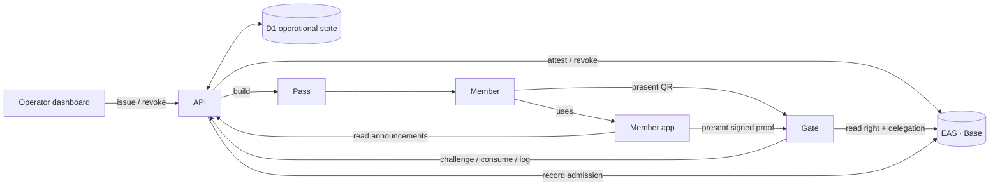

# Architecture

fuda treats membership and access as on-chain rights. The API coordinates
issuance and operational state, while EAS on Base remains the authority for a
right's contents, issuer delegation, and revocation. Passes and apps
present or control those rights; they do not replace the chain as the source
of validity.

## Components

| Component          | Path                  | Responsibility                                                                                                                                               |
| ------------------ | --------------------- | ------------------------------------------------------------------------------------------------------------------------------------------------------------ |
| API                | `apps/api`            | Coordinates issuance, revocation, gate operational state, pass generation, and announcement indexing                                                         |
| Operator dashboard | `apps/dash`           | Gives authorized issuers the controls to issue, inspect, and revoke rights                                                                                   |
| Member app         | `apps/app`            | Holds member signing rails, answers Signed challenges, and discovers +Private rights client-side                                                             |
| Gate               | `apps/gate`           | Reads presented rights, requests proof when required, and renders an ADMIT or REJECT verdict                                                                 |
| EAS on Base        | External; `apps/api`  | Records Entitlements, issuer delegation, revocation, and Attendance evidence                                                                                 |
| D1 (SQLite)        | `apps/api/migrations` | Stores operational state such as challenges, SINGLE_USE consumption, entry logs, member indexes, and announcement caches                                     |
| Passes             | `packages/pass`       | Builds the Google Wallet save link and the Apple `.pkpass`; the api renders the browser-based pass. Passes present a right and are never its source of truth |

## Authority and trust boundaries

- **Right validity is on-chain.** The gate reads the Entitlement and its
  IssuerDelegation from EAS. A fuda account or API response is not trusted as a
  substitute for those records.
- **Admission also has operational state.** D1 tracks one-time challenges,
  SINGLE_USE consumption, and entry logs. Failure to read required chain or
  delegation state fails closed.
- **Passes are presentation surfaces.** Revoking an Entitlement changes the
  next gate verdict without replacing its Apple, Google, web, or QR pass.
- **Private discovery is client-side.** The member app derives viewing keys and
  matches ERC-5564 announcements locally; the API only serves candidate
  announcement data.
- **Admin routes fail closed.** Issue, revoke and member listing require
  `ADMIN_TOKEN` wherever a signer is configured; a deployment with a signer and
  no token locks them rather than opening them.
- **The public verify endpoints are unauthenticated by design.** `GET
  /verify/:uid` and `POST /verify` take a uid that is public on chain, so anyone
  who learns one can preview it — and burn a SINGLE_USE slot. What that buys an
  attacker, and why Signed is the answer for rights that must resist it, is in
  the attestation model's [threat model of the public verify
  endpoints](./attestation-model.md#api-payloads-that-touch-attestations).

## UX and decentralization

fuda's core is decentralized and ownable: a right is an on-chain attestation
that anyone can verify and the member can come to own. For UX, fuda surfaces
that core through Apple, Google, and its own hosted backend. The design
principle: **decentralized at the core, on rails only for UX.** The core
carries the guarantees and a right's validity never leaves it; the rails add
convenience on top. Strip a rail away and every function keeps working — with
somewhat worse UX — because the fallback is the core itself.

| Function             | Best UX (platform / fuda-hosted)                     | Decentralized fallback (self-runnable)                                                                 | What survives without fuda or the platform                                 |
| -------------------- | ---------------------------------------------------- | ------------------------------------------------------------------------------------------------------ | -------------------------------------------------------------------------- |
| Right validity       | — (never on a rail)                                  | the on-chain EAS attestation itself                                                                    | everything — this is the substrate                                         |
| Pass presentation    | Apple Wallet / Google Wallet                         | browser-based pass; ultimately the QR and holder address                                               | the right is untouched; only the presentation surface degrades             |
| Gate verification    | fuda gate app + API                                  | anyone reads the Entitlement and delegation from EAS via `eth_call`                                    | permissionless verification; no fuda account needed                        |
| Issuance             | fuda API with the backend included                   | the issuer attests directly with its own key; IssuerDelegation is an on-chain record                   | proof of issuing authority stays on-chain                                  |
| Signing keys         | passkey with OS sync                                 | bring-your-own EOA or compatible smart wallet                                                          | open signature rails: ECDSA, ERC-1271, ERC-6492                            |
| Sign-up (first mile) | anonymous `/save` mint to a claimable smart account  | direct Signed issuance to a member wallet                                                              | issuance still works; the instant, frictionless path is fuda's added value |
| Account control      | unclaimed account managed by fuda for instant Bearer | activation swaps in the member's own key at the same address; fuda removes itself                      | self-custody at the same holder address                                    |
| +Private discovery   | API-assisted announcement scan                       | client-side scan of ERC-5564 announcements; deterministic re-enumeration from the member's root secret | the full rights list is rebuildable without any fuda server                |
| Restore              | OS-standard passkey sync and pass re-download        | key restore at the same holder, owner rotation, or issuer re-attestation as a last resort              | points and history persist on-chain at the stable holder                   |

Two patterns cover every row. In most rows the UX layer only carries
presentation, delivery, or assistance, and validity never leaves the chain.
In the remaining rows — the unclaimed account and the managed signing key —
the UX layer temporarily holds authority, and the decentralized exit
(activation, key export, bring-your-own wallet) is the guarantee.

## Models

- [Attestation model](./attestation-model.md) — Entitlement,
  IssuerDelegation, Attendance, lifecycle, and the EAS/D1 authority boundary
- [Pass types and flows](./pass-types-and-flows.md) — use-case templates,
  wallet roles, standard activation, privacy-first issuance, the gate protocol,
  the pass contracts, and the deployed surfaces
- [Naming](./naming.md) — ENS hierarchy, the member number, what a name
  resolves to (rotating stealth addresses for +Private), name lifecycle

## Configuration

The deployment's configured values, and what fails when one is missing, are
tabulated once in the attestation model's [chain
fixtures](./attestation-model.md#chain-fixtures) and [configured
values](./attestation-model.md#configured-values). In outline:

- **`apps/api/wrangler.jsonc` `vars`** — the chain addresses and the api's own
  base: `EAS_ADDRESS`, `SCHEMA_REGISTRY_ADDRESS`, `EAS_SCHEMAS`,
  `ISSUER_ADDRESS`, `DELEGATION_UID`, `ANNOUNCER_ADDRESS`,
  `ANNOUNCER_FROM_BLOCK` (the announcement cache's sync floor),
  `FACTORY_ADDRESS` (the smart-wallet factory the Bearer holder address is
  derived from), and `API_BASE_URL` (the absolute base of the `passUrls` in an
  `/issue` response, and the api entry in the Google Wallet `origins` claim).
- **Worker secrets** — `SIGNER_PRIVATE_KEY`, `ADMIN_TOKEN`, `BASE_RPC_URL`, the
  four `GOOGLE_*` names and the five `APPLE_*` names. A wallet platform is
  all-or-nothing: a missing name answers `501`, never a broken pass.
- **`USE_FAKE_CHAIN`** — local development only (`apps/api/.dev.vars`); it swaps
  in an in-memory chain and is never set in a deployed environment.
- **Frontend build environment** — `VITE_API_BASE_URL` in all three apps, plus
  `VITE_APP_ORIGIN` and `VITE_RP_ID` in the member app. Vite bakes these in at
  build time, so changing one means rebuilding and redeploying that app.

The strings a client and the api must agree on byte-for-byte — the QR payload,
the challenge string, the nonce shape, the announcement metadata, the HKDF salt,
the PRF eval input and the passkey `rp.id` — are pinned in the attestation
model's [wire constants](./attestation-model.md#wire-constants). Changing any of
them is a protocol version bump.

## Related documentation

- [Runbook](../runbook.md) — one-time chain setup, secrets and vars, deploy
  order, smoke ladders, reconciliation
- [ADR 0001 — EAS-native target architecture](../adr/0001-eas-native-target-architecture.md)
- [ADR 0002 — unfiltered announcement log](../adr/0002-unfiltered-announcement-log.md)
- [api README](../../apps/api/README.md) — running the api locally, endpoints,
  error codes
- [Glossary](../CONTEXT.md)
