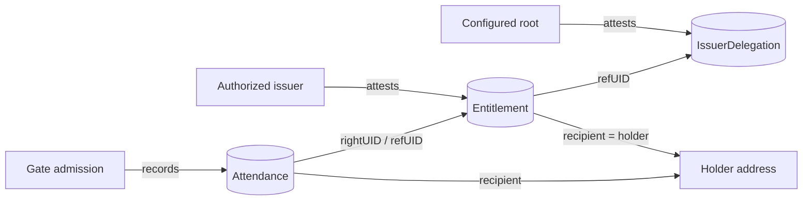

# Attestation model

fuda represents authorization as a small graph of EAS attestations on Base.
This document defines the durable records, references, and authority boundary,
and records the exact schema strings, configured values, payload shapes, D1
tables, and tests that the MVP implementation binds to
(see [MVP implementation reference](#mvp-implementation-reference)).

## Records and roles

### Records

| Record             | Responsibility                                                                                                                                |
| ------------------ | --------------------------------------------------------------------------------------------------------------------------------------------- |
| `Entitlement`      | The revocable right held by a wallet address, including its issuer, usage policy, tier, validity window, serial value, and metadata reference |
| `IssuerDelegation` | The root-authorized statement that identifies an issuer allowed to create trusted Entitlements                                                |
| `Attendance`       | Evidence that a gate admitted the holder of an Entitlement, referencing that right and recording the entry context                            |

### Roles

| Role            | Responsibility                                                                                                   |
| --------------- | ---------------------------------------------------------------------------------------------------------------- |
| Configured root | Establishes the trust root by attesting IssuerDelegation records                                                 |
| Issuer          | Attests and revokes Entitlements under a valid delegation                                                        |
| Operator        | Uses the dashboard and API to exercise the issuer authority available to their account                           |
| Holder          | Receives or controls the address named by an Entitlement                                                         |
| Gate            | Reads EAS, applies the verification policy, coordinates operational admission state, and returns ADMIT or REJECT |



## Entitlement lifecycle

1. **Delegate.** The configured root attests an IssuerDelegation for an issuer.
   This creates the trust path the gate will later validate.
2. **Issue.** An authorized issuer attests an Entitlement whose recipient is
   its holder and whose `refUID` points to the governing IssuerDelegation. The
   public MVP waits for confirmed chain state before returning the issued UID.
3. **Verify.** The gate reads the Entitlement and delegation from EAS. It checks
   accepted schemas, delegation authority, revocation, validity bounds, and
   the usage model. Signed policies additionally verify a fresh challenge
   against the holder.
4. **Admit.** Admission consumes any required operational slot and creates an
   entry log. For a right whose `level` is `0` or `1` the API then attempts
   to attest Attendance without delaying the gate verdict; an Attendance
   write failure may leave the successful entry represented only in
   operational logs. **No Attendance is attested for a `level == 2`
   (+Private) right**: the stealth holder is unlinkable to the member, but a
   public Attendance would still publish that right's visit history, which is
   exactly what +Private exists to hide. Its entries live only in the entry
   log.
5. **Revoke.** The issuer revokes the Entitlement on EAS. A later gate read
   rejects the same pass because the on-chain right is no longer valid.

Holder-preserving activation changes the owners of a claimable smart account,
not the Entitlement. Its holder address, attestation UID, Attendance history,
and other public history remain unchanged.

## Identity and reference invariants

- An Entitlement's EAS recipient is its holder address.
- An Entitlement's `refUID` identifies the IssuerDelegation that governs its
  issuer. The gate checks that delegation's schema, root attester, active flag,
  revocation state, and delegated issuer.
- Attendance identifies the admitted Entitlement through `rightUID`; its EAS
  reference also points back to that right.
- EAS recipients are immutable. Moving a right to a different holder requires
  a fresh attestation rather than editing the existing record.
- Activating a claimable smart account does not move the right because account
  ownership changes behind the same holder address.
- Crossing the +Private boundary requires a fresh holder and attestation. The
  transition must not publish an on-chain lineage link that correlates the
  private and non-private rights.

The [pass types and flows](./pass-types-and-flows.md) guide explains when
the holder is a claimable smart account, direct wallet, or one-time stealth
address.

## On-chain authority and D1(SQLite) operational state

| EAS / Base — authoritative chain facts                            | D1(SQLite) — operational and indexed state            |
| ----------------------------------------------------------------- | ----------------------------------------------------- |
| Attestation UID, schema, data, attester, recipient, and reference | Member index and product-facing status                |
| IssuerDelegation authority and revocation                         | One-time Signed challenges and consumption timestamps |
| Entitlement contents and revocation                               | SINGLE_USE slot consumption                           |
| Confirmed Attendance evidence                                     | Gate entry logs and optional Attendance UID backfill  |
| ERC-5564 announcement events                                      | Announcement cache and sync cursor                    |

D1 can make the product responsive and enforce admission state that EAS does
not model, but it cannot make an invalid or revoked Entitlement valid. If the
gate cannot read required chain or delegation state, it must **fail closed**
instead of trusting a cached D1 copy.

The split also means the two stores need not advance atomically. A confirmed
Entitlement can exist before an index update, and a successful entry log can
exist when its asynchronous Attendance attestation failed. Consumers must
distinguish authoritative chain evidence from operational observations.

## Schema evolution and consistency

EAS schemas are immutable. fuda therefore treats each record type as an
**accepted-version set** rather than assuming one permanent schema UID:

- issuance writes the newest accepted version;
- verification accepts listed older versions;
- a version-specific decoder upcasts each record to the current internal
  model; and
- an unknown schema fails verification rather than being guessed.

The public MVP issues Entitlements synchronously and returns only after their
chain receipts are confirmed. Operational indexing may happen separately and
can be repaired from authoritative chain state. Attendance is deliberately
asynchronous so a slow evidence write never holds the physical gate open.

## MVP implementation reference

The values below are the implementation contract for the public MVP on Base
Sepolia. They are the source of truth for the strings and constants that code,
configuration, and tests must agree on.

### Chain fixtures

| Contract                      | Address                                                                                                                                                             |
| ----------------------------- | ------------------------------------------------------------------------------------------------------------------------------------------------------------------- |
| EAS                           | `0x4200000000000000000000000000000000000021`                                                                                                                        |
| SchemaRegistry                | `0x4200000000000000000000000000000000000020`                                                                                                                        |
| Chain / RPC                   | Base Sepolia; `BASE_RPC_URL` secret, fallback `https://sepolia.base.org`                                                                                            |
| ERC-5564 Announcer            | `0x55649E01B5Df198D18D95b5cc5051630cfD45564` (`ANNOUNCER_ADDRESS`); scan floor `ANNOUNCER_FROM_BLOCK` = the block this contract was deployed at on the target chain |
| Coinbase Smart Wallet factory | `0x0BA5ED0c6AA8c49038F819E587E2633c4A9F428a` (`FACTORY_ADDRESS`); derives the counterfactual claimable-smart-account address for Bearer holders                     |

### Wire constants

Every string a client and the api must agree on byte-for-byte. Changing any of
them is a protocol version bump.

| Constant                                                 | Value                                                                                                                                                  |
| -------------------------------------------------------- | ------------------------------------------------------------------------------------------------------------------------------------------------------ |
| Pass / QR payload                                        | `fuda:v1:<uid>` (uid = `0x` + 64 lowercase hex)                                                                                                        |
| Challenge string (what is signed, EIP-191 personal-sign) | `fuda-gate:<uid>:<nonce>`                                                                                                                              |
| Challenge nonce                                          | `0x` + 32 hex (16 random bytes); TTL 300 s; one-time                                                                                                   |
| Announcement metadata                                    | `0x` + viewTag (2 hex) + uid (64 hex)                                                                                                                  |
| HKDF domain salt (`@fuda/stealth-address`)                       | `fuda.sh/stealth/v1` (UTF-8 bytes)                                                                                                                     |
| WebAuthn PRF eval input                                  | `prf: { eval: { first: utf8('fuda.sh/stealth/prf/v1') } }` — the PRF output is a function of this input; it must never change                          |
| WebAuthn `rp.id`                                         | `fuda.sh` for every fuda passkey ceremony in production (`VITE_RP_ID`, baked into the member app at build time; local dev overrides it to `localhost`) |

`uid` values are normalized to lowercase at every route entry; a mixed-case uid
in a QR, path or body is accepted and treated as the same right.

### Schemas

All three schemas are registered with `resolver = 0x0` and `revocable = true`,
so their UIDs are deterministic:
`keccak256(encodePacked(['string','address','bool'], [schema, resolver, revocable]))`.
Registration is an idempotent script (`apps/api/scripts/register-schemas.ts`)
that prints the UIDs for configuration.

**Entitlement**

```
address holder,address issuer,uint8 usageModel,uint8 tier,uint8 level,bytes32 serial,uint64 validFrom,uint64 validUntil,string metaURI
```

- `usageModel`: `0 = SINGLE_USE`, `1 = MULTI_USE`, `2 = METERED`. Values `> 2`
  fail closed at the gate (`UNKNOWN_USAGE_MODEL`).
- `tier`: `0 = FREE`, `1 = REGULAR`, `2 = VIP`, `3 = FOUNDER`.
- `level`: the verification level the right was issued at:
  `0 = bearer`, `1 = signed`, `2 = private`. The QR path (`POST /verify`)
  admits only `level == 0`; any higher level presented as a bare QR is
  `REJECT LEVEL_REQUIRED`, so a photo or copied UID of a Signed or +Private
  pass never admits. `/verify-signed` accepts every level. `/issue` sets the
  value from the issuance level; it is never taken from the request.
- `validFrom` / `validUntil`: unix seconds; `0` means unbounded on that side.
- Attested with `recipient = holder`, `revocable = true`, and
  `refUID = <the root IssuerDelegation UID>`.

**IssuerDelegation**

```
address issuer,bool active,string name
```

One root delegation is attested at setup time by the configured root signer
(`issuer` = that signer, `active = true`).

**Attendance**

```
bytes32 rightUID,address holder,uint64 enteredAt,bytes32 slotId
```

Attested with `recipient = holder` and `refUID = rightUID`.

### Configured values

| Key                                                                                        | Location                | Meaning                                                                                                                                                                                                                                                                                                                |
| ------------------------------------------------------------------------------------------ | ----------------------- | ---------------------------------------------------------------------------------------------------------------------------------------------------------------------------------------------------------------------------------------------------------------------------------------------------------------------- |
| `EAS_SCHEMAS`                                                                              | `wrangler.jsonc` `vars` | Accepted-version set per record type: `[{ uid, version }]`, one entry per type at launch                                                                                                                                                                                                                               |
| `DELEGATION_UID`                                                                           | `wrangler.jsonc` `vars` | UID of the root IssuerDelegation that every issued Entitlement references                                                                                                                                                                                                                                              |
| `ISSUER_ADDRESS`                                                                           | `wrangler.jsonc` `vars` | The configured root attester; the gate accepts only delegations attested by this address                                                                                                                                                                                                                               |
| `ANNOUNCER_ADDRESS`                                                                        | `wrangler.jsonc` `vars` | The ERC-5564 Announcer `/issue` writes +Private announcements to and `GET /announcements` reads                                                                                                                                                                                                                        |
| `ANNOUNCER_FROM_BLOCK`                                                                     | `wrangler.jsonc` `vars` | Sync floor for the announcement cache. Must be this deployment's Announcer deployment block; `0`, missing or unparseable counts as unconfigured and `GET /announcements` answers `502 rpc_unavailable` without touching the chain (fails closed rather than walking from genesis)                                      |
| `FACTORY_ADDRESS`                                                                          | `wrangler.jsonc` `vars` | Coinbase Smart Wallet factory used to derive Bearer holder addresses                                                                                                                                                                                                                                                   |
| `API_BASE_URL`                                                                             | `wrangler.jsonc` `vars` | Absolute base for the `passUrls` in `/issue` responses; its origin is the api entry in the Google Wallet `origins` claim, which also lists `https://dash.fuda.sh` and `https://app.fuda.sh`                                                                                                                            |
| Signer key (`SIGNER_PRIVATE_KEY`)                                                          | Worker secret           | Signs Entitlement, IssuerDelegation, and Attendance transactions; endpoints answer `501 no_signer` without                                                                                                                                                                                                             |
| `ADMIN_TOKEN`                                                                              | Worker secret           | Bearer token for `/issue`, `/revoke`, `/members`. Required whenever a chain binding is configured: with `SIGNER_PRIVATE_KEY` or `BASE_RPC_URL` set and no token the admin routes answer `401 unauthorized` and every response carries `x-auth-mode: locked`; with no token and neither binding (local dev) they are open and responses carry `x-auth-mode: open` |
| `BASE_RPC_URL`                                                                             | Worker secret           | Base Sepolia RPC; falls back to the public endpoint                                                                                                                                                                                                                                                                    |
| `GOOGLE_ISSUER_ID`, `GOOGLE_CLASS_ID`, `GOOGLE_SA_EMAIL`, `GOOGLE_SA_KEY_PEM`              | Worker secrets          | Google Wallet; all four or `GET /pass/:uid/google` answers `501 google_not_configured`                                                                                                                                                                                                                                 |
| `APPLE_PASS_TYPE_ID`, `APPLE_TEAM_ID`, `APPLE_CERT_PEM`, `APPLE_KEY_PEM`, `APPLE_WWDR_PEM` | Worker secrets          | Apple Wallet; all five or `GET /pass/:uid/apple.pkpass` answers `501 apple_not_configured`                                                                                                                                                                                                                             |

Issuance always writes the newest version in the set; verification accepts
every listed version and decodes through a per-version codec
(`decodeEntitlementV1 → toCanonical`, the identity for v1). A future v2 is
added by appending a set entry and a codec, with no change to gate logic.
Deprecation policies, `refUID` supersession chains, and touch-time migration
are deliberately not in the MVP.

`USE_FAKE_CHAIN=1` is a local-development opt-in only (`apps/api/.dev.vars`): it
swaps in an in-memory chain and is ignored whenever a signer or an RPC binding is
present. It is never set in a deployed environment. Wrangler named environments
do not inherit top-level `vars` or `d1_databases`, so the `env.dev` block in
`apps/api/wrangler.jsonc` repeats them in full with deterministic fake-chain
values.

Migrations under `apps/api/migrations/` are hand-written SQL; there is no
drizzle-kit snapshot. Before any future `drizzle-kit generate`, bootstrap the
baseline snapshot first, or the generator re-emits every table as a new
migration.

### Delegation check

At verify time the gate loads the Entitlement's `refUID` and requires that it
is a non-revoked IssuerDelegation whose schema is in the IssuerDelegation
accepted-version set, whose attester is `ISSUER_ADDRESS`, whose
`active = true`, and whose `issuer` field equals the Entitlement's attester.
Failures map to `NO_DELEGATION`, `ISSUER_NOT_DELEGATED`,
`DELEGATION_UNAVAILABLE` (RPC error, fail closed), and
`DELEGATION_CONFIG_MISSING`.

### Gate verification order and reasons

`verifyUid(uid)` reads `EAS.getAttestation(uid)` via `eth_call`, then checks
in this order. The first failing check is the reported reason.

| Check                                                                                                                       | REJECT reason                                                                                     |
| --------------------------------------------------------------------------------------------------------------------------- | ------------------------------------------------------------------------------------------------- |
| attestation exists (`uid != 0`)                                                                                             | `NOT_FOUND`                                                                                       |
| schema in the Entitlement accepted-version set; decode and upcast to canonical                                              | `WRONG_SCHEMA`                                                                                    |
| `revocationTime == 0`                                                                                                       | `REVOKED`                                                                                         |
| `expirationTime == 0 \|\| now <= expirationTime` (EAS-level expiry on the attestation itself; fuda's `/issue` pins it to 0) | `EXPIRED`                                                                                         |
| `usageModel <= 2`                                                                                                           | `UNKNOWN_USAGE_MODEL`                                                                             |
| `validFrom == 0 \|\| now >= validFrom`                                                                                      | `NOT_YET_VALID`                                                                                   |
| `validUntil == 0 \|\| now <= validUntil`                                                                                    | `EXPIRED`                                                                                         |
| delegation chain valid (see above)                                                                                          | `NO_DELEGATION` / `ISSUER_NOT_DELEGATED` / `DELEGATION_UNAVAILABLE` / `DELEGATION_CONFIG_MISSING` |
| `level == 0` (`POST /verify` only; `/verify-signed` accepts every level)                                                    | `LEVEL_REQUIRED`                                                                                  |
| slot not consumed (SINGLE_USE, action endpoints only)                                                                       | `ALREADY_USED`                                                                                    |
| challenge valid (signed endpoint only)                                                                                      | `BAD_CHALLENGE`                                                                                   |
| signature valid (signed endpoint only)                                                                                      | `BAD_SIGNATURE`                                                                                   |

Every chain error fails closed. `LEVEL_REQUIRED` is checked before slot
consumption, so a photographed Signed pass cannot burn its SINGLE_USE slot.
`GET /verify/:uid` reports the level but never rejects on it: it is a
read-only preview that answers "is this right valid?", not "may it enter by
QR?".

### Error codes

Errors are `{ "error": "<code>" }` with these statuses. Every gate *decision* is
`200` and decision-shaped; input, auth, configuration and infrastructure
failures use these codes instead. A read the gate cannot complete is not a
decision: it fails closed as `502 chain_error` and is never written to
`entry_log`.

| Code                                             | Status | When                                                                                                                                                                                                                                                       |
| ------------------------------------------------ | ------ | ---------------------------------------------------------------------------------------------------------------------------------------------------------------------------------------------------------------------------------------------------------- |
| `bad_input`                                      | 400    | body fails validation                                                                                                                                                                                                                                      |
| `bad_uid`                                        | 400    | uid is not `0x` + 64 hex                                                                                                                                                                                                                                   |
| `bad_qr`                                         | 400    | QR payload is not `fuda:v1:<uid>`                                                                                                                                                                                                                          |
| `bad_meta_address`                               | 400    | +Private meta-address is malformed or off-curve                                                                                                                                                                                                            |
| `client_ip_required`                             | 400    | budgeted route called without `CF-Connecting-IP`                                                                                                                                                                                                           |
| `unauthorized`                                   | 401    | admin bearer missing or wrong, or admin routes locked                                                                                                                                                                                                      |
| `not_found`                                      | 404    | no `members` row for the uid (also a +Private row on the pass routes)                                                                                                                                                                                      |
| `rate_limited`                                   | 429    | per-IP hourly budget exceeded                                                                                                                                                                                                                              |
| `internal`                                       | 500    | unclassified defect; logged                                                                                                                                                                                                                                |
| `no_signer`                                      | 501    | write route without `SIGNER_PRIVATE_KEY`                                                                                                                                                                                                                   |
| `google_not_configured` / `apple_not_configured` | 501    | wallet platform secrets absent                                                                                                                                                                                                                             |
| `chain_error`                                    | 502    | chain write reverted or failed; the gate cannot read the attestation or its schema binding at verify time (fail closed); or the deployment cannot issue: `ISSUER_ADDRESS` or `DELEGATION_UID` unset or zero, or the accepted schema set empty or malformed |
| `rpc_unavailable`                                | 502    | announcement cache empty and the chain unreachable, or `ANNOUNCER_FROM_BLOCK` unconfigured                                                                                                                                                                 |

The `ErrorCode` union in `packages/sdk` is this list.

### API payloads that touch attestations

**`POST /issue`** derives the level from the keys present:
`stealthMetaAddress` → +Private (`memberId` optional, `holder` forbidden);
else `holder` → Signed (`memberId` forbidden); else `memberId` → Bearer;
anything else → `400 bad_input`.

```jsonc
{
    "memberId": "alice", // Bearer: any non-empty string. +Private: optional representative id
    "holder": "0x…40", // Signed: the member's wallet address
    "stealthMetaAddress": "0x…132hex", // +Private: 66-byte meta-address
    "tier": 1, // optional, 0–3, default 0
    "usageModel": 1, // optional, 0–2, default 1 (MULTI_USE)
    "validFrom": 0,
    "validUntil": 0, // optional unix seconds
    "metaURI": "", // optional string
}
```

Issuance is synchronous: the endpoint submits the attestation transaction and
waits for the receipt before returning the UID. A Bearer or Signed issuance
answers:

```jsonc
{
    "uid": "0x…64", // the Entitlement attestation UID
    "level": "bearer", // or "signed"
    "holder": "0x…40", // the Entitlement's EAS recipient
    "qr": "fuda:v1:0x…64", // the payload the gate scanner reads
    "passUrls": {
        "web": "https://api.fuda.sh/pass/0x…64",
        "google": "https://api.fuda.sh/pass/0x…64/google",
        "apple": "https://api.fuda.sh/pass/0x…64/apple.pkpass",
    },
}
```

All three `passUrls` are absolute against `API_BASE_URL` and always present,
even where a wallet platform is unconfigured (that route answers `501`). A
+Private issuance answers the other arm — `{ "uid", "level": "private",
"announced": true, "announceTx" }` — with no `holder`, no `qr` and no
`passUrls`, because a +Private right has no pass
([passes](./pass-types-and-flows.md#passes)).

**`POST /revoke`** takes `{ "uid": "0x…64" }`, calls
`revoke(entitlementSchemaUid, uid)` on EAS, then marks the member row
`revoked`. Response `{ "revoked": true, "uid" }`. Errors: `400 bad_uid`,
`501 no_signer`, `502 chain_error` (an unknown or already-revoked UID both
revert on EAS and surface here; the member row is left untouched).

**`GET /verify/:uid` and `POST /verify`** require
`uid` to match `/^0x[0-9a-fA-F]{64}$/` (`400 bad_uid`). `POST /verify` takes
`{ "qr": "fuda:v1:0x…64" }` (`400 bad_qr` otherwise). Both return the decoded
records:

```jsonc
{
    "decision": "ADMIT", // or "REJECT"
    "reason": "OK", // reason table above
    "entitlement": {
        "holder": "0x…",
        "issuer": "0x…",
        "usageModel": 1,
        "tier": 1,
        "level": 0,
        "validFrom": 0,
        "validUntil": 0,
        "schemaVersion": 1,
    },
    "delegation": { "issuer": "0x…", "active": true, "name": "fuda root" },
}
```

`GET /verify/:uid` is a read-only preview: it never consumes a slot and is
never written to `entry_log`. For the action endpoints (`POST /verify` and
`POST /verify-signed`) every decision-shaped response (`ADMIT` or `REJECT`
with its reason) is appended to `entry_log`; `4xx` input errors are not.

**Threat model of the public verify endpoints.** `GET /verify/:uid` and
`POST /verify` are unauthenticated, and every Bearer uid is public on chain and
in the pass URL scheme (`/pass/<uid>`). Anyone who learns a uid can preview it
and, for a SINGLE_USE right, burn its slot with a bare `POST /verify`. This is
by design: a Bearer right is a bearer credential, and the issuer's own gate
scanner shares the same anonymous path. Rights that must resist this are issued
at Signed, where admission needs a challenge signature from the holder.

**+Private privacy boundary.** Unlinkability holds against chain observers, not
against the issuer: the issuer attested the right, chose the stealth address at
issue time, and its own `members` row may carry the representative `member_id`
next to the uid, so it can join member id, uid, and stealth address. The gate
additionally learns which right entered from the stealth-key signature.

**Signature verification and RPC outages.** `POST /verify-signed` verifies
possession through viem's `publicClient.verifyMessage`, which covers EOAs
(ecrecover), deployed smart accounts (ERC-1271) and undeployed ones (ERC-6492)
in one call. viem folds a transport error during the ERC-1271/6492 path into a
`false` result, so an RPC outage surfaces as `BAD_SIGNATURE` (fail closed)
rather than `502`; the burned challenge is cheap to re-mint. The api's wrapper
keeps a fail-closed branch for a client that does throw — an `HttpRequestError`,
`TimeoutError` or `RpcRequestError` becomes a `ChainError` and a `502` — so a
viem version that stops swallowing transport failures changes the status, not
the safety. Re-test this behaviour on every viem major bump.

### D1 tables that mirror or extend attestations

The schema is `apps/api/migrations/0000_init.sql` in full:

```sql
CREATE TABLE members (
  attestation_uid TEXT PRIMARY KEY,          -- 0x…64; one row per issued right
  member_id       TEXT NOT NULL DEFAULT '',  -- persistent id: operator-chosen (bearer), holder address (signed), optional representative id (private); NOT unique
  holder          TEXT,                      -- attested address (bearer/signed); NULL for private rows — the stealth address is never stored
  level           TEXT NOT NULL,             -- 'bearer' | 'signed' | 'private' (mirror of the on-chain `level`)
  tier            INTEGER NOT NULL DEFAULT 0,
  status          TEXT NOT NULL DEFAULT 'active',  -- 'active' | 'revoked'
  created_at      INTEGER NOT NULL           -- unix seconds
);
CREATE INDEX members_holder ON members(holder);
CREATE INDEX members_member_id ON members(member_id);

CREATE TABLE rate_limits (
  ip           TEXT NOT NULL,
  window_start INTEGER NOT NULL,
  count        INTEGER NOT NULL,
  PRIMARY KEY (ip, window_start)
);

CREATE TABLE challenges (
  nonce      TEXT PRIMARY KEY,
  uid        TEXT NOT NULL,
  created_at INTEGER NOT NULL,
  used_at    INTEGER
);

CREATE TABLE slots (                          -- SINGLE_USE consumption
  uid         TEXT NOT NULL,
  slot        TEXT NOT NULL,                  -- 'default' in the MVP
  consumed_at INTEGER NOT NULL,
  PRIMARY KEY (uid, slot)
);

CREATE TABLE entry_log (
  id       INTEGER PRIMARY KEY AUTOINCREMENT,
  uid      TEXT NOT NULL,
  decision TEXT NOT NULL,                     -- 'ADMIT' | 'REJECT'
  reason   TEXT NOT NULL,                     -- reason table above
  path     TEXT NOT NULL,                     -- 'qr' | 'signature' (entry path, not the right's level)
  at       INTEGER NOT NULL,
  attendance_uid TEXT                          -- written back after the Attendance attest lands
);

CREATE TABLE announcements (
  tx_hash           TEXT NOT NULL,
  log_index         INTEGER NOT NULL,
  block_number      INTEGER NOT NULL,
  scheme_id         INTEGER NOT NULL,
  stealth_address   TEXT NOT NULL,
  caller            TEXT NOT NULL,
  ephemeral_pub_key TEXT NOT NULL,
  metadata          TEXT NOT NULL,
  PRIMARY KEY (tx_hash, log_index)
);

CREATE TABLE sync_state (
  key   TEXT PRIMARY KEY,
  value INTEGER NOT NULL
);
```

SINGLE_USE consumption is a D1 batch that writes the `slots` row and the `ADMIT`
`entry_log` row together: the slot insert is a plain `INSERT`, so a second scan
violates the `(uid, slot)` primary key and the whole batch rolls back — the slot
is the lock, and no `ADMIT` is ever logged against a slot already burned. No
Durable Objects are used in the MVP.

`challenges` rows are one-time and short-lived: `POST /verify-signed` consumes a
nonce with a conditional `UPDATE … WHERE used_at IS NULL AND created_at > now −
300`, and `POST /challenge` opportunistically deletes rows older than the 300 s
TTL on every mint, so the table holds only live nonces. `rate_limits` is the
per-IP fixed hourly window (`floor(now / 3600) * 3600`) behind
`GET /announcements` only: 120 requests per hour per IP; the gate routes, admin
routes and `/health` are never budgeted. `announcements` and `sync_state` are
the ERC-5564 log cache and its cursor (next subsection).

### Announcement cache (`GET /announcements`)

The api mirrors every scheme-1 `Announcement` event of the configured Announcer
into D1 and serves it to every caller identically; it never filters by caller or
by anything a member could be identified by
([ADR 0002](../adr/0002-unfiltered-announcement-log.md)). Contract:

- **Lazy sync.** Each request first syncs from the persisted cursor (floor:
  `max(sync_state, ANNOUNCER_FROM_BLOCK − 1)`) in chunks of at most 1000 blocks,
  at most 5 chunks per request; each chunk's rows and its new cursor land in one
  D1 batch, and the cursor write is monotone (`max`) so concurrent requests
  cannot lower it. Rows are insert-or-ignore keyed on `(tx_hash, log_index)`, so
  re-scanning a held range is a no-op, and multi-row inserts are sliced to stay
  under D1's 100-parameter cap.
- **Reorg guarantee.** Sync stops `CONFIRMATIONS = 5` blocks short of the head,
  so a re-org cannot strand a row behind the cursor.
- **Response.** `{ announcements, syncedTo }`: up to 1000 rows ascending by
  `(block_number, log_index)` starting at `fromBlock` (default 0; a fractional
  value truncates, a negative or non-numeric one clamps to 0).
- **Paging (client rule).** A page shorter than 1000 rows is the last one.
  Otherwise resume at the last row's `blockNumber` (the api pages by block, so
  the boundary block is returned again) and de-duplicate on `(txHash,
  logIndex)`. The member app caps a discovery walk at 50 pages and marks the
  result incomplete when the cap is hit; a full walk of a large log can
  therefore spend up to 50 of the caller's 120 hourly requests.
- **Degradation.** With the chain unreachable the route serves the stale cache
  and its last `syncedTo`; it answers `502 rpc_unavailable` only when nothing
  has ever been cached, and likewise when `ANNOUNCER_FROM_BLOCK` is
  unconfigured. A freshly deployed api therefore needs one warm-up call (or the
  live smoke) before the first member discovery.

### Operational reconciliation

Two writes are deliberately non-atomic across the chain and D1, and each leaves
a trace an operator reconciles by hand:

- **Orphan attestation.** `POST /issue` attests first, then (for +Private)
  announces, and writes the `members` row last. If the announce or the row
  insert fails, the route answers `502 chain_error`, persists nothing, and logs
  the uid. The right exists on chain but fuda's ledger does not know it; revoke
  it by uid from the dashboard, or re-run the issue. A re-run attests a second
  right, so the orphan is the duplicate to revoke.
- **Lost `attendance_uid`.** Attendance is attested best-effort after the
  verdict; if the attest or the write-back fails, the `entry_log` row keeps
  `attendance_uid = NULL` and the failure is logged. The admission stands; the
  on-chain evidence is missing for that entry.
  `SELECT * FROM entry_log WHERE decision = 'ADMIT' AND attendance_uid IS NULL`
  lists them.

### Tests that pin this model

- **Unit (api helpers):** schema UID computation vs the registry; Entitlement
  codec round-trip including `level`; Attendance codec round-trip; reason
  ordering (`LEVEL_REQUIRED` precedes `ALREADY_USED`); versioning seam:
  unknown UID → `WRONG_SCHEMA`, v1 decode → canonical upcast identity,
  delegation accepted-set lookup; EAS `expirationTime` in the past → `EXPIRED`,
  taking precedence over the usage-model check.
- **Integration (api, workerd + real D1):** issue → verify ADMIT (bearer);
  revoke → REJECT; SINGLE_USE double-scan; signed-level right by QR →
  `LEVEL_REQUIRED` with its slot left unconsumed; same holder issued twice →
  two rows; delegation-missing REJECT; `/revoke` unknown uid →
  `502 chain_error`; +Private issue → member row has `holder = NULL` and
  `member_id` = the supplied representative id; +Private ADMIT via
  `/verify-signed` → no Attendance attest is attempted and `attendance_uid`
  stays `NULL`; admin routes locked (`401`, `x-auth-mode: locked`) without
  `ADMIN_TOKEN` when a signer is set, and equally when only `BASE_RPC_URL` is
  set; `/pass/:uid` `404` for a +Private row (the
  shared row load precedes any platform check); announcement sync: chunk cap and
  resume, monotone cursor under a concurrent faster sync, cursor floored at the
  configured start, and the `CONFIRMATIONS` stop short of the head.
- **Unit (member app):** announcement paging — a short page ends the walk, a
  full page resumes from its last block and de-duplicates the repeated boundary
  row, and the 50-page cap reports the list as incomplete.

## Related specs

- [Architecture overview](./README.md)
- [Pass types and flows](./pass-types-and-flows.md)
- [Naming](./naming.md)
