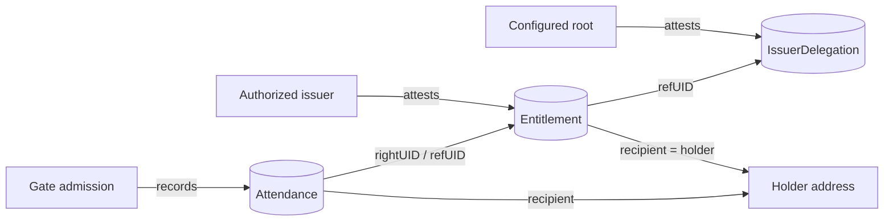

# Attestation model

fuda represents authorization as a small graph of EAS attestations on Base.
This document defines the durable records, references, and authority boundary,
and records the exact schema strings, configured values, payload shapes, D1
tables, and tests that the MVP implementation binds to
(see [MVP implementation reference](#mvp-implementation-reference)).

## Records and roles

### Records

| Record             | Responsibility                                                                                                                                |
| ------------------ | --------------------------------------------------------------------------------------------------------------------------------------------- |
| `Entitlement`      | The revocable right held by a wallet address, including its issuer, usage policy, tier, validity window, serial value, and metadata reference |
| `IssuerDelegation` | The root-authorized statement that identifies an issuer allowed to create trusted Entitlements                                                |
| `Attendance`       | Evidence that a gate admitted the holder of an Entitlement, referencing that right and recording the entry context                            |

### Roles

| Role            | Responsibility                                                                                                   |
| --------------- | ---------------------------------------------------------------------------------------------------------------- |
| Configured root | Establishes the trust root by attesting IssuerDelegation records                                                 |
| Issuer          | Attests and revokes Entitlements under a valid delegation                                                        |
| Operator        | Uses the dashboard and API to exercise the issuer authority available to their account                           |
| Holder          | Receives or controls the address named by an Entitlement                                                         |
| Gate            | Reads EAS, applies the verification policy, coordinates operational admission state, and returns ADMIT or REJECT |



## Entitlement lifecycle

1. **Delegate.** The configured root attests an IssuerDelegation for an issuer.
   This creates the trust path the gate will later validate.
2. **Issue.** An authorized issuer attests an Entitlement whose recipient is
   its holder and whose `refUID` points to the governing IssuerDelegation. The
   public MVP waits for confirmed chain state before returning the issued UID.
3. **Verify.** The gate reads the Entitlement and delegation from EAS. It checks
   accepted schemas, delegation authority, revocation, validity bounds, and
   the usage model. Signed policies additionally verify a fresh challenge
   against the holder.
4. **Admit.** Admission consumes any required operational slot and creates an
   entry log. The API then attempts to attest Attendance without delaying the
   gate verdict; an Attendance write failure may leave the successful entry
   represented only in operational logs.
5. **Revoke.** The issuer revokes the Entitlement on EAS. A later gate read
   rejects the same pass because the on-chain right is no longer valid.

Holder-preserving activation changes the owners of a claimable smart account,
not the Entitlement. Its holder address, attestation UID, Attendance history,
and other public history remain unchanged.

## Identity and reference invariants

- An Entitlement's EAS recipient is its holder address.
- An Entitlement's `refUID` identifies the IssuerDelegation that governs its
  issuer. The gate checks that delegation's schema, root attester, active flag,
  revocation state, and delegated issuer.
- Attendance identifies the admitted Entitlement through `rightUID`; its EAS
  reference also points back to that right.
- EAS recipients are immutable. Moving a right to a different holder requires
  a fresh attestation rather than editing the existing record.
- Activating a claimable smart account does not move the right because account
  ownership changes behind the same holder address.
- Crossing the +Private boundary requires a fresh holder and attestation. The
  transition must not publish an on-chain lineage link that correlates the
  private and non-private rights.

The [pass types and flows](./pass-types-and-flows.md) guide explains when
the holder is a claimable smart account, direct wallet, or one-time stealth
address.

## On-chain authority and D1(SQLite) operational state

| EAS / Base — authoritative chain facts                            | D1(SQLite) — operational and indexed state            |
| ----------------------------------------------------------------- | ----------------------------------------------------- |
| Attestation UID, schema, data, attester, recipient, and reference | Member index and product-facing status                |
| IssuerDelegation authority and revocation                         | One-time Signed challenges and consumption timestamps |
| Entitlement contents and revocation                               | SINGLE_USE slot consumption                           |
| Confirmed Attendance evidence                                     | Gate entry logs and optional Attendance UID backfill  |
| ERC-5564 announcement events                                      | Announcement cache and sync cursor                    |

D1 can make the product responsive and enforce admission state that EAS does
not model, but it cannot make an invalid or revoked Entitlement valid. If the
gate cannot read required chain or delegation state, it must **fail closed**
instead of trusting a cached D1 copy.

The split also means the two stores need not advance atomically. A confirmed
Entitlement can exist before an index update, and a successful entry log can
exist when its asynchronous Attendance attestation failed. Consumers must
distinguish authoritative chain evidence from operational observations.

## Schema evolution and consistency

EAS schemas are immutable. fuda therefore treats each record type as an
**accepted-version set** rather than assuming one permanent schema UID:

- issuance writes the newest accepted version;
- verification accepts listed older versions;
- a version-specific decoder upcasts each record to the current internal
  model; and
- an unknown schema fails verification rather than being guessed.

The public MVP issues Entitlements synchronously and returns only after their
chain receipts are confirmed. Operational indexing may happen separately and
can be repaired from authoritative chain state. Attendance is deliberately
asynchronous so a slow evidence write never holds the physical gate open.

## MVP implementation reference

The values below are the implementation contract for the public MVP on Base
Sepolia. They are the source of truth for the strings and constants that code,
configuration, and tests must agree on.

### Chain fixtures

| Contract       | Address                                                                  |
| -------------- | ------------------------------------------------------------------------ |
| EAS            | `0x4200000000000000000000000000000000000021`                             |
| SchemaRegistry | `0x4200000000000000000000000000000000000020`                             |
| Chain / RPC    | Base Sepolia; `BASE_RPC_URL` secret, fallback `https://sepolia.base.org` |

### Schemas

All three schemas are registered with `resolver = 0x0` and `revocable = true`,
so their UIDs are deterministic:
`keccak256(encodePacked(['string','address','bool'], [schema, resolver, revocable]))`.
Registration is an idempotent script (`apps/api/scripts/register-schemas.ts`)
that prints the UIDs for configuration.

**Entitlement**

```
address holder,address issuer,uint8 usageModel,uint8 tier,uint8 level,bytes32 serial,uint64 validFrom,uint64 validUntil,string metaURI
```

- `usageModel`: `0 = SINGLE_USE`, `1 = MULTI_USE`, `2 = METERED`. Values `> 2`
  fail closed at the gate (`UNKNOWN_USAGE_MODEL`).
- `tier`: `0 = FREE`, `1 = REGULAR`, `2 = VIP`, `3 = FOUNDER`.
- `level`: the verification level the right was issued at:
  `0 = bearer`, `1 = signed`, `2 = private`. The QR path (`POST /verify`)
  admits only `level == 0`; any higher level presented as a bare QR is
  `REJECT LEVEL_REQUIRED`, so a photo or copied UID of a Signed or +Private
  pass never admits. `/verify-signed` accepts every level. `/issue` sets the
  value from the issuance level; it is never taken from the request.
- `validFrom` / `validUntil`: unix seconds; `0` means unbounded on that side.
- Attested with `recipient = holder`, `revocable = true`, and
  `refUID = <the root IssuerDelegation UID>`.

**IssuerDelegation**

```
address issuer,bool active,string name
```

One root delegation is attested at setup time by the configured root signer
(`issuer` = that signer, `active = true`).

**Attendance**

```
bytes32 rightUID,address holder,uint64 enteredAt,bytes32 slotId
```

Attested with `recipient = holder` and `refUID = rightUID`.

### Configured values

| Key              | Location                | Meaning                                                                                                    |
| ---------------- | ----------------------- | ---------------------------------------------------------------------------------------------------------- |
| `EAS_SCHEMAS`    | `wrangler.jsonc` `vars` | Accepted-version set per record type: `[{ uid, version }]`, one entry per type at launch                   |
| `DELEGATION_UID` | `wrangler.jsonc` `vars` | UID of the root IssuerDelegation that every issued Entitlement references                                  |
| `ISSUER_ADDRESS` | `wrangler.jsonc` `vars` | The configured root attester; the gate accepts only delegations attested by this address                   |
| Signer key       | Worker secret           | Signs Entitlement, IssuerDelegation, and Attendance transactions; endpoints answer `501 no_signer` without |

Issuance always writes the newest version in the set; verification accepts
every listed version and decodes through a per-version codec
(`decodeEntitlementV1 → toCanonical`, the identity for v1). A future v2 is
added by appending a set entry and a codec, with no change to gate logic.
Deprecation policies, `refUID` supersession chains, and touch-time migration
are deliberately not in the MVP.

### Delegation check

At verify time the gate loads the Entitlement's `refUID` and requires that it
is a non-revoked IssuerDelegation whose schema is in the IssuerDelegation
accepted-version set, whose attester is `ISSUER_ADDRESS`, whose
`active = true`, and whose `issuer` field equals the Entitlement's attester.
Failures map to `NO_DELEGATION`, `ISSUER_NOT_DELEGATED`,
`DELEGATION_UNAVAILABLE` (RPC error, fail closed), and
`DELEGATION_CONFIG_MISSING`.

### Gate verification order and reasons

`verifyUid(uid)` reads `EAS.getAttestation(uid)` via `eth_call`, then checks
in this order. The first failing check is the reported reason.

| Check                                                                          | REJECT reason                                                                                     |
| ------------------------------------------------------------------------------ | ------------------------------------------------------------------------------------------------- |
| attestation exists (`uid != 0`)                                                | `NOT_FOUND`                                                                                       |
| schema in the Entitlement accepted-version set; decode and upcast to canonical | `WRONG_SCHEMA`                                                                                    |
| `revocationTime == 0`                                                          | `REVOKED`                                                                                         |
| `usageModel <= 2`                                                              | `UNKNOWN_USAGE_MODEL`                                                                             |
| `validFrom == 0 \|\| now >= validFrom`                                         | `NOT_YET_VALID`                                                                                   |
| `validUntil == 0 \|\| now <= validUntil`                                       | `EXPIRED`                                                                                         |
| delegation chain valid (see above)                                             | `NO_DELEGATION` / `ISSUER_NOT_DELEGATED` / `DELEGATION_UNAVAILABLE` / `DELEGATION_CONFIG_MISSING` |
| `level == 0` (`POST /verify` only; `/verify-signed` accepts every level)       | `LEVEL_REQUIRED`                                                                                  |
| slot not consumed (SINGLE_USE, action endpoints only)                          | `ALREADY_USED`                                                                                    |
| challenge valid (signed endpoint only)                                         | `BAD_CHALLENGE`                                                                                   |
| signature valid (signed endpoint only)                                         | `BAD_SIGNATURE`                                                                                   |

Every chain error fails closed. `LEVEL_REQUIRED` is checked before slot
consumption, so a photographed Signed pass cannot burn its SINGLE_USE slot.
`GET /verify/:uid` reports the level but never rejects on it: it is a
read-only preview that answers "is this right valid?", not "may it enter by
QR?".

### API payloads that touch attestations

**`POST /issue`** derives the level from the keys present:
`stealthMetaAddress` → +Private (`memberId` optional, `holder` forbidden);
else `holder` → Signed (`memberId` forbidden); else `memberId` → Bearer;
anything else → `400 bad_input`.

```jsonc
{
    "memberId": "alice", // Bearer: any non-empty string. +Private: optional representative id
    "holder": "0x…40", // Signed: the member's wallet address
    "stealthMetaAddress": "0x…132hex", // +Private: 66-byte meta-address
    "tier": 1, // optional, 0–3, default 0
    "usageModel": 1, // optional, 0–2, default 1 (MULTI_USE)
    "validFrom": 0,
    "validUntil": 0, // optional unix seconds
    "metaURI": "", // optional string
}
```

Issuance is synchronous: the endpoint submits the attestation transaction and
waits for the receipt before returning the UID.

**`POST /revoke`** takes `{ "uid": "0x…64" }`, calls
`revoke(entitlementSchemaUid, uid)` on EAS, then marks the member row
`revoked`. Response `{ "revoked": true, "uid" }`. Errors: `400 bad_uid`,
`501 no_signer`, `502 chain_error` (an unknown or already-revoked UID both
revert on EAS and surface here; the member row is left untouched).

**`GET /verify/:uid` and `POST /verify`** require
`uid` to match `/^0x[0-9a-fA-F]{64}$/` (`400 bad_uid`). `POST /verify` takes
`{ "qr": "fuda:v1:0x…64" }` (`400 bad_qr` otherwise). Both return the decoded
records:

```jsonc
{
    "decision": "ADMIT", // or "REJECT"
    "reason": "OK", // reason table above
    "entitlement": {
        "holder": "0x…",
        "issuer": "0x…",
        "usageModel": 1,
        "tier": 1,
        "level": 0,
        "validFrom": 0,
        "validUntil": 0,
        "schemaVersion": 1,
    },
    "delegation": { "issuer": "0x…", "active": true, "name": "fuda root" },
}
```

`GET /verify/:uid` is a read-only preview: it never consumes a slot and is
never written to `entry_log`. For the action endpoints (`POST /verify` and
`POST /verify-signed`) every decision-shaped response (`ADMIT` or `REJECT`
with its reason) is appended to `entry_log`; `4xx` input errors are not.

### D1 tables that mirror or extend attestations

```sql
CREATE TABLE members (
  attestation_uid TEXT PRIMARY KEY,          -- 0x…64; one row per issued right
  member_id       TEXT NOT NULL DEFAULT '',  -- persistent id: operator-chosen (bearer), holder address (signed), optional representative id (private); NOT unique
  holder          TEXT,                      -- attested address (bearer/signed); NULL for private rows — the stealth address is never stored
  level           TEXT NOT NULL,             -- 'bearer' | 'signed' | 'private' (mirror of the on-chain `level`)
  tier            INTEGER NOT NULL DEFAULT 0,
  status          TEXT NOT NULL DEFAULT 'active',  -- 'active' | 'revoked'
  created_at      INTEGER NOT NULL           -- unix seconds
);
CREATE INDEX members_holder ON members(holder);
CREATE INDEX members_member_id ON members(member_id);

CREATE TABLE slots (                          -- SINGLE_USE consumption
  uid         TEXT NOT NULL,
  slot        TEXT NOT NULL,                  -- 'default' in the MVP
  consumed_at INTEGER NOT NULL,
  PRIMARY KEY (uid, slot)
);

CREATE TABLE entry_log (
  id       INTEGER PRIMARY KEY AUTOINCREMENT,
  uid      TEXT NOT NULL,
  decision TEXT NOT NULL,                     -- 'ADMIT' | 'REJECT'
  reason   TEXT NOT NULL,                     -- reason table above
  path     TEXT NOT NULL,                     -- 'qr' | 'signature' (entry path, not the right's level)
  at       INTEGER NOT NULL,
  attendance_uid TEXT                          -- written back after the Attendance attest lands
);
```

SINGLE_USE consumption is a D1 `INSERT OR IGNORE` on the `(uid, slot)` key,
consumed iff `meta.changes > 0`. No Durable Objects are used in the MVP.

### Tests that pin this model

- **Unit (api helpers):** schema UID computation vs the registry; Entitlement
  codec round-trip including `level`; Attendance codec round-trip; reason
  ordering (`LEVEL_REQUIRED` precedes `ALREADY_USED`); versioning seam:
  unknown UID → `WRONG_SCHEMA`, v1 decode → canonical upcast identity,
  delegation accepted-set lookup.
- **Integration (api, workerd + real D1):** issue → verify ADMIT (bearer);
  revoke → REJECT; SINGLE_USE double-scan; signed-level right by QR →
  `LEVEL_REQUIRED` with its slot left unconsumed; same holder issued twice →
  two rows; delegation-missing REJECT; `/revoke` unknown uid →
  `502 chain_error`; +Private issue → member row has `holder = NULL` and
  `member_id` = the supplied representative id.

## Related specs

- [Architecture overview](./README.md)
- [Pass types and flows](./pass-types-and-flows.md)
- [Naming](./naming.md)
