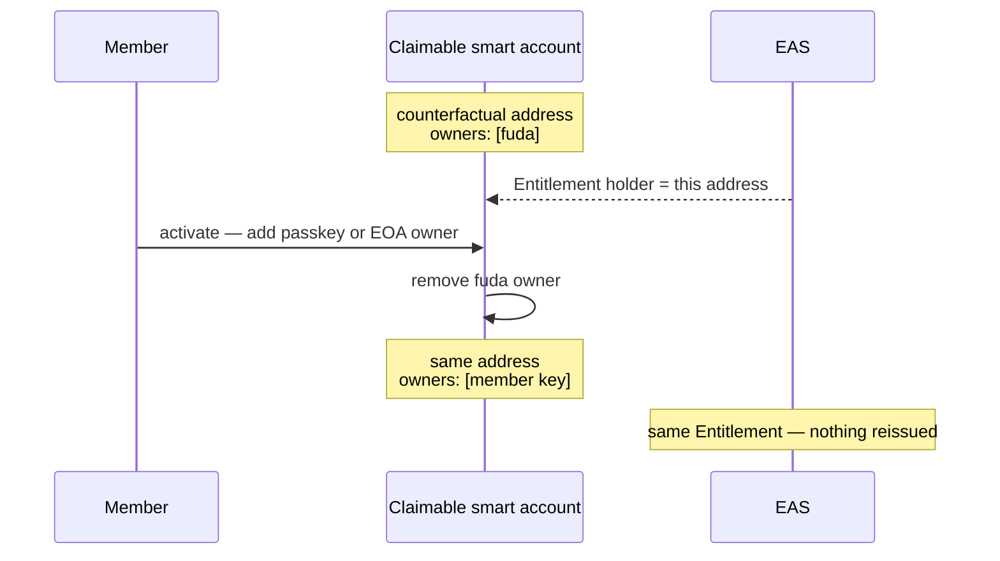
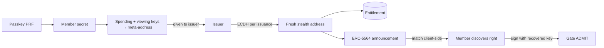

# Pass types and flows

This document explains which fuda template fits a use case, what the member
does during onboarding, and which pass and holder type the resulting right
uses. The template is a product-policy choice; Bearer and Signed remain the
verification rules applied by the gate.

## Choose by use case

Templates and the self-serve handle route are the product model. The api
derives a right's level from the keys present in the request and issues only
through the admin `POST /issue`; the `fuda.sh` apex serves the landing page.

**The template is the issuer's choice, made at issuance time.** The issuer
configures which templates are available and sets the default. An authorized
operator selects one when issuing a right. In a self-service flow such as
`fuda.sh/@wassie-coffee`, the issuer binds the route to a template in
advance, so each member does not need an operator to approve the issuance
manually.

The onboarding flow behind each column is detailed in the U1–U3 sections
below. Legend: ◎ effortless · ◯ supported, with some setup or conditions ·
△ partial · − not provided.

|                                                                       | **U1: `standard`**                                                                                                                               | **U2: `private`**                                                                                                    | **U3: `private + loyalty`**                                                                                         |
| --------------------------------------------------------------------- | ------------------------------------------------------------------------------------------------------------------------------------------------ | -------------------------------------------------------------------------------------------------------------------- | ------------------------------------------------------------------------------------------------------------------- |
| **Typical uses**                                                      | shop membership and stamp cards / retail loyalty / community, coworking, gym, club / event and concert tickets / recurring venue or event passes | employee badges / restricted offices, labs, data centers / backstage and crew access / privacy-sensitive memberships | private club + loyalty / employee access + cafeteria points / coworking + credits / private events + member history |
| **Sign-up** — what it takes to get the first pass                     | **◎**<br>save the pass in one-tap and use it right away                                                                                          | **◯**<br>create a passkey before save                                                                                | **◯**<br>create a passkey before save; the loyalty card itself works right away                                     |
| **Ownability** — the card is controlled by your own key               | **△** ¹                                                                                                                                          | **◯**                                                                                                                | **◯**                                                                                                               |
| **Restore** — getting the card back on a new phone                    | **◎** ²                                                                                                                                          | **◯** ³                                                                                                              | **◯** ³                                                                                                             |
| **Decentralization** — the card keeps working without fuda            | **△** ¹                                                                                                                                          | **◯**                                                                                                                | **◯**                                                                                                               |
| **Private** — your visits stay unlinkable to you on-chain             | −                                                                                                                                                | **◯**                                                                                                                | **◯**<br>access / − loyalty ⁴                                                                                       |
| **Loyalty** — points and history build up in one place                | **◯**                                                                                                                                            | −                                                                                                                    | **◯**                                                                                                               |
| **Name** — `<member-no>.<issuer>.fuda.eth`, see [Naming](./naming.md) | **◯**<br>resolves to the stable holder                                                                                                           | **◯**<br>resolves to a fresh stealth address per lookup                                                              | **◯**<br>two numbers: access rotates, loyalty is stable                                                             |

1. A `standard` right starts unclaimed, with fuda controlling the holder
   account. Activation replaces fuda with the member's passkey or EOA at the
   same address; from then on ownership and open-rail control are ◯.
2. OS-standard features already cover most of restore: the pass comes
   back with the platform's own device restore or a pass re-download, and an
   activated member key comes back through standard passkey sync (iCloud
   Keychain, Google Password Manager) or the external wallet's backup. The
   chain adds what the OS cannot: the right itself is an on-chain attestation
   at a stable holder address, never data stored on the phone, so a restored
   key at the same address brings back the card, points, and history
   unchanged — and because the holder is a smart account, an owner key can be
   rotated, or the issuer can re-attest to a new holder as a last resort.
3. +Private keys derive from the PRF passkey, and the same OS-standard
   passkey sync restores that credential on a new device. From the restored
   keys, every stealth right can be re-enumerated deterministically from
   on-chain announcements — no fuda server is needed to rebuild the list. If
   the platform does not sync the PRF credential and it is lost, the derived
   keys are gone, and recovery falls back to re-issuing the rights to freshly
   enrolled keys.
4. `private + loyalty` deliberately splits into two rights: the
   private-access right is unlinkable, while the loyalty (persistent-value)
   right uses a stable public holder by design. The two must not be correlated
   at the gate.

## U1. Standard issuance and optional activation

U1 uses `standard` for shops, communities, loyalty cards, stamps, tickets,
and other rights where instant acquisition matters more than hiding the
right's public history.

1. The member opens a handle route such as `fuda.sh/@wassie-coffee` and
   requests a card without creating an account or connecting a crypto wallet.
2. fuda creates an opaque member identifier and derives a counterfactual
   claimable-smart-account address. The address is known before the account is
   deployed.
3. The issuer attests the Entitlement to that address and returns Apple,
   Google, and browser-based pass destinations after the on-chain UID is
   confirmed.
4. The member can immediately present the saved pass as Bearer.
5. Later, the member may activate the same right by adding a passkey—the
   default—or an EOA as an owner of the existing smart account. fuda removes
   its initial owner.
6. The holder address, Entitlement UID, pass, points, and Attendance history
   remain unchanged. The activated right can answer a Signed gate challenge.



The default passkey ceremony requests WebAuthn PRF support so the credential
is ready for a later U2 enrollment when the device supports it. U1 activation
does **not** derive or publish a meta-address, issue a stealth right, or
silently enable +Private. Lack of PRF support blocks only a later private
enrollment, not ordinary Signed activation.

Direct issuance to a member's EOA or compatible smart wallet remains an open
compatibility path for a right that starts as Signed. It needs no activation,
but a direct EOA does not provide the stable-holder/account-owner separation
of the U1 claimable-smart-account path.

## U2. Privacy-first issuance

Unlike U1, U2 uses `private` for employee badges, sensitive rooms, and
other rights whose stable ownership must not become public before the member
uses them. It starts as Signed +Private and never passes through a public
Bearer stage.

1. The member enrolls a compatible PRF passkey and derives spending and
   viewing keys locally.
2. The member gives the issuer only the resulting meta-address.
3. For every right, the issuer derives a fresh ERC-5564 stealth address,
   attests the Entitlement to it, and emits an announcement.
4. The member scans announcements and discovers matching rights client-side.
5. At the gate, the member recovers the right's one-time key locally and signs
   the ordinary Signed challenge.



The issuance response does not identify the stealth destination. Each private
right uses a different holder, so on-chain observers cannot link it to the
member or to the member's other private rights.

**Discovery.** The member app walks `GET /announcements` from block 0 (the
paging rule is in the
[attestation model](./attestation-model.md#announcement-cache-get-announcements))
and matches the rows locally with the viewing key; the api never learns which
rows are the member's. Matching runs the ECDH against the row's ephemeral key,
checks the announcement's view tag against byte 0 of the resulting shared
secret, and only then derives the stealth address to compare.

**Interoperability caveat.** fuda's shared secret is the `keccak256` of the
**compressed** 33-byte ECDH point. An ERC-5564 scanner that hashes a different
encoding of the same point derives different addresses, so it will not discover
fuda's announcements and fuda will not discover the ones it publishes; the
meta-address format and the announcement layout are otherwise standard scheme 1.

**Same meta-address on every device** holds for a passkey that the platform
syncs (iCloud Keychain, Google Password Manager). A device-bound passkey yields a
different member secret, hence a different meta-address, and rights issued to the
first one are not discoverable from the second. The app also re-uses one stored
WebAuthn `user.id`, so a second "create passkey" replaces the credential instead
of adding one; if the browser blocks that storage the id is per-ceremony, and a
member who enrolls twice ends up with two passkeys, two meta-addresses, and
rights only the first one can find.

**Privacy boundary.** Unlinkability holds against chain observers, not against
the issuer; see the [+Private privacy
boundary](./attestation-model.md#api-payloads-that-touch-attestations).

Moving a U1 right into +Private or a U2 right into a stable holder requires a
new attestation. The old and new rights must not publish an on-chain lineage
link, because that would defeat the privacy boundary.

## U3. Private access with persistent value

U3 uses `private + loyalty` for cases that need U2-style unlinkable access
alongside a U1-style long-lived relationship such as points, payments, or
public membership history. It deliberately creates two rights:

| Right            | Holder                                   | Verification     | Purpose                                  |
| ---------------- | ---------------------------------------- | ---------------- | ---------------------------------------- |
| Private access   | fresh ERC-5564 stealth address           | Signed +Private  | enter without exposing a stable identity |
| Persistent value | claimable smart account or member wallet | Bearer or Signed | retain points, balance, and history      |

The member presents only the private-access right at a private gate. The gate
must not also request the persistent-value right, and admission must not
automatically award value against it. Either action would correlate the
stealth right with the member's persistent history. Value actions happen as a
separate, explicit interaction.

## Gate protocol

### Bearer entry (`POST /verify`)

The gate scans `fuda:v1:<uid>`, posts `{ "qr" }`, and renders the verdict. A
verdict is always `200` and decision-shaped, and every verdict is appended to
`entry_log` with `path: 'qr'`. A malformed payload answers `400 bad_qr`, and a
chain read the gate cannot complete answers `502 chain_error`; neither is a
decision, so neither is logged. A Signed or +Private right presented by bare QR
answers `REJECT LEVEL_REQUIRED` before any slot is consumed — a photo of a
Signed pass does not admit. The full order of checks and the reason each one
reports live in the
[attestation model](./attestation-model.md#gate-verification-order-and-reasons).

**Three-state gate rule.** The scanner classifies what it reads: a bare uid is a
read-only preview (`GET /verify/:uid`), a `fuda:v1:` payload is an admission
(`POST /verify`). A preview never consumes a slot and is never logged. The
display has three states, not two:

| State  | When                                                                                                                                                                                                                                       |
| ------ | ------------------------------------------------------------------------------------------------------------------------------------------------------------------------------------------------------------------------------------------ |
| GREEN  | an admission `ADMIT`, or a preview `ADMIT` whose `entitlement.level` is `0`                                                                                                                                                                |
| YELLOW | a preview `ADMIT` with `level ≥ 1` — valid, but it has to enter through the Signed flow — or a preview whose `entitlement` is missing, which fails closed because an unknown level may be Signed                                           |
| RED    | any `REJECT`, and any answer that is not a verdict: a `4xx`, or a `5xx` or transport failure, which additionally raise the network banner. Input the scanner cannot classify is red too, rendered as "not a fuda pass" without an api call |

### Signed entry (`POST /challenge` → `POST /verify-signed`)

`POST /challenge { "uid" }` answers `200 { "challenge", "nonce" }`; both strings
are pinned in the attestation model's [wire
constants](./attestation-model.md#wire-constants). There is no chain lookup: a
challenge for an unknown or revoked uid is minted anyway and rejected at the next
step. `400 bad_uid` for a malformed uid; `Cache-Control: no-store`. Every mint
also sweeps the nonces that have outlived the TTL.

`POST /verify-signed { "uid", "nonce", "signature" }` answers `400 bad_uid` when
the uid is absent or is not a uid, and `400 bad_input` when the uid is well
formed but the nonce or the signature is not. Every decision is `200` in one
shape:

```jsonc
{
  "decision": "ADMIT" | "REJECT",
  "reason": "<reason>",
  "path": "signature",
  // present once the attestation was decoded
  "holder": "0x…",
  // only on the two early stops
  "stage": "entitlement" | "challenge"
}
```

`stage` marks those two early stops: `entitlement` (chain verification failed —
`reason` is the gate reason table's entry) and `challenge` (`BAD_CHALLENGE`: the
nonce is unknown, expired, or already used). Later verdicts —
`BAD_SIGNATURE`, `ALREADY_USED`, `ADMIT` — carry no `stage`. `holder` is present
once the attestation was decoded, including on the `entitlement` rejections;
`NOT_FOUND` and `WRONG_SCHEMA` decoded nothing and answer without it.

After the challenge is consumed the signature is verified (`BAD_SIGNATURE` — a
wrong signature also burns the nonce), then the SINGLE_USE slot
(`ALREADY_USED`), then `ADMIT`. For a SINGLE_USE right the slot insert and the
ADMIT log row are one D1 batch; any other usage model just appends the log row.
Every verdict is logged with `path: 'signature'` and carries `no-store`. The one
non-decision answer past validation is `502 chain_error`: from the chain read that
precedes the challenge, or from the signature check itself — in which case the
nonce stays consumed and the member simply mints a fresh one, which is why the
burn is cheap. What an RPC outage actually
looks like through viem's verification is recorded in the
[attestation model](./attestation-model.md#api-payloads-that-touch-attestations).

### +Private entry

Identical to Signed. The member recovers the stealth address's private key
client-side and signs the same challenge; `holder` in the verdict is the stealth
address. There is no separate +Private gate machinery.

## Passes

A pass presents a right; it is never the source of validity. The api serves
three forms for every Bearer and Signed right, all linked from the `/issue`
response (`passUrls.web`, `.google`, `.apple`) and from the dashboard. A
+Private right has no pass: its holder is a one-time stealth address only the
member can recover, its `/issue` response carries no `passUrls`, and all three
pass routes answer `404 not_found` for it. Every pass response — the `404`s and
`501`s included — carries `Cache-Control: no-store`.

| Route                         | Answer                                                                                                                                                                                                                                                                                                                                                                                                                                                                                                          |
| ----------------------------- | --------------------------------------------------------------------------------------------------------------------------------------------------------------------------------------------------------------------------------------------------------------------------------------------------------------------------------------------------------------------------------------------------------------------------------------------------------------------------------------------------------------- |
| `GET /pass/:uid`              | self-contained HTML: an inline SVG QR of `fuda:v1:<uid>`, the tier, the short holder, an add-to-home-screen hint, an "Add to Google Wallet" button that appears only when `/pass/:uid/google` answers, and a live status re-read from `GET /verify/:uid` every 30 seconds. Never `5xx`: a chain failure renders the status as `UNKNOWN`                                                                                                                                                                         |
| `GET /pass/:uid/google`       | `200 { "saveUrl": "https://pay.google.com/gp/v/save/<jwt>" }` — an RS256 `savetowallet` JWT (`iss` = the service-account email, `aud: google`, `origins` = the api origin, `https://dash.fuda.sh` and `https://app.fuda.sh`) carrying one GenericObject: id `<issuerId>.<uid without 0x>`, card title "fuda membership", header = the tier label, QR barcode `fuda:v1:<uid>`, text modules Tier and Member. `501 google_not_configured` without all four `GOOGLE_*` secrets, or when the key cannot be imported |
| `GET /pass/:uid/apple.pkpass` | `application/vnd.apple.pkpass` as an attachment: a stored (uncompressed) ZIP of `pass.json` (a storeCard; serial = the uid; QR `fuda:v1:<uid>`; fields TIER, MEMBER and Attestation), `icon.png`, `manifest.json` (SHA-1 per file) and a detached CMS `signature` (RSASSA-PKCS1-v1_5 over SHA-256, made with the Pass Type ID certificate and carrying the Apple WWDR intermediate). `501 apple_not_configured` without all five `APPLE_*` secrets, or when the certificate or key cannot be used               |

The check order on every pass route is bad uid (`400 bad_uid`) → unknown uid
(`404 not_found`) → +Private (`404 not_found`) → platform configuration, so a
`404` never reveals whether a wallet platform is configured.

## Supporting verification concepts

### Pass and wallet components

Terms (Pass, Device wallet, Crypto wallet, Holder) are defined once in the
[glossary](../CONTEXT.md); this table only maps them onto the use cases.

| Type                                        | Role                                                                                                | Used by                             |
| ------------------------------------------- | --------------------------------------------------------------------------------------------------- | ----------------------------------- |
| Device wallet (Apple Wallet, Google Wallet) | Saves and presents the branded pass and its QR; it is not the source of right validity              | U1, U2, and U3                      |
| Browser-based pass                          | Presents the same right on other devices without a platform wallet                                  | U1, U2, and U3                      |
| Claimable smart account                     | Holds a standard right at a stable counterfactual address before and after member activation        | U1; persistent-value side of U3     |
| Passkey                                     | Default member-owned signing key; its PRF extension can also derive +Private keys                   | activated U1; required by U2 and U3 |
| EOA or compatible external wallet           | Optional open signing rail or direct holder for a right that starts as Signed                       | U1 Signed compatibility paths       |
| ERC-5564 stealth address                    | Fresh one-time holder controlled by a locally recovered key, preventing a stable public member link | U2; private-access side of U3       |

A Bearer member needs only the saved pass. Signed entry additionally uses the
passkey, EOA, smart account, or recovered stealth key associated with the
Entitlement holder.

### Verification level

fuda has two gate verification levels:

- **Bearer** proves that the presented right exists and is valid. No member
  signature is required, so lending is tolerated.
- **Signed** additionally proves that the presenter controls the Entitlement
  holder through a fresh challenge response.

**+Private is a privacy extension on Signed**, not a third verification level.
It keeps the Signed challenge while replacing a stable public holder with a
fresh stealth address for every private right.

### Wallet rail and claim state

The wallet rail determines how the member holds signing keys: managed,
self-custody passkey, bring-your-own EOA, or compatible smart wallet. Choosing
a rail does not change the verification level.

A claimable smart account can be **unclaimed** or **claimed**:

- Unclaimed means fuda initially controls the account so a Bearer right can be
  issued before the member creates a key.
- Claimed means the member's passkey or EOA controls that same account.

Activation changes account control. It does not change the Entitlement holder
address or create a new verification level.

### Holder and owner relationships

| Path                     | Entitlement holder                     | Authorized key or owner                                               | Address continuity                                                |
| ------------------------ | -------------------------------------- | --------------------------------------------------------------------- | ----------------------------------------------------------------- |
| Unclaimed standard right | counterfactual claimable smart account | fuda's initial key; no member key required                            | holder address is fixed at issuance                               |
| Activated standard right | the same claimable smart account       | member passkey or EOA; fuda removes itself                            | Entitlement and history stay at the same address                  |
| Direct Signed issuance   | member EOA or compatible smart account | the member's external wallet                                          | no activation step; no holder-address separation for a direct EOA |
| Signed +Private          | fresh one-time stealth address         | one-time key recovered client-side from the member's PRF-derived keys | a new address for every private right                             |

The verifier accepts the open Ethereum signature path appropriate to the
holder:

- ECDSA for an EOA, including a recovered stealth key;
- ERC-1271 for a deployed smart account; and
- ERC-6492 for a counterfactual smart account that has not yet been deployed.

All paths answer the same gate question: does this signature answer the
current challenge for the Entitlement holder?

## Surfaces

| Host             | Worker      | Dev port | Role                                                                         |
| ---------------- | ----------- | -------- | ---------------------------------------------------------------------------- |
| `api.fuda.sh`    | `apps/api`  | 8787     | the api                                                                      |
| `gate.fuda.sh`   | `apps/gate` | 5174     | scanner: uid preview, QR admission, verdict                                  |
| `dash.fuda.sh`   | `apps/dash` | 5175     | operator dashboard: issue, list, revoke, pass links                          |
| `app.fuda.sh`    | `apps/app`  | 5173     | member app: `/signed` challenge-response, `/private` enrolment and discovery |
| `fuda.sh` (apex) | `apps/app`  | —        | landing only                                                                 |

Each host is a custom domain of its Worker, and the dev ports are pinned in each
app's `vite.config.ts`. The frontends call the api cross-origin at
`VITE_API_BASE_URL`, baked in at build time and defaulting to
`http://localhost:8787`. The api's CORS allow-list is exactly
`https://app.fuda.sh`, `https://dash.fuda.sh` and `https://gate.fuda.sh`, plus
any `http://localhost:<port>` or `http://127.0.0.1:<port>` origin.

The apex `fuda.sh` is served by the member-app Worker but is **not** a CORS
origin: it hosts the landing only, and `/signed` and `/private` on the apex
redirect to `VITE_APP_ORIGIN` (`https://app.fuda.sh`) behind a one-line
interstitial, so every api call originates from an allowed origin. `VITE_RP_ID`
fixes the passkey `rp.id` to `fuda.sh` in production builds, so the apex and
`app.fuda.sh` share one passkey; local dev must set it to `localhost`, since a
browser rejects an `rp.id` that is not a registrable suffix of the page's host.

## Related specs

- [Architecture overview](../architecture.md)
- [Attestation model](./attestation-model.md)
