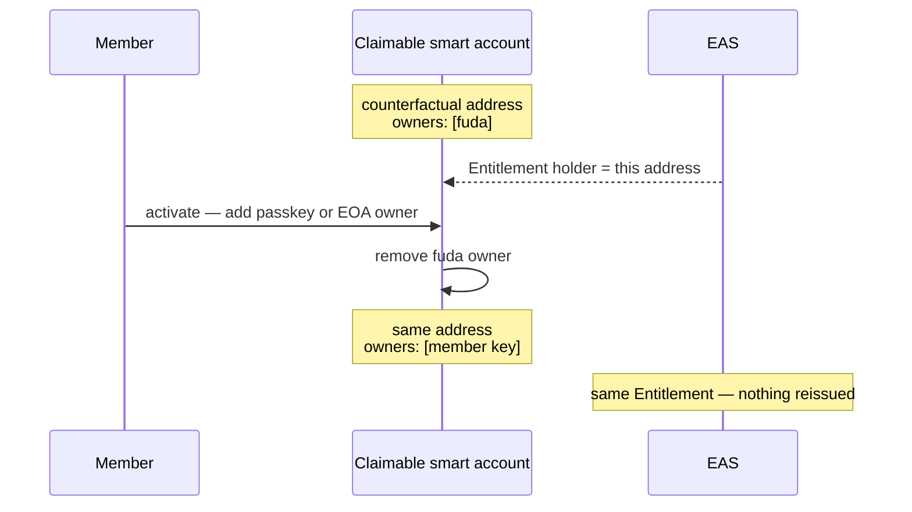
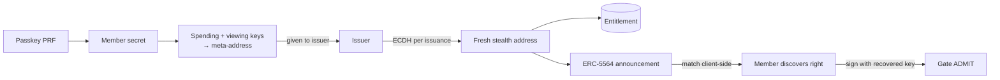
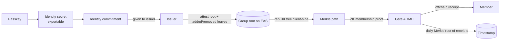

# Pass types and flows

This document explains which fuda template fits a use case, what the member
does during onboarding, and which pass and holder type the resulting right
uses. The template is a product-policy choice; Bearer and Signed remain the
verification rules applied by the gate.

API paths below omit `/v1` except where shown explicitly; pass, asset, gateway,
and health URLs are unversioned. See
[API versioning](./attestation-model.md#api-versioning).

## Choose by use case

Templates and the self-serve handle route are the product model. The api
derives a right's level from the keys present in the request on the admin
`POST /issue`; the self-serve route `POST /issuers/:handle/:slug/issue` issues only
`standard` (Bearer) rights under the issuer's card (see [Issuer onboarding and
the handle route](#issuer-onboarding-and-the-handle-route)); the `fuda.sh`
apex redirects `/@*` to `app.fuda.sh`; other apex handling is outside this repository.

**The template is the issuer's choice, made at issuance time.** The issuer
configures which templates are available and sets the default. An authorized
operator selects one when issuing a right. In a self-service flow such as
`fuda.sh/@wassie-coffee`, the issuer binds the route to a template in
advance, so each member does not need an operator to approve the issuance
manually.

The onboarding flow behind each column is detailed in the U1–U4 sections
below. U4 is a v2 design and is not implemented; its column shows the intended
product behaviour, not something the api offers today. Legend: ◎ effortless · ◯ supported, with some setup or conditions ·
△ partial · − not provided.

|                                                                       | **U1: `standard`**                                                                                                                               | **U2: `private`**                                                                                                    | **U3: `private + loyalty`**                                                                                         | **U4: `anonymous`**<br>v2 design — not implemented |
| --------------------------------------------------------------------- | ------------------------------------------------------------------------------------------------------------------------------------------------ | -------------------------------------------------------------------------------------------------------------------- | ------------------------------------------------------------------------------------------------------------------- | --- |
| **Typical uses**                                                      | shop membership and stamp cards / retail loyalty / community, coworking, gym, club / event and concert tickets / recurring venue or event passes | employee badges / restricted offices, labs, data centers / backstage and crew access / privacy-sensitive memberships | private club + loyalty / employee access + cafeteria points / coworking + credits / private events + member history | the U2 cases where no per-visit on-chain record may exist at all, and revocation may lag one root rotation |
| **Sign-up** — what it takes to get the first pass                     | **◎**<br>save the pass in one-tap and use it right away                                                                                          | **◯**<br>create a passkey before save                                                                                | **◯**<br>create a passkey before save; the loyalty card itself works right away                                     | **◯**<br>create a passkey before enrolment; first entry waits for the next root rotation |
| **Ownability** — the card is controlled by your own key               | **△** ¹                                                                                                                                          | **◯**                                                                                                                | **◯**                                                                                                               | **◯** ⁵ |
| **Restore** — getting the card back on a new phone                    | **◎** ²                                                                                                                                          | **◯** ³                                                                                                              | **◯** ³                                                                                                             | **◯** ⁵ |
| **Decentralization** — the card keeps working without fuda            | **△** ¹                                                                                                                                          | **◯**                                                                                                                | **◯**                                                                                                               | **◯** |
| **Private** — your visits stay unlinkable to you on-chain             | −                                                                                                                                                | **◯**                                                                                                                | **◯**<br>access / − loyalty ⁴                                                                                       | **◎**<br>no per-member record on chain |
| **Loyalty** — points and history build up in one place                | **◯**                                                                                                                                            | −                                                                                                                    | **◯**                                                                                                               | − |
| **Name** — `<member-no>.<issuer>.fuda.eth`, see [ENS naming](./ens-naming.md) | **◯**<br>resolves to the stable holder                                                                                                           | **◯**<br>resolves to a fresh stealth address per lookup                                                              | **◯**<br>two numbers: access rotates, loyalty is stable                                                             | **△**<br>derived member number; resolution not yet specified |

1. A `standard` right starts unclaimed, with fuda controlling the holder
   account. Activation replaces fuda with the member's passkey or EOA at the
   same address; from then on ownership and open-rail control are ◯.
2. OS-standard features already cover most of restore: the pass comes
   back with the platform's own device restore or a pass re-download, and an
   activated member key comes back through standard passkey sync (iCloud
   Keychain, Google Password Manager) or the external wallet's backup. The
   chain adds what the OS cannot: the right itself is an on-chain attestation
   at a stable holder address, never data stored on the phone, so a restored
   key at the same address brings back the card, points, and history
   unchanged — and because the holder is a smart account, an owner key can be
   rotated, or the issuer can re-attest to a new holder as a last resort.
3. +Private keys derive from the PRF passkey, and the same OS-standard
   passkey sync restores that credential on a new device. From the restored
   keys, every stealth right can be re-enumerated deterministically from
   on-chain announcements — no fuda server is needed to rebuild the list. If
   the platform does not sync the PRF credential and it is lost, the derived
   keys are gone, and recovery falls back to re-issuing the rights to freshly
   enrolled keys.
4. `private + loyalty` deliberately splits into two rights: the
   private-access right is unlinkable, while the loyalty (persistent-value)
   right uses a stable public holder by design. The two must not be correlated
   at the gate.
5. U4 keys derive from a passkey-held identity secret that is also exportable
   (ADR 0001, decision 8), so a `fuda.sh` passkey is not the only key that can
   hold it. The membership tree and the member's Merkle path are rebuilt from
   the issuer's on-chain root attestations, with no fuda server.

## U1. Standard issuance and optional activation

U1 uses `standard` for shops, communities, loyalty cards, stamps, tickets,
and other rights where instant acquisition matters more than hiding the
right's public history.

1. The member opens a handle route such as `fuda.sh/@wassie-coffee` and
   requests a card without creating an account or connecting a crypto wallet.
2. fuda creates an opaque member identifier and derives a counterfactual
   claimable-smart-account address. The address is known before the account is
   deployed.
3. The issuer attests the Entitlement to that address and returns Apple,
   Google, and browser-based pass destinations after the on-chain UID is
   confirmed.
4. The member can immediately present the saved pass as Bearer.
5. Later, the member may activate the same right by adding a passkey—the
   default—or an EOA as an owner of the existing smart account. fuda removes
   its initial owner.
6. The holder address, Entitlement UID, pass, points, and Attendance history
   remain unchanged. The activated right can answer a Signed gate challenge.



The default passkey ceremony requests WebAuthn PRF support so the credential
is ready for a later U2 enrollment when the device supports it. U1 activation
does **not** derive or publish a meta-address, issue a stealth right, or
silently enable +Private. Lack of PRF support blocks only a later private
enrollment, not ordinary Signed activation.

Direct issuance to a member's EOA or compatible smart wallet remains an open
compatibility path for a right that starts as Signed. It needs no activation,
but a direct EOA does not provide the stable-holder/account-owner separation
of the U1 claimable-smart-account path.

## U2. Privacy-first issuance

Unlike U1, U2 uses `private` for employee badges, sensitive rooms, and
other rights whose stable ownership must not become public before the member
uses them. It starts as Signed +Private and never passes through a public
Bearer stage.

1. The member enrolls a compatible PRF passkey and derives spending and
   viewing keys locally.
2. The member gives the issuer only the resulting meta-address.
3. For every right, the issuer derives a fresh ERC-5564 stealth address,
   attests the Entitlement to it, and emits an announcement.
4. The member scans announcements and discovers matching rights client-side.
5. At the gate, the member recovers the right's one-time key locally and signs
   the ordinary Signed challenge.



The issuance response does not identify the stealth destination. Each private
right uses a different holder, so on-chain observers cannot link it to the
member or to the member's other private rights.

**Discovery.** The member app pages raw announcements from the rights subgraph
through its configured public Graph endpoint and matches them locally with the
viewing key; the api is not involved and never learns which rows are the
member's. Pages use a stable `(blockNumber, id)` cursor, and Graph `BigInt`
scalars remain JavaScript `bigint` values. Matching runs the ECDH against the
row's ephemeral key, checks the announcement's view tag against byte 0 of the
resulting shared secret, and only then derives the stealth address to compare.
The rights subgraph indexes the Announcer directly. Discovery does not consume
the optional Substreams push lane and continues when no Substreams process is
running.

**Interoperability caveat.** fuda's shared secret is the `keccak256` of the
**compressed** 33-byte ECDH point. An ERC-5564 scanner that hashes a different
encoding of the same point derives different addresses, so it will not discover
fuda's announcements and fuda will not discover the ones it publishes; the
meta-address format and the announcement layout are otherwise standard scheme 1.

**Same meta-address on every device** holds for a passkey that the platform
syncs (iCloud Keychain, Google Password Manager). A device-bound passkey yields a
different member secret, hence a different meta-address, and rights issued to the
first one are not discoverable from the second. The app also re-uses one stored
WebAuthn `user.id`, so a second "create passkey" replaces the credential instead
of adding one; if the browser blocks that storage the id is per-ceremony, and a
member who enrolls twice ends up with two passkeys, two meta-addresses, and
rights only the first one can find.

**Privacy boundary.** Unlinkability holds against chain observers, not against
the issuer; see the [+Private privacy
boundary](./attestation-model.md#api-payloads-that-touch-attestations).

Moving a U1 right into +Private or a U2 right into a stable holder requires a
new attestation. The old and new rights must not publish an on-chain lineage
link, because that would defeat the privacy boundary.

## U3. Private access with persistent value

U3 uses `private + loyalty` for cases that need U2-style unlinkable access
alongside a U1-style long-lived relationship such as points, payments, or
public membership history. It deliberately creates two rights:

| Right            | Holder                                   | Verification     | Purpose                                  |
| ---------------- | ---------------------------------------- | ---------------- | ---------------------------------------- |
| Private access   | fresh ERC-5564 stealth address           | Signed +Private  | enter without exposing a stable identity |
| Persistent value | claimable smart account or member wallet | Bearer or Signed | retain points, balance, and history      |

The member presents only the private-access right at a private gate. The gate
must not also request the persistent-value right, and admission must not
automatically award value against it. Either action would correlate the
stealth right with the member's persistent history. Value actions happen as a
separate, explicit interaction.

## U4. Anonymous membership (v2 design, not implemented)

**Status.** U4 is the post-hackathon v2 template decided in
[ADR 0001](../adr/0001-eas-native-target-architecture.md). Nothing in this
section exists today: no api route accepts `anonymous`, the gate has no
proof path, and the member app has no enrolment screen. The section records the
intended product flow so the template has a home next to U1–U3; the ADR is its
only source, and what the ADR leaves open is listed as such below.

U4 uses `anonymous` for the U2 cases where even a per-right stealth holder
is too much on-chain footprint: the venue must publish no per-visit record and
should not learn which of its members entered. Where U2 hides a stable holder
behind a fresh stealth address per right, U4 has no per-member on-chain record
at all. The member proves membership in an issuer-attested group. No
Entitlement is attested for the right; its verification level is marked by the
record type.

1. The member enrols a passkey and derives an identity secret locally. The
   secret is exportable, so the passkey bound to `fuda.sh` is not the only key
   that can hold it.
2. The member gives the issuer an identity commitment — a leaf, not an address.
3. The issuer attests the group's Merkle root on EAS. The attestation data
   carries the leaves added and removed since the previous root, so the tree
   is reconstructable from chain alone; no separate contract holds it.
4. The member rebuilds the tree from the issuer's root attestations and computes
   their own Merkle path locally. No fuda server is involved.
5. At the gate, the member answers the challenge with a zero-knowledge
   membership proof against the current attested root, produced in the
   browser. The gate verifies the proof against the root it reads from EAS.
   This is the **Proved** level.
6. The gate writes no Attendance. It hands the member an offchain receipt and
   timestamps a daily Merkle root of the receipts it issued.



**What an issuer choosing U4 accepts.** Both points are stated to the issuer at
template selection:

- Revocation lags. Removing a member takes effect at the next root rotation,
  so revocation acquires a lag equal to the issuer's root-rotation grace
  window.
- First entry waits. A newly added member can enter only once a root that
  includes their leaf has been attested.

**Member number and name.** A U4 member number is derived, not issued:
`encode28(H(secret, issuer))` plus the standard check character from
[ENS naming](./ens-naming.md#member-number). It is recomputable without fuda
and differs per issuer. What a U4 name resolves to is not yet specified.

**Relationship to +Private.** Proved is a third verification level and
coexists with +Private. The stealth-address templates stay; deprecating them
for access is a later, separate decision. Stealth addresses remain the rail for
receiving value, so U4 changes only how access is proved.

**Not yet specified.** The ADR does not decide, and this section does not
invent: the proof system and circuit; how the proof binds to the gate challenge
and resists replay; the wire shape of a Proved gate exchange; whether a Proved
right has a pass; the receipt format and where the daily root is timestamped;
name resolution for a U4 right.

## Issuer onboarding and the handle route

The U1 first-pass flow is self-serve. An operator creates a venue and its
cards in the dashboard; a member gets a card from the handle route with no
account and no wallet.

**Operator sign-in.** The dashboard signs the operator in with a passkey
wallet (Base Account): `POST /auth/challenge { address }` answers
`{ nonce, message }` where `message` is
`fuda.sh dashboard sign-in\nnonce: <nonce>`; the wallet personal-signs it and
`POST /auth/verify { address, nonce, signature }` answers
`{ token, issuer | null }`. The signature is checked through the chain client
(EOA, ERC-1271, ERC-6492), so an undeployed Base Account signs in. The session
token is presented as `Authorization: Bearer` on the operator routes, lives 30
days, and is stored hashed; `POST /auth/logout` ends it. A nonce is one-time,
bound to the address, and expires with the gate's 300 s TTL; a wrong signature
burns it. The admin token is not an operator identity and is not accepted on
operator routes.

**Member sign-in.** The member app uses one Base Account entry for new and
returning members. `POST /auth/member/challenge { address }` returns
`{ nonce, message }`, with `fuda.sh member sign-in\nnonce: <nonce>` as the message.
`POST /auth/member/verify { address, nonce, signature }` returns `{ address, token }`.
`GET /auth/member/me` validates the bearer and returns `{ address }`;
`POST /auth/member/logout` deletes that session. Auth responses are not cacheable.
The signature verification, nonce expiry, hashed token storage and 30-day lifetime
match the operator flow. Challenges bind both address and audience. Member and
operator challenges and tokens cannot be exchanged; existing sessions default to
operator. A recognized member token is rejected before any operator-or-admin
fallback, including when the deployment has no admin token configured. Member
sessions have no issuer binding and do not create a member profile or transfer a Right.

**Venue and cards.** One issuer per operator address; an issuer owns zero or
more cards. Registration precedes ENS acquisition, which precedes card creation.
`POST /issuers` (session) creates only the issuer and binds the session to it
in one batch; body `{ handle, name, tagline, brandColor, logoUploadId? }`, answer
`201 { issuer, cards: [], ens, publicUrl }` with
`publicUrl` = `<PUBLIC_BASE_URL>/@<handle>`. It does not create a placeholder card.
The operator then acquires the issuer's ENS name from the venue screen.
`POST /issuers/cards` (session) creates the first or any subsequent card and
answers `201 { issuer, card, publicUrl }`. It requires a recorded chain-confirmed
claim for that issuer's configured ENS name: an unclaimed name returns
`409 ens_required`; an unavailable ENS name configuration returns
`503 ens_not_configured`. Neither failure inserts a card. This is an acquisition
prerequisite; it introduces no new expiry policy for existing cards or rights.
A card is
`{ slug, title, category, perk, reward, lockScreen, venue?, claimFrom,
claimUntil, validityDays, validFrom, validUntil }`.
`GET /issuers/me` (session) returns `{ issuer, cards, ens, publicUrl }`, or
`{ issuer: null, cards: [], ens: null, publicUrl: null }` before registration.
A registered issuer remains present even when its cards array is empty.
`GET /issuers/check?handle=` and `GET /issuers/cards/check?slug=` (both
session-gated, so neither namespace can be enumerated anonymously) answer
`{ …, valid, available }`.

**The venue's logo.** It belongs to the issuer, not the card, and lives in R2
with only its prefix in D1. Because Workers have no image decoder, the
dashboard draws the variants and the api verifies them: `master` 1024×1024
serves Google Wallet and every web surface, while `logo1x` 50×50, `logo2x`
100×100 and `logo3x` 150×150 are embedded in the `.pkpass` — linking would not
work there, and embedding the master would add about a megabyte to every pass.
Each object must be a PNG of exactly its variant's side, within 1 MiB, and the
set within 2 MiB; the api reads the PNG signature and IHDR directly rather than
trusting what the browser sent.

Uploading is two-phase, because the first logo is chosen in the same form that
creates the venue. `POST /issuers/logo` (session, multipart) writes the objects
under a fresh immutable prefix and stages them for 15 minutes, answering
`201 { logoUploadId, expiresAt }`; `POST /issuers` accepts that id, and
`POST /issuers/logo/commit` binds one to a venue that already exists. An
upload is spendable once and only by the session that made it. Stale rows are
swept on the next upload, so no cron is involved. Replacing a logo writes a new
prefix, so a cached URL never shows the old mark.

`GET /assets/:handle/logo/:variant` (public) serves an object, resolving the
prefix from the issuer row against a fixed variant list so no caller-supplied
path reaches R2. It answers an ETag and honours `if-none-match` with a `304`.

The route is keyed by the handle rather than by the object's prefix, so that a
link printed before a logo change still resolves — which means the address
alone does not say which mark it is. The version restores that: the api hands
out `…/logo/master?v=<prefix uuid>` and caches such a request for a year,
while an unversioned or stale one is served with a sixty-second life so a
replaced logo corrects itself. **A client must never assemble this URL.** The
api returns it as `logoUrl` on the issuer, on the public venue, and inside a
pass's branding, and replacing a logo changes it, which is what makes Google
Wallet and every browser pick up the new mark.

Without the `MEDIA_BUCKET` binding the upload route answers
`501 media_not_configured` and every other surface works unbranded.

**A card's two time windows.** They answer different questions and are set
independently.

The **claim window** (`claimFrom`, `claimUntil`, both optional unix seconds)
says when the card is handed out at all. A stamp card leaves both unset and
stays open; a concert's card closes when its doors do. Outside the window
`POST /issuers/:handle/:slug/issue` answers `409 card_closed` rather than
minting a right the gate would only ever reject, which the signer pays for. A
closed card still appears on the venue page, marked `claimable: false`, so a
printed link explains itself instead of answering `404`.

The **validity window** says how long the issued right lasts, in exactly one
of two shapes, and becomes the Entitlement's `validFrom`/`validUntil`:

| Shape | Fields | Means | Fits |
| --- | --- | --- | --- |
| Relative | `validityDays` | N days counted from the moment this member claimed it, so two members who claimed a month apart expire a month apart | a trial membership, a coupon |
| Absolute | `validFrom`, `validUntil` | fixed instants, the same for everyone however early they claimed | one evening's concert, a flight, a season pass |
| None | all three unset | the right does not expire | a stamp card |

Setting a relative and an absolute rule at once is `400 bad_input`: a card
expires one way or the other. Only the absolute shape can express "valid on
the day of the event", because a relative window moves with each claim. The
gate already enforces both ends, answering `NOT_YET_VALID` before the start
and `EXPIRED` after the end.

The dashboard defaults these by category — a `membership` card opens forever
and does not expire, a `ticket` closes at its event and carries an absolute
window — but the api accepts any valid combination, so an operator is never
boxed in by the default.

**Names.** The Handle is the ENS issuer-label rule from
[ENS naming](./ens-naming.md) plus the api's own route prefixes as reserved
names. A card's **slug** is the path segment under the venue and uses the same
character rule, unique within the issuer. The slug is a product path only: the
ENS hierarchy stays `<member-no>.<issuer>.fuda.eth` and never carries a card.
Both rules are shared with the dashboard through `@fuda/sdk`, so the form
rejects what the api would reject.

**Member.** `GET /issuers/:handle` (public, `no-store`) returns the venue and
every card it publishes:
`{ handle, name, tagline, brandColor, cards: [{ id, slug, title, category,
perk, reward, validityDays }] }`, and never the operator address. A venue with
one card opens that card directly at `fuda.sh/@<handle>`; a venue with several
shows the member a list, and each card also has its own link
`fuda.sh/@<handle>/<slug>` that a poster or a message can point at.
`POST /issuers/:handle/:slug/issue` (public, no body, 20 per IP per hour)
issues a Bearer right under that card with a generated member number and
answers the Bearer `/issue` shape plus `memberNumber` (see the [attestation
model](./attestation-model.md#api-payloads-that-touch-attestations)). An
unknown handle or slug answers `404 not_found`. Signed and +Private are not
reachable from the handle route.

**One member, several cards.** A member who claims two cards of one venue
holds two rights: two attestations, two member numbers, two passes. The
numbers are unique per issuer, so the two never collide as ENS labels, and
they are unrelated to each other, so neither the chain nor a name links them
to one person.

**A U1 card cannot be limited to one per person.** U1's defining property is
that the member has no identity at claim time: no account, no contact detail,
no key. The member app remembers a claimed card on the device and shows it
again instead of issuing a second one, and the per-IP budget bounds automated
abuse, but neither is identity: a cleared browser, a private window, or a
second device yields another card. Enforcing one-per-person needs a stable
member key, which is what U2 and U3 already have — a `private` member gives
the issuer a meta-address, and a `private + loyalty` member additionally has a
stable persistent-value holder — so the constraint belongs to those templates,
or to a card that deliberately requires a passkey before it is claimed and so
gives up U1's one-tap sign-up.

## Gate protocol

### Bearer entry (`POST /verify`)

The gate scans `fuda:v1:<uid>`, posts `{ "qr" }`, and renders the verdict. A
verdict is always `200` and decision-shaped, and every verdict is appended to
`entry_log` with `path: 'qr'`. A malformed payload answers `400 bad_qr`, and a
chain read the gate cannot complete answers `502 chain_error`; neither is a
decision, so neither is logged. A Signed or +Private right presented by bare QR
answers `REJECT LEVEL_REQUIRED` before any slot is consumed — a photo of a
Signed pass does not admit. The full order of checks and the reason each one
reports live in the
[attestation model](./attestation-model.md#gate-verification-order-and-reasons).

**Three-state gate rule.** The scanner classifies what it reads: a bare uid is a
read-only preview (`GET /verify/:uid`), a `fuda:v1:` payload is an admission
(`POST /verify`). A preview never consumes a slot and is never logged. The
display has three states, not two:

| State  | When                                                                                                                                                                                                                                       |
| ------ | ------------------------------------------------------------------------------------------------------------------------------------------------------------------------------------------------------------------------------------------ |
| GREEN  | an admission `ADMIT`, or a preview `ADMIT` whose `entitlement.level` is `0`                                                                                                                                                                |
| YELLOW | a preview `ADMIT` with `level ≥ 1` — valid, but it has to enter through the Signed flow — or a preview whose `entitlement` is missing, which fails closed because an unknown level may be Signed                                           |
| RED    | any `REJECT`, and any answer that is not a verdict: a `4xx`, or a `5xx` or transport failure, which additionally raise the network banner. Input the scanner cannot classify is red too, rendered as "not a fuda pass" without an api call |

### Signed entry (`POST /challenge` → `POST /verify-signed`)

`POST /challenge { "uid" }` answers `200 { "challenge", "nonce" }`; both strings
are pinned in the attestation model's [wire
constants](./attestation-model.md#wire-constants). There is no chain lookup: a
challenge for an unknown or revoked uid is minted anyway and rejected at the next
step. `400 bad_uid` for a malformed uid; `Cache-Control: no-store`. Every mint
also sweeps the nonces that have outlived the TTL.

`POST /verify-signed { "uid", "nonce", "signature" }` answers `400 bad_uid` when
the uid is absent or is not a uid, and `400 bad_input` when the uid is well
formed but the nonce or the signature is not. Every decision is `200` in one
shape:

```jsonc
{
  "decision": "ADMIT" | "REJECT",
  "reason": "<reason>",
  "path": "signature",
  // present once the attestation was decoded
  "holder": "0x…",
  // only on the two early stops
  "stage": "entitlement" | "challenge"
}
```

`stage` marks those two early stops: `entitlement` (chain verification failed —
`reason` is the gate reason table's entry) and `challenge` (`BAD_CHALLENGE`: the
nonce is unknown, expired, or already used). Later verdicts —
`BAD_SIGNATURE`, `ALREADY_USED`, `ADMIT` — carry no `stage`. `holder` is present
once the attestation was decoded, including on the `entitlement` rejections;
`NOT_FOUND` and `WRONG_SCHEMA` decoded nothing and answer without it.

After the challenge is consumed the signature is verified (`BAD_SIGNATURE` — a
wrong signature also burns the nonce), then the SINGLE_USE slot
(`ALREADY_USED`), then `ADMIT`. For a SINGLE_USE right the slot insert and the
ADMIT log row are one D1 batch; any other usage model just appends the log row.
Every verdict is logged with `path: 'signature'` and carries `no-store`. The one
non-decision answer past validation is `502 chain_error`: from the chain read that
precedes the challenge, or from the signature check itself — in which case the
nonce stays consumed and the member simply mints a fresh one, which is why the
burn is cheap. What an RPC outage actually
looks like through viem's verification is recorded in the
[attestation model](./attestation-model.md#api-payloads-that-touch-attestations).

### +Private entry

Identical to Signed. The member recovers the stealth address's private key
client-side and signs the same challenge; `holder` in the verdict is the stealth
address. There is no separate +Private gate machinery.

## Passes

A pass presents a right; it is never the source of validity. The api serves
three forms for every Bearer and Signed right, all linked from the `/issue`
response (`passUrls.web`, `.google`, `.apple`) and from the dashboard. A
+Private right has no pass: its holder is a one-time stealth address only the
member can recover, its `/issue` response carries no `passUrls`, and all three
pass routes answer `404 not_found` for it. Every pass response — the `404`s and
`501`s included — carries `Cache-Control: no-store`.

A right issued under an issuer's card (`members.card_id` set) renders branded:
the venue name, card title, brand colour with readable text, and the member
number in `4-4-5` display form appear on the web pass, as the Google generic
object's `cardTitle`, `header`, `subheader` and `hexBackgroundColor`, and as
the Apple storeCard's `organizationName`, `description`, colours and primary
field; a card with lock-screen relevance and a venue position adds Apple
`locations`. Admin-issued rights keep the plain fuda look described below.

| Route                         | Answer                                                                                                                                                                                                                                                                                                                                                                                                                                                                                                          |
| ----------------------------- | --------------------------------------------------------------------------------------------------------------------------------------------------------------------------------------------------------------------------------------------------------------------------------------------------------------------------------------------------------------------------------------------------------------------------------------------------------------------------------------------------------------- |
| `GET /pass/:uid`              | self-contained HTML: an inline SVG QR of `fuda:v1:<uid>`, the tier, the short holder, an add-to-home-screen hint, an "Add to Google Wallet" button that appears only when `/pass/:uid/google` answers, and a live status re-read from `GET /verify/:uid` every 30 seconds. Never `5xx`: a chain failure renders the status as `UNKNOWN`                                                                                                                                                                         |
| `GET /pass/:uid/google`       | `200 { "saveUrl": "https://pay.google.com/gp/v/save/<jwt>" }` — an RS256 `savetowallet` JWT (`iss` = the service-account email, `aud: google`, `origins` = the api origin, `https://dash.fuda.sh` and `https://app.fuda.sh`) carrying one GenericObject: id `<issuerId>.<uid without 0x>`, card title "fuda membership", header = the tier label, QR barcode `fuda:v1:<uid>`, text modules Tier and Member. `501 google_not_configured` without all four `GOOGLE_*` secrets, or when the key cannot be imported |
| `GET /pass/:uid/apple.pkpass` | `application/vnd.apple.pkpass` as an attachment: a stored (uncompressed) ZIP of `pass.json` (a storeCard; serial = the uid; QR `fuda:v1:<uid>`; fields TIER, MEMBER and Attestation), `icon.png`, `manifest.json` (SHA-1 per file) and a detached CMS `signature` (RSASSA-PKCS1-v1_5 over SHA-256, made with the Pass Type ID certificate and carrying the Apple WWDR intermediate). `501 apple_not_configured` without all five `APPLE_*` secrets, or when the certificate or key cannot be used               |

The check order on every pass route is bad uid (`400 bad_uid`) → unknown uid
(`404 not_found`) → +Private (`404 not_found`) → platform configuration, so a
`404` never reveals whether a wallet platform is configured.

## Supporting verification concepts

### Pass and wallet components

Terms (Pass, Device wallet, Crypto wallet, Holder) are defined once in the
[glossary](../CONTEXT.md); this table only maps them onto the use cases.

| Type                                        | Role                                                                                                | Used by                             |
| ------------------------------------------- | --------------------------------------------------------------------------------------------------- | ----------------------------------- |
| Device wallet (Apple Wallet, Google Wallet) | Saves and presents the branded pass and its QR; it is not the source of right validity              | U1; persistent-value side of U3     |
| Browser-based pass                          | Presents the same right on other devices without a platform wallet                                  | U1; persistent-value side of U3     |
| Claimable smart account                     | Holds a standard right at a stable counterfactual address before and after member activation        | U1; persistent-value side of U3     |
| Passkey                                     | Default member-owned signing key; its PRF extension can also derive +Private keys                   | activated U1; required by U2 and U3 |
| EOA or compatible external wallet           | Optional open signing rail or direct holder for a right that starts as Signed                       | U1 Signed compatibility paths       |
| ERC-5564 stealth address                    | Fresh one-time holder controlled by a locally recovered key, preventing a stable public member link | U2; private-access side of U3       |
| Membership group root (EAS attestation)     | Issuer-attested Merkle root the member proves membership in; rebuilt from chain, no fuda server     | U4 (v2 design, not implemented)     |

A Bearer member needs only the saved pass. Signed entry additionally uses the
passkey, EOA, smart account, or recovered stealth key associated with the
Entitlement holder.

### Verification level

fuda has two gate verification levels:

- **Bearer** proves that the presented right exists and is valid. No member
  signature is required, so lending is tolerated.
- **Signed** additionally proves that the presenter controls the Entitlement
  holder through a fresh challenge response.

**+Private is a privacy extension on Signed**, not a third verification level.
It keeps the Signed challenge while replacing a stable public holder with a
fresh stealth address for every private right.

[ADR 0001](../adr/0001-eas-native-target-architecture.md) adds a third level
for v2, **Proved**: a zero-knowledge membership proof against an
issuer-attested group root, used by U4. It is designed, not implemented.

### Wallet rail and claim state

The wallet rail determines how the member holds signing keys: managed,
self-custody passkey, bring-your-own EOA, or compatible smart wallet. Choosing
a rail does not change the verification level.

A claimable smart account can be **unclaimed** or **claimed**:

- Unclaimed means fuda initially controls the account so a Bearer right can be
  issued before the member creates a key.
- Claimed means the member's passkey or EOA controls that same account.

Activation changes account control. It does not change the Entitlement holder
address or create a new verification level.

### Holder and owner relationships

| Path                     | Entitlement holder                     | Authorized key or owner                                               | Address continuity                                                |
| ------------------------ | -------------------------------------- | --------------------------------------------------------------------- | ----------------------------------------------------------------- |
| Unclaimed standard right | counterfactual claimable smart account | fuda's initial key; no member key required                            | holder address is fixed at issuance                               |
| Activated standard right | the same claimable smart account       | member passkey or EOA; fuda removes itself                            | Entitlement and history stay at the same address                  |
| Direct Signed issuance   | member EOA or compatible smart account | the member's external wallet                                          | no activation step; no holder-address separation for a direct EOA |
| Signed +Private          | fresh one-time stealth address         | one-time key recovered client-side from the member's PRF-derived keys | a new address for every private right                             |

The verifier accepts the open Ethereum signature path appropriate to the
holder:

- ECDSA for an EOA, including a recovered stealth key;
- ERC-1271 for a deployed smart account; and
- ERC-6492 for a counterfactual smart account that has not yet been deployed.

All paths answer the same gate question: does this signature answer the
current challenge for the Entitlement holder?

## Surfaces

| Host             | Worker      | Dev port | Role                                                                                              |
| ---------------- | ----------- | -------- | ------------------------------------------------------------------------------------------------- |
| `api.fuda.sh`    | `apps/api`  | 8787     | the api                                                                                           |
| `gate.fuda.sh`   | `apps/gate` | 5174     | scanner: uid preview, QR admission, verdict                                                       |
| `dash.fuda.sh`   | `apps/dash` | 5175     | operator dashboard: passkey or admin-token sign-in; `/` overview from D1 member rows and client configuration, `/rights` D1 search/filter/revoke/pass links plus separate on-chain lookup, and `/issue` issuance; with a passkey session `/venue` venue registration, identity and ENS acquisition, `/new` card designer after ENS acquisition, and `/published` the venue's cards with their links and QR codes |
| `app.fuda.sh`    | `apps/app`  | 5173     | member app: public `/` and `/signin`; public `/@<handle>` venue and `/@<handle>/<slug>` card issuance; authenticated `/rights`, `/signed`, `/private`, and `/settings` |
| `fuda.sh` (apex) | Cloudflare zone | —     | `/@*` redirect to the same path on `app.fuda.sh`; other apex paths are outside this repository    |

`GET /members` and `POST /revoke` accept either credential and answer according
to which one they see. A passkey session is scoped to that operator's venue: it
lists only members whose `issuer_id` is theirs — both cards of a two-card venue,
since the scope is the issuer rather than the card — and may revoke only those
rights. A uid belonging to another venue answers `404`, not `403`, so an
operator cannot learn which uids exist outside their own. The admin token keeps
the whole-deployment view on both routes.

Root `pnpm dev` starts all four services on their fixed development ports. The
selective `dev:api`, `dev:app`, `dev:gate`, and `dev:dash` commands start one
service at a time on the same ports.

Each Worker-backed production host is its Worker's custom domain. In local
development, the frontends call the api cross-origin at
`VITE_API_BASE_URL`, baked in at build time and defaulting to
`http://localhost:8787`. The api's CORS allow-list is exactly
`https://app.fuda.sh`, `https://dash.fuda.sh` and `https://gate.fuda.sh`, plus
any `http://localhost:<port>` or `http://127.0.0.1:<port>` origin.

The member-app Worker claims only `app.fuda.sh`; it does not claim the apex.
A zone-level Single Redirect maps `fuda.sh/@*` to the same path on
`app.fuda.sh` and preserves its query string. Handling for every other apex path
is outside this repository. The app Worker runs `/@*` before Workers Static
Assets and returns the SPA shell directly, preventing the asset layer from
canonicalizing a literal `@` to `%40` with an extra redirect. `VITE_RP_ID` fixes
the passkey `rp.id` to `fuda.sh` in production builds, which is a registrable
suffix of `app.fuda.sh`; direct fixed-port local dev must set it to `localhost`,
since a browser rejects an `rp.id` that is not a registrable suffix of the
page's host.

The app separates public venue pages from member navigation. Venue pages use a
single mobile column, centered at up to 28 rem on desktop. Every home/back link
stays at `/@<handle>`, including loading, missing and failed states. Invalid card
suffixes under a valid venue handle remain in the venue's missing-card view. A saved card
opens its Pass without another issuance; repeated clicks during issuance send
one request. Wallet links appear only after availability checks, with the browser
Pass as fallback. These pages require no member session and show no member Dock.

The member top `/` and unified `/signin` are public. `/rights`, `/signed`,
`/private`, and `/settings` require a server-validated member session and share a
four-link Dock: Your passes, Enter, +Private, Settings. Content and Dock remain
centered at up to 30 rem on desktop, with room for mobile safe areas. The Dock is
absent from the top, sign-in and venue pages. Internal navigation retains session
ownership and public read cache; browser history and modified clicks remain usable.
Only recognized member-relative paths can be sign-in return destinations; other
values default to `/rights`. Query-UID recovery survives the sign-in round trip.

Member tokens persist separately from operator tokens and are scoped to the API
deployment. Restoration calls `/auth/member/me` before showing protected content.
A 401 clears the token; a network/server failure preserves it and offers retry.
Stale restoration or sign-in work cannot install a session after replacement,
sign-out, or departure from the sign-in route. A pending sign-in can be canceled
locally, including when the wallet popup closes before loading. After cancellation,
no subsequent challenge, signature prompt or verification step starts; an already
submitted operation may finish. Blocked browser storage still permits an in-memory
session, including navigation through the public top.

Settings shows the verified address, shared theme control and sign-out confirmation.
Cancel, Escape and backdrop dismissal preserve the session. Confirmation immediately
clears member token, public read cache and transient wallet/private state, then goes
to `/`; a failed logout request cannot restore local sign-in. Saved public Cards and
Passes, passkey identity and appearance preferences remain. Base authentication is
separate from Signed entry and the dedicated +Private PRF credential. Leaving
+Private discards derived keys and discovered associations; none enter shared caches
or persistent storage. Leaving either entry screen stops subsequent prompts,
key derivation, discovery, signatures and verification requests from its pending
attempts. An already submitted operation may finish, but cannot start the next
step or install a result after departure. Signing in does not activate, transfer
or recover a Right.

The member app and dashboard read on-chain views directly from the public
rights subgraph configured by `VITE_GRAPH_RIGHTS_ENDPOINT`. The member list at
`/rights` follows these rules:

1. It defaults to the verified member Holder and includes passes saved on this
   browser. Manual public-address lookup remains a secondary option; it does not
   create a server-side member list.
2. The member session requires a signature. Public graph/status reads themselves
   do not require additional signatures and do not authorize entry.
3. It retains a claimed or opened public pass's uid and holder in this browser,
   then re-reads its live status from `GET /verify/:uid`; losing that local
   memory loses the device-only row.
4. It keeps +Private discovery on `/private`: it never combines public-holder
   queries with a stealth address.
5. It provides each public row's browser pass URL and, when available, its
   Google Wallet and Apple Wallet links; private passes do not have pass links.

The dashboard's On-chain status section queries rights by holder, Attendance by
right UID, and IssuerDelegation by issuer. It is visually and operationally
separate from the session- or admin-token-protected D1 Rights view: on-chain-status reads
do not create or update member rows. A +Private stealth holder may be entered
locally for a lookup but is never persisted to D1 by either view. If
`VITE_GRAPH_RIGHTS_ENDPOINT` is empty or a holder query fails, `/rights` keeps
device-remembered rows and refreshes each one through `GET /verify/:uid`; it
shows `index unavailable; showing passes saved on this device`. Address-derived
rows remain unavailable until the index recovers. Graph-only discovery on
`/private` still reports that discovery is not configured and does not fall
back to the API or D1.

The member public pass list caches reads in memory for the active session,
retaining its scope across Dock transitions,
with a separate identity for each API/graph deployment, holder set, and set of
remembered passes. It refreshes live status every 30 seconds while visible and
when returning to a stale page or reconnecting. Rows remain visible during a
refresh; changing the holder set cannot display a late result for the previous
set. A remembered pass remains as a status row when a rejection omits
entitlement details; only confirmed public data enables wallet links or a
holder query. Confirmed non-public passes are excluded. Query-UID recovery
remembers a public pass once per mounted UID and cannot write device memory
after unmount. The cache contains no signing keys or +Private discovery results.

Dashboard issuer reads use an in-memory cache scoped to a session generation.
Cached issuer data never authorizes a restored session: startup validation is
always fresh. Background revalidation returning 401 ends the current session;
other failures retain its displayed issuer information. Replacing a session
clears the protected cache, including when the token text is reused. Successful
card creation and logo updates replace cached issuer data; ENS confirmation
updates the cached claim state before triggering a fresh read. Older reads cannot roll these changes back.

The dashboard keeps its admin token in the current tab's memory only and applies the gate to every Dash route. Operator session tokens persist in browser-local storage scoped to the API deployment, so reloads and browser restarts retain sign-in within the server's 30-day session lifetime. At startup, the dashboard validates the saved token through `GET /issuers/me` and loads the current issuer, cards, and ENS state before showing protected pages or redirecting routes. An operator without an issuer returns to `/venue`; a registered issuer with no cards is still restored normally. `/venue` separates venue identity and ENS acquisition from card design. `/new` requires a registered issuer with a confirmed ENS claim and redirects to `/venue` until that prerequisite is met. `/published` lists all existing cards, including an empty state with the appropriate next step; existing cards remain readable when ENS is unavailable. Restoration shows a pending view instead of the sign-in screen. A 401 clears the saved token and requests sign-in; network and other server failures preserve it and offer retry or sign-out. A manual sign-out opens a confirmation modal; cancel, Escape, or backdrop dismissal preserves the session. Confirming sign-out or invalidating the current session removes its saved token immediately, without deleting a different token saved by another tab. Restoration results are discarded if the saved token changed while validation was pending. If browser storage is unavailable, sign-in still works for the current page lifetime. Replacing or signing out of a session immediately clears protected local state; asynchronous work started by the previous session cannot restore it or overwrite the replacement session. This ownership is local only: signing out does not cancel a remote HTTP request or an already submitted chain transaction. A passkey sign-in response initializes the ENS section from the issuer response, including an already claimed name. English is the first-visit language; an explicit English/Japanese choice and a light/dark/system theme mode persist in browser-local preferences. These presentation preferences do not enter API requests and changing them does not clear route or operational state. Navigation uses one responsive daisyUI Drawer with icons preceding its menu labels. Below 64 rem, it opens over the page, keeps keyboard focus inside, and closes on navigation or Escape; D1 rights use cards. At and above 64 rem, navigation is persistent and rights use a table. Sign-out confirmation uses a daisyUI Modal. Revocation always requires confirmation and suppresses a duplicate submission while the selected UID is in flight.

## Related specs

- [Architecture overview](../architecture.md)
- [Attestation model](./attestation-model.md)
- [ENS naming](./ens-naming.md)
- [ADR 0001 — EAS-native target architecture](../adr/0001-eas-native-target-architecture.md)
  — the v2 decisions behind U4
